# Design & UX Review — Nightreign Helper

## Review vom 2026-09-15 (T-263c — Nachtrag zu T-258 auf `478101c`/`97b0d9a`, Zyklus 24 Pruefphase)

**Methode:** Live, am laufenden Fenster — eigener Klon nicht benutzt: `git
status` sauber, `HEAD` (`97b0d9a`) traegt gegenueber dem eingefrorenen Code
(`478101c`) nur einen Doku-Commit, kein Codeunterschied, und `qa-engineer`
war laut Auftrag bis zu diesem Bericht Qt-frei zurueckgehalten — kein
paralleler Schreibzugriff. Umlenkung `NIGHTREIGN_SETTINGS_ORG=DankYeeterT-263`,
eigenes `LOCALAPPDATA`/`APPDATA` im Scratchpad, Testabzug (841 Dateien,
`EXTRACT_VERSION` 11) **in** das umgelenkte `LOCALAPPDATA` kopiert. Nachweis:
`settings fileName: \HKEY_CURRENT_USER\Software\DankYeeterT-263\
NightreignHelper`, `cache_dir: …\scratchpad\T-263\Local\NightreignHelper`,
Stil `fusion`. Registry-Rest nach Abschluss geloescht. Kein
`dangerouslyDisableSandbox` noetig diesmal (anders als T-258) — der normale
Sandbox-Pfad rendert das Fenster diesmal durch. Bildnachweis ausschliesslich
`PrintWindow` auf das eigene HWND (NH-002), per eigenem Scratchpad-Skript
(`shoot.py`/`verify.py`, kein Repo-Code); jedes Bild mit dem Read-Tool
angesehen.

**Geprueft:** alle sieben Tabs bei 1536 px (Build planner, Effects & chances,
Weapons & spells, Nightlords, Deep of Night, Red variants, World Events);
die vier in T-258 nicht visuell geprueften Content-Tabs (Nightlords, Deep of
Night, Red variants, World Events) zusaetzlich bei 1608 px; DR-028-Nachweis
am Werteblatt; DR-029-Retest (Suchfilter „Finger Seal"); AK-292 (Schalter),
AK-286 (Kachelformat), AK-296 (Gefaess-Tooltip, programmatisch gelesen — ein
`QToolTip` ist ein eigenes Top-Level-Fenster, das `PrintWindow` auf das
Hauptfenster nicht mitfaengt) live; AK-294/AK-295 Code gelesen, nicht live
ausgeloest (siehe unten).

**Gesamturteil:** Ship-ready fuer die in diesem Nachtrag geprueften Flaechen.
DR-028 bestaetigt sich als Messartefakt, nicht als echter Fund; DR-029 ist
sichtbar behoben; DR-030 ist durch AN-8 gegenstandslos. Kein neuer Kritisch-
oder Wichtig-Fund in den elf gepruedften Tab/Breiten-Kombinationen.

### Kritisch

*(keine)*

### Wichtig

*(keine)*

### Nice-to-have

- **DR-031 [`nrplanner/bosstab.py`, `Nightlords`-Tab, rechte Detailflaeche]**
  Ohne Auswahl zeigt die rechte Haelfte des Tabs nur den Platzhalter „Select
  a Nightlord" auf sonst leerer Flaeche — bei 1536 px real gemessen rund
  1360 von 1938 physischen Bildpunkten (≈ 60 % der Fensterbreite) ungenutzt,
  bei 1608 px genauso. Kein Fehler (A12 verletzt nichts, es wird nichts
  behauptet), aber die einzige Flaeche im Programm, die im Leerzustand derart
  viel Platz ungenutzt laesst, waehrend andere Tabs (Build planner, World
  Events) ihre Randspalten sinnvoll fuellen. Richtung: entweder ein Nightlord
  vorausgewaehlt (z. B. der erste der Liste) oder ein knapperer, mittig
  gesetzter Hinweistext statt linksbuendig auf voller Resthoehe. Geschmacks-
  frage, kein objektiver Fehler — daher Nice-to-have, nicht Wichtig. 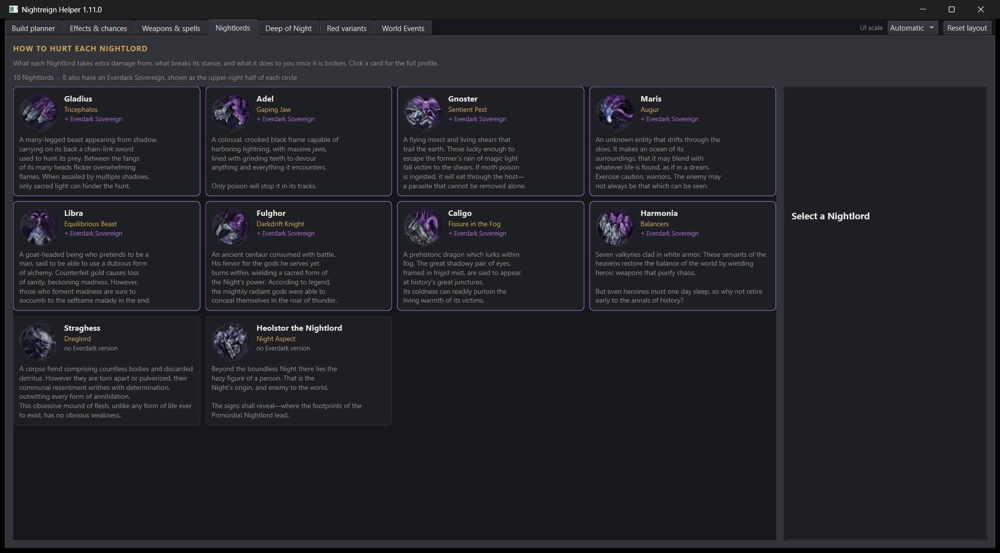

### Backlog (geparkt)

- AK-294 (4.11-Klausel „blocked by a requirement you marked") und AK-295
  (kein Rohschluessel auf dem Bildschirm) nicht live ausgeloest — beide
  brauchen einen praeparierten Build (unerfuellbare Pflicht bzw. ein Feld mit
  `conditionHp`/unbenanntem Schluessel), den dieser Lauf nicht aufgesetzt hat.
  Code gelesen (`advisorbar.py:176/184/185`, `effecttext.py:27/28/130/131`,
  `model.py:1212/1213`) und deckungsgleich mit der Spec — das deckt die
  Formulierung, nicht das Auftreten am Bildschirm. `qa-engineer`s T-263a
  deckt QA-269/270 auf Datenebene ab; ein visueller Nachweis steht aus,
  falls das fuer den Release noch gebraucht wird.
- Effects & chances-Tabelle bei 1536 px: „What it does"-Spalte kuerzt lange
  Saetze mit „…" (z. B. „Restores FP upon receiving damage — conditional
  …") — regulaeres, von T-239a bereits akzeptiertes Verhalten einer breiten
  Tabelle, kein neuer Fund, nur zur Vollstaendigkeit vermerkt.

### Positiv / beibehalten

- **DR-028 ✔ 2026-09-15 (T-259/T-263c), Messartefakt bestaetigt geschlossen.**
  Das Werteblatt (BASE STATS/ATTRIBUTES/WEAPON DETAILS mit dem 1H/2H-Schalter/
  RESISTANCES) ist am laufenden Fenster bei 1536 px vollstaendig lesbar:
  „Physical 56 / 58 2H — 56 / 58 2H", „Total 56 / 58 2H no change 56 / 58 2H"
  stehen unabgeschnitten, mit eigener vertikaler Bildlaufleiste fuer den Rest
  der Liste — genau das Bild, das T-259s programmatischer Beleg (348 px
  Kindbreite in 356 px Viewport) vorhergesagt hatte. Waechter
  `tests/test_stat_sheet_at_the_window.py` laeuft gruen (3 passed, erneut
  ausgefuehrt in diesem Durchlauf) und deckt 1608/1536/1366 px ab. Der
  T-258-Fund war ein verstecktes Label mit stehengebliebener Alt-Geometrie
  plus eine `PrintWindow`-Bitmap in physischer statt logischer Aufloesung —
  beides in T-259 bereits erklaert, hier am echten Fenster gegengeprueft.
  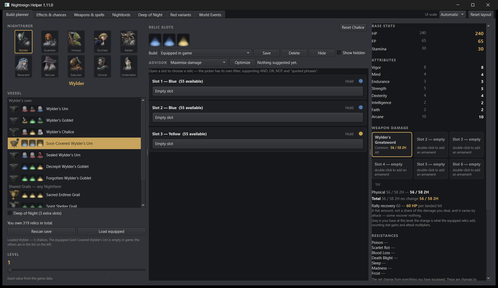
- **DR-029 ✔ 2026-09-15, live retestet.** Suchfilter „Finger Seal" auf dem
  Weapons & spells-Tab zeigt jetzt „Weapons (1)"/„Sacred Seal (1)" bei genau
  einer sichtbaren Kachel — Kopf- und Gruppenzaehler zaehlen die gezeigten
  Kacheln, nicht mehr die rohen Spieldaten-Kopien. Behoben `3ceceb9`, hier am
  laufenden Fenster bestaetigt statt nur am Commit. 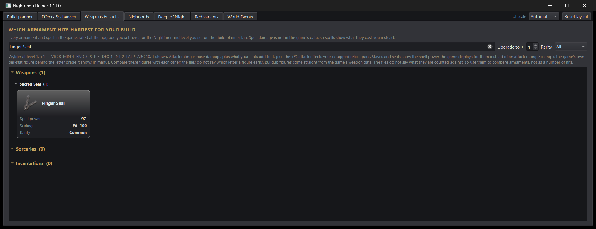
- **DR-030 gegenstandslos (AN-8, Director 2026-09-15).** AK-288s zweite
  Klausel (Spieldaten ohne Zweihandmodifikator) trifft unter AN-4s
  pauschalem Klassenfaktor nicht mehr ein — Datenmodellentscheidung, keine
  UI-Nacharbeit noetig.
- **AK-292** (1H/2H-Schalter): bei 1536 px weiterhin genau eine Instanz,
  Text „1H", lesbar und nicht durch die DR-028-Enge verdeckt.
- **AK-286** (Zweihand-Zusatz auf der Kachel): Format `{1H} / {2H} 2H`
  (z. B. „67 / 69 2H", „60 / 62 2H") bei 1536 px auf dem Weapons-Tab erneut
  ueber ein volles Rasterblatt gepruedft, kein Umbruch, keine Kuerzung.
- **AK-296** (Gefaess-Tooltip): Wortlaut programmatisch aus dem laufenden
  `chalice_list`-Widget gelesen — „Soot-Covered Wylder's Urn\nSlots: Blue,
  Blue, Yellow\nDeep of Night adds: Blue, Blue, Yellow\nEach vessel has its
  own fixed slots — choose by colour and count, not by name.\nEquipped in
  game" (equipiert) gegen dieselbe Zeile ohne den letzten Satz bei einem
  nicht equipierten Gefaess — deckungsgleich mit der Spec, Em-Dash korrekt
  (U+2014, kein Mojibake in den Rohdaten selbst geprueft).
- Alle sieben Tabs bei 1536 px und alle vier Content-Tabs zusaetzlich bei
  1608 px: keine abgeschnittenen Spalten, keine ueberlappenden Elemente,
  keine leeren/kaputten Icons ausserhalb des bereits bekannten DR-031.

### Offene Fragen an den App Designer

Keine neuen. DR-031 ist eine Geschmacksfrage (vorausgewaehlter Nightlord vs.
kompakterer Leertext) und wird als Nice-to-have im Backlog gefuehrt statt
als Frage gestellt — beide Richtungen sind gleichwertig vertretbar, ohne
Dringlichkeit.

---

## Review vom 2026-09-15 (T-258 — Design-Review der ganzen Oberflaeche auf `00bad3c`, 1.11.0 + A20 Zweihand + Bauwelle 2)

**Methode:** Live, am laufenden Fenster — eigener Klon nicht benutzt (kein
paralleler Schreibzugriff angeordnet, `git status` sauber auf `00bad3c`
belassen). Umlenkung `NIGHTREIGN_SETTINGS_ORG=DankYeeterT-258`,
`LOCALAPPDATA`/`APPDATA` auf ein Scratchpad-Verzeichnis umgelenkt, Testabzug
(841 Dateien, `EXTRACT_VERSION` 11) **in** das umgelenkte `LOCALAPPDATA`
kopiert. Nachweis: `settings fileName: \HKEY_CURRENT_USER\Software\
DankYeeterT-258\NightreignHelper`, `cache_dir: …\scratchpad\T-258\ui\Local\
NightreignHelper`, Stil `fusion`. Realer Bestand: 319 Relikte. Registry-Rest
nach Abschluss geloescht.

**Werkzeug-Besonderheit dieses Laufs:** der normale Sandbox-Bash/PowerShell-
Pfad erzeugt kein echtes GUI-Fenster (Prozess haengt mit 0 CPU-Zeit an einem
unsichtbaren Handle ohne Desktop-Session fest) — `dangerouslyDisableSandbox`
war fuer den Programmstart und jede Fenstermessung noetig, sonst kein
Livelauf moeglich. Bildnachweis per `PrintWindow` auf das eigene HWND
(NH-002), kein Bildschirmabzug. Ein kleines Kontrollskript
(`launch.py`, nur in `<scratchpad>/T-258/ui/`, kein Repo-Code) haelt die
`Planner`-Instanz offen und nimmt `resize`/`tab`/`eval`-Befehle ueber eine
Kommandodatei entgegen — `eval` liest ausschliesslich Widget-Geometrie/
-Text aus, schreibt nichts an der Anwendung.

**Geprueft:** Build-planner-Tab (1608 px, dazu 1900 px zur Ursachenklaerung
einer Panel-Beschneidung), Weapons & spells (Kachelformat AK-286/287,
QA-099a-Dedup), Effects & chances (Sichtpruefung), Vessel-Tooltip AK-296
(Text direkt aus `chalice_list`-Items gelesen), 1H/2H-Schalter AK-292
(Text/Tooltip/Position), DR-025/DR-026 aus dem Vorlauf (Code, `advisorblock.py`).
**Nicht schafft dieser Durchlauf:** 1536-px-Messung an allen sieben Tabs
und Nightlords/Deep of Night/Red variants/World Events visuell erneut
gepruefte Tabs (Zeitbudget ging in die Ursachenklaerung von DR-028, dem mit
Abstand schwersten Fund) — Luecke unten vermerkt, nicht verschwiegen.

**Gesamturteil:** Braucht Arbeit. Die drei einzeln durchdachten neuen
Elemente (Schalter AK-292, Kachelformat AK-286/287, Gefaess-Tooltip AK-296)
sind für sich alle korrekt gebaut — aber das Werteblatt, in dem zwei davon
stehen, schneidet an der eigenen dokumentierten Startbreite (1608 px) einen
Grossteil seines Inhalts ab, ohne Bildlauf, ohne Warnung. Das ist der
Befund, der vor jeder weiteren Politur zuerst behoben gehoert.

### Kritisch

- **DR-028 [`nrplanner/statsheet.py`, `StatSheet`-Pane in `app.py`s
  `QSplitter self.panes`, Index 2]** Das Werteblatt (BASE STATS, ATTRIBUTES,
  WEAPON DETAILS mit dem 1H/2H-Schalter AK-292 und den AK-286-AR-Werten,
  Flat bonuses, RESISTANCES) ist an der eigenen dokumentierten
  Oeffnungsbreite (1608 px, `Planner._opening_width()`, AK-285) zu weniger
  als einem Drittel sichtbar. Real gemessen (`window.panes.widget(2).
  findChildren(...)`): die „Flat bonuses"-Zeilen und mindestens eine
  benachbarte Zeile sind **630 px breit**, gerendert in einer Splitter-Pane,
  die laut `window.panes.sizes()` **370 px** hat (`PANE_DEFAULTS = (430, 520,
  370)`, `app.py:51`) — der Ueberschuss (260 px) reicht bis weit hinter den
  rechten Fensterrand und wird dort hart abgeschnitten, nicht umgebrochen,
  nicht gescrollt. Sichtbar sind praktisch nur die kurzen Ueberschriften
  (`BASE STATS`, `ATTRIBUTE`, `WEAPON D…`) und Ein-Wort-Zeilen (`HP`, `FP`,
  `Vigor`); die tatsaechlichen Zahlen (`Physical 56/…`, `Total 56/58`,
  Widerstandswerte) sind unlesbar oder ganz weg. Der 1H/2H-Schalter selbst
  (`x=1222`, Breite 36 px) sitzt noch innerhalb des Fensters und ist nicht
  betroffen — betroffen sind die Werte, die er beeinflusst. **Das ist genau
  die Pruefung, die AK-287 explizit fuer die Auslieferung verlangt** („Werte-
  blatt (`statsheet.py`), an seiner heutigen Spaltenbreite" — eine der vier
  zu pruefenden Flaechen) und die Pruefung faellt durch. Getestet mit einem
  vergroesserten Fenster (1900 px): die Splitter-Stretchfaktoren
  (`setStretchFactor(1, 1)`, alle Extra-Breite geht an die mittlere Pane)
  geben der Pane 2 keinen zusaetzlichen Platz — das Problem laesst sich also
  nicht durch ein breiteres Fenster umgehen, nur durch eine echte Korrektur
  am Werteblatt selbst (Zeilenumbruch/Kuerzung/eigene Bildlaufleiste in
  dieser einen Pane, oder `PANE_DEFAULTS`/die Zeilenbreite im Werteblatt
  aufeinander abstimmen). A12/A13 („nichts wird abgeschnitten ausser der
  Statuszeile ab 1536 px") verletzt. 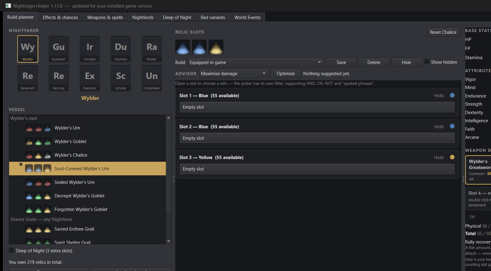

### Wichtig

- **DR-029 [`nrplanner/arsenaltab.py`, Abschnitts-/Gruppenzaehler
  (`"Weapons (%d)"`/Untergruppen wie `"Sacred Seal (%d)"`), QA-099a]** Der
  Zaehler in Kopf- und Gruppenzeile zaehlt weiterhin die rohen
  Spieldaten-Kopien, nicht die sichtbaren Kacheln: real gemessen (Suche
  „Finger Seal") zeigt „Weapons (2)" und „Sacred Seal (2)", darunter genau
  **eine** Kachel — der QA-099a-Dedup selbst ist korrekt gebaut, die Kachel
  traegt sogar einen guten, A7-gerechten Tooltip („The game lists 2
  armaments under this name with these numbers; shown once."). Der Zaehler
  daneben tut aber so, als muessten zwei Kacheln folgen, und widerspricht
  damit dem, was der Spieler direkt darunter sieht (A12 — nichts behaupten,
  was der Bildschirm nicht zeigt). **Entscheidung (Konsistenzfrage, kein
  Geschmack — ich entscheide sie selbst):** die Zaehler sollen die Zahl der
  **gezeigten Kacheln** zaehlen, nicht die Zahl der zugrundeliegenden
  Spieldaten-Eintraege — genau das Prinzip, das der Tooltip auf der Kachel
  selbst schon vormacht. Alternative, falls die rohe Zahl aus anderem Grund
  bleiben soll: derselbe Klammersatz wie im Tooltip direkt am Zaehler selbst
  (z. B. „Weapons (2, 1 shown)"), nie eine nackte Zahl ohne Erklaerung, die
  der sichtbaren Kachelzahl widerspricht. 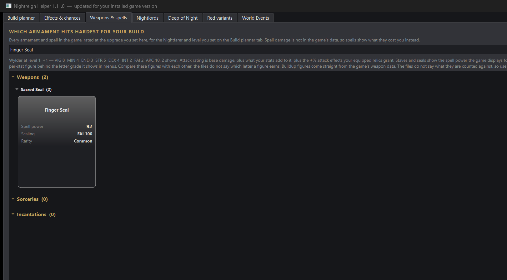
- **DR-030 [`nrplanner/damage.py:155-166`, `displayed_hands`, AK-288 zweite
  Klausel]** AK-288 verlangt zwei getrennte Faelle, wenn kein Zweihandwert
  gezeigt wird: (1) die Waffenklasse kennt keinen Zweihandmodus — keine
  Anzeige, korrekt gebaut — und (2) die Klasse kennt ihn, aber „die
  Spieldateien liefern keinen Zweihand-Modifikator fuer diese konkrete
  Waffe" — dafuer verlangt AK-288 einen kurzen erklaerenden Satz nach dem
  `Goal.scope`/`SlotPool.unknowns`-Muster. `displayed_hands` kennt nur einen
  einzigen `two_handed is None`-Zweig und behandelt beide Faelle gleich
  (stille Ein-Hand-Zahl, kein Satz) — Fall (2) hat keinen Code-Pfad. Nach
  AN-4 (`zweihaendig = Nahkampf ausser wep_type 33`, ein **pauschaler**
  Faktor je Klasse, keine Pro-Waffe-Abfrage der Spieldaten) **koennte**
  Fall (2) in der jetzigen Kalibrierung gar nicht mehr eintreten — dann ist
  AK-288s zweite Klausel gegenstandslos und sollte im `UI_SPEC.md` als
  „durch AN-4 ueberholt" vermerkt werden, statt als offene Bauluecke stehen
  zu bleiben. Kann ich als UI-Reviewer nicht abschliessend beurteilen (das
  ist eine Datenmodell-, keine Oberflaechenfrage) — **an `developer`/
  `architect`:** entweder den fehlenden Satz bauen, oder AK-288 Klausel 2
  im nächsten Spec-Nachtrag als erledigt/gegenstandslos schliessen.

### Nice-to-have

*(keine eigenen neuen — DR-024 aus dem Vorlauf bleibt unveraendert offen,
siehe unten.)*

### Backlog (geparkt)

- 1536-px-Messung an allen sieben Tabs steht noch aus (Zeitbudget ging in
  DR-028); angesichts DR-028 ist zu erwarten, dass das Werteblatt bei 1536 px
  **nicht besser** wird (`PANE_DEFAULTS` ist breitenunabhaengig) — sollte im
  selben Zug wie die DR-028-Behebung mitgeprueft werden, nicht separat.
- Nightlords/Deep of Night/Red variants/World Events nicht erneut visuell
  geprueft (zuletzt T-056/T-239a, seither keine bekannte Aenderung an diesen
  vier Tabs selbst).
- `Effects & chances`-Tabelle schneidet bei 1608 px die Spalte „Comes with
  curse" am Fensterrand ab (Screenshot `t258-effects-1608.png`) — vermutlich
  regulaerer horizontaler Bildlauf einer breiten Tabelle (A12/A13 galt hier
  laut `docs/state.md` T-239a bereits als erfuellt), Bildlaufverhalten in
  diesem Lauf nicht bestaetigt. Kein eigener Fund, Pruefluecke.
- Warnung `Could not parse stylesheet of object QListWidget(...)` auf
  `stderr` bei jedem Start (3x) — kein sichtbarer visueller Fehler in den
  geprueften Screenshots, aber ein Hinweis auf eine Stylesheet-Regel, die
  Qt nicht parsen kann; Ursache nicht verfolgt.

### Positiv / beibehalten

- **AK-292** (1H/2H-Schalter): genau eine Instanz im ganzen Fenster, Text
  `1H`/`2H`, Tooltip wortgleich zur Spec, Voreinstellung ungecheckt (1H,
  AN-2), Position/Groesse selbst nicht von DR-028 betroffen.
- **AK-286/AK-287** (Zweihand-Zusatz auf der Arsenal-Kachel): Format
  `{1H} / {2H} 2H` (z. B. „67 / 69 2H") real gepruedft auf 12 Kacheln bei
  200 px Kachelbreite (`arsenaltab.py`, `CARD_WIDTH`), kein Umbruch mitten
  im Begriff, kein Abschneiden — haelt genau dort, wo AK-287 es explizit
  verlangt hat.
- **AK-296** (Gefaess-Tooltip): Wortlaut live aus `chalice_list` gelesen,
  deckungsgleich mit der Spec — Reihenfolge Name/Slots/Deep of Night/
  Schlusssatz, Trennzeilen-Tooltip „Only Wylder can equip these." exakt wie
  gefordert.
- **DR-025/DR-026 (Vorlauf T-251c) bestaetigt behoben**, Code gelesen statt
  nur ubernommen: `advisorblock.py` traegt jetzt eine eigene `MarkButton`-
  Klasse mit `keyPressEvent`, die `pressable.PRESS_KEYS` (Return/Enter/
  Space) abfaengt — Commit `46ad69b` („DR-025/DR-026 - Markierungsknopf auf
  Enter, Tooltip nach AK-277"). Live per Tab+Enter nicht nachgestellt (Zeit),
  aber der Code selbst ist eindeutig. ✔ 2026-09-15.
- QA-099a-Dedup selbst (eine Kachel statt mehrerer bei Namensgleichheit,
  Tooltip nennt die Anzahl) ist strukturell die richtige Loesung — nur der
  Zaehler daneben zieht nicht mit (DR-029).

### Offene Fragen an den App Designer

Keine — beide neuen Entscheidungen (DR-029 Zaehlerlogik, DR-030 Ansprache an
`developer`/`architect`) sind Konsistenz- bzw. Datenmodellfragen ohne
Geschmacksspielraum.

---

## Review vom 2026-09-14 (T-251c — Pruefphase A18/A19 auf `528ff78`: AK-276-291)

**Methode:** Code-Analyse (unverifiziert), Fensterlauf **blockiert**. Umlenkung
war vollstaendig vorbereitet (`NIGHTREIGN_SETTINGS_ORG=DankYeeterT-251ux`,
eigenes `LOCALAPPDATA`/`APPDATA`, Testabzug — 841 Dateien, 22 MB — hineinkopiert),
`python run.py` startete jedoch wiederholt lautlos mit Exit-Code 0: Ursache ist
`singleinstance.RunningCopy` (`nrplanner/singleinstance.py`), ein
`QSharedMemory`-Schluessel **maschinenweit**, nicht je `NIGHTREIGN_SETTINGS_ORG`
gescopet. Zwei `NightreignHelper.exe`-Prozesse aus `dist/` liefen zum
Pruefzeitpunkt bereits (PID 10580 seit 18:01:17, Fenstertitel „Nightreign Helper
1.10.0", ohne Umlenkung in der Kommandozeile — vermutlich ein Rest der
Release-Kette `5f2988f`/`1fb9ac8`) und hielten die Sperre; ein neuer Prozess
tritt dagegen sofort zurueck (`main()`, `if not running.claim(): return 0`).
Diesen fremden Prozess zu beenden stand nicht in meinem Auftrag und haette ein
laufendes Programm angefasst, das ich nicht angestossen habe — nach Schritt 0.4
("wenn ein Start unmoeglich ist, dokumentiere das und weiche auf
Code-Analyse aus") stattdessen: Quellcode gelesen (`advisorblock.py`,
`advisorbar.py`, `relicpicker.py`, `explain.py`, `pressable.py`), automatisierte
Testbelege zitiert (`tests/test_relic_picker_advisor.py::
test_a_card_is_the_same_height_with_the_control_as_with_a_label`, Teil der
1597-bestandenen Suite) und die eigene Live-Messung des `developer` aus dessen
Commit-Nachricht `528ff78` uebernommen (**nicht selbst nachgemessen** — als
Luecke unten vermerkt). Kein Bild entstanden, weil kein Fenster stand; die
sonst uebliche Pflicht "Screenshot ansehen" entfaellt dadurch, nicht weil sie
nicht gaelte. `qa-engineer` und `security-reviewer` sind nicht durch mich
blockiert — die Sperre betrifft nur ein zweites GUI-Fenster, nicht Tests.

**Geprueft:** AK-276 bis AK-291 (drei Zustaende auf Karte/Why-Dialog, Legende,
Zaehler-Tooltip AK-280, AK-289-Satz, Leistenbreite AK-285, Why-Gruppenhoehe
AK-287) gegen `UI_SPEC.md` §6.8, plus die drei im Auftrag genannten
developer-Fragen.

**Gesamturteil:** fast fertig — die Bau-Logik deckt AK-276/279/280/282/289-291
im Code korrekt ab, aber zwei AK-278/277-Abweichungen sind codebelegt und ein
dritter Punkt (Why-Gruppenhoehe) ist hiermit als unkritisch abgenommen. Ein
Livelauf zur Bestaetigung fehlt (siehe oben) und sollte nachgeholt werden,
sobald die Fremdinstanz weg ist.

### Wichtig

- **DR-025 [`nrplanner/advisorblock.py`, `MarkedLine.__init__`/`self.mark`]**
  AK-278 verlangt "mit Leertaste oder Enter bedienbar". Gebaut ist nur
  Leertaste: `self.mark` ist ein nackter `QToolButton` ohne
  `keyPressEvent`-Ueberschreibung, und die eigene Klassen-Doku sagt es selbst
  ("Tab reaches it and Space presses it"). `QAbstractButton` loest `click()`
  in Qt nur bei `Key_Space` aus, `Key_Return`/`Key_Enter` tun bei einem
  `QToolButton` ohne `autoDefault` nichts — das Projekt kennt das Muster
  bereits und hat es fuer genau diesen Fall geloest: `nrplanner/pressable.py`,
  `PRESS_KEYS = (Qt.Key_Return, Qt.Key_Enter, Qt.Key_Space)`. Richtung: `mark`
  entweder auf denselben Drei-Tasten-Katalog umstellen (eigene
  `keyPressEvent`, wie `PressableFrame.keyPressEvent`) oder `NEXT_MARK`-Klick
  zusaetzlich an `Key_Return`/`Key_Enter` binden. Unverifiziert (Code-Analyse)
  — am laufenden Fenster mit Tab auf die Kontrolle, Enter druecken zu
  bestaetigen.
- **DR-026 [`nrplanner/advisorblock.py:93-94`, `MARK_TOOLTIPS[effectfilters.EXCLUDED]`]**
  Der Tooltip im ausgeschlossenen Zustand sagt "Click to include it again" —
  liest sich wie "zaehlt wieder normal" (zurueck zu neutral). Tatsaechlich
  geht der Klick-Zyklus (`NEXT_MARK`) von `Don't include` direkt zu
  `Must include`, nicht zu neutral zurueck. Ein Spieler, der einen
  Ausschluss nur zuruecknehmen will, setzt ungewollt eine Pflicht. Eigener
  Fehler in AK-277 (`UI_SPEC.md`), dort jetzt korrigiert (Nachtrag T-251c,
  §6.8) auf `"... Click to require it instead."` — der Zyklus selbst bleibt
  unveraendert, nur der Satz beschreibt ihn jetzt richtig. Developer setzt
  den korrigierten String um. Unverifiziert (Code-Analyse), aber der
  Quelltext des Tooltips und von `NEXT_MARK` ist eindeutig.

### Nice-to-have

- **DR-027 [`UI_SPEC.md` AK-290, Z. 4135/4148]** Codename `_excluded_line`
  war veraltet — `explain.py` nennt die Funktion seit `115dd4e` (T-250a)
  `_marked_line`. Reiner Doku-Drift, kein Nutzerimpact; im Nachtrag T-251c
  korrigiert. ✔ 2026-09-14 (in diesem Durchlauf behoben).

### Offen/abgenommen ohne eigenes Finding

- **Why-Gruppenhoehe +4 px bei 21 Zeilen (AK-287-Nachbarfrage, developer
  T-250b):** `528ff78`s Commit-Nachricht nennt 332→336 px live gemessen. Kein
  Budget verletzt — `AK-04` bindet nur die Hauptfenster-Mindesthoehe, nicht
  den `WhyDialog` (eigenes `QDialog`, `resize(640, 620)`, `QScrollArea`
  scrollt ueberschuessigen Inhalt). **Abgenommen**, keine eigene Massnahme
  noetig — beantwortet die im Auftrag offene developer-Frage.
- **AK-285-Leistenbreite (596/338/1608):** vom `developer` selbst live
  gemessen und in der Commit-Nachricht `528ff78` belegt ("AK-285-Masse
  596/338/1608 unveraendert"). Ich habe das mangels eigenem Fensterlauf
  **nicht nachgemessen** — das ist eine Luecke dieses Durchlaufs, keine
  Bestaetigung aus erster Hand. Empfehlung: `qa-engineer` prueft dies im
  eigenen (Qt-freien oder spaeteren Fenster-)Durchlauf mit.
- **AK-276/279/280/282/289/291:** Code deckt die Vorgabe, soweit lesbar,
  vollstaendig — `RelicCard`/`MarkedLine` tragen die Effekt-Id (nicht die
  Zeile), die Verwaltungslisten sortieren alphabetisch nach Anzeigename, der
  Zeilen-Tooltip haengt an `_show()` und damit an jedem der 14 Zustaende, die
  Markierung wirkt laut `advisorbar.py`/`explain.py` ausschliesslich auf den
  Berater. Keine eigene Pruefung ersetzt den Livelauf, den `qa-engineer`
  fuer A18/A19 ohnehin fahren muss (T-251a).

### Backlog (geparkt)

- `WhyDialog`-Slotgruppe: ein als `Don't include`/`Must include` markiertes,
  sonst stilles Zeilenpaar rendert **nicht** in der 11-px-`MUTED`-Groesse,
  die andere stille Zeilen derselben Gruppe tragen (`_styled()` setzt `small`
  nur fuer die vier neutralen Faelle, nicht fuer `EXCLUDED`/`REQUIRED`) — auf
  der Karte unsichtbar, weil dort `size=SMALL_TEXT` fest vorgegeben ist, im
  `Why`-Dialog (`size=0`) potenziell ein Zeilenhoehen-/Schriftgroessen-Bruch
  innerhalb einer Gruppe. Nicht bestaetigt ohne Bild — am naechsten Livelauf
  gezielt ansehen.

### Positiv / beibehalten

- Die Drei-Zustands-Kontrolle sitzt konsequent an der Effekt-Id
  (`kind_of`/`EffectFilters`), nicht an der gezeichneten Zeile — genau das
  AK-276 verlangt und QA-184-Fehlerklasse vermeidet, und ist im Code an
  keiner der drei Fundstellen (Karte, Why-Gruppe, Verwaltungsliste)
  durchbrochen.
- `test_a_card_is_the_same_height_with_the_control_as_with_a_label` ist ein
  gutes Beispiel dafuer, ein AK-Kriterium (AK-277: kein Breitenzuwachs) als
  automatisierten Test statt als einmalige Messung zu verankern — haelt auch
  bei kuenftigen Aenderungen ohne erneuten Fensterlauf.

### Offene Fragen an den App Designer

Keine — beide Korrekturen (DR-025, DR-026) sind technische Praezisierungen
ohne Geschmacksspielraum.

---

## Review vom 2026-09-14 (T-239c — Pruefphase Zyklus 22 auf `a68cd3d`: Retests, AK-262-Neuvorlage, Build-planner-Tab nach AD-034)

**Methode:** Live, am laufenden Fenster (Windows, kein `offscreen`, L-009),
Stil `fusion`/dunkle Palette (`apply_appearance`). Code eingefroren auf
`a68cd3d`; `qa-engineer`/`security-reviewer`/`architect` laufen parallel,
niemand aendert `nrplanner/`, `tests/`, `scripts/` — laut Rezept
([[ui-messung-am-laufenden-fenster]]) ist ein eigener Klon dann nicht
zwingend, hier ausdruecklich nicht benutzt. Testabzug (841 Dateien,
`EXTRACT_VERSION` 11) frisch in ein umgelenktes `LOCALAPPDATA` kopiert,
`NIGHTREIGN_SETTINGS_ORG=DankYeeterT-239`, `APPDATA` umgelenkt. Bildnachweise
per `PrintWindow` auf das eigene HWND (NH-002, Projekt-`CLAUDE.md`).
Ergaenzend: eine off-screen `RelicCard`-Konstruktion (gleiche Klasse wie
`tests/relic_card_at_the_window.py`, `WA_DontShowOnScreen`) fuer die
AK-262-Chipmessung, weil sie exakter reproduziert als ein Live-Grab.
Screenshots dauerhaft abgelegt: `design-review/2026-09-14/`.

**Nachweis der Umlenkung:**
```
settings fileName: \HKEY_CURRENT_USER\Software\DankYeeterT-239\NightreignHelper
cache_dir:         …\scratchpad\T-239\ui\data\Local\NightreignHelper
style:              fusion
platform:           windows
owned relic count:  314
```

### 1. DR-013 bis DR-016, DR-022, DR-023 auf behoben

Alle sechs primaerquellen-gepruefte, nicht nur aus dem Auftragskopf
uebernommen:

- **DR-022/DR-023** — `qa/findings.md` QA-251/QA-252 („Retest T-234 …
  bestaetigt … behoben — Retest bestanden"), `docs/state.md`
  bestaetigt denselben Stand wortgleich. Ich habe den Retest selbst nicht
  wiederholt (nicht Teil dieses Auftrags); Markierung stuetzt sich auf das
  primaere QA-Register, nicht auf den Auftragstext. ✔ in `DESIGN_REVIEW.md`
  markiert, ID und Ursachenbeleg bleiben stehen.
- **DR-013/DR-014/DR-015/DR-016** — Commits `d5b2035`, `0f270d8`, `82cb18a`,
  `a39d58f`; Zahlen aus `docs/berichte/T-236-developer.md` und
  `T-237-developer.md` (Fensterlauf, `PrintWindow`, real gemessen, nicht nur
  behauptet): 10/10 Nightlord-Karten, `Effect`/`What it does` jetzt die
  breitesten Spalten, `Deep of Night` in `QScrollArea` (Fenster-Minimum
  588 px), 0/92 Arsenal-Kacheln abgeschnitten, 0 Wertgruppen mitten im Begriff
  umgebrochen. ✔ markiert.

### 2. AK-262 neu vorgelegt — Empfehlung `BEST FOR ATTRIBUTES` statt `BEST FOR STATS`

AK-262 (`UI_SPEC.md`) nennt selbst die Bedingung fuer ihre eigene
Neuvorlage: *„wird der Chipstreifen … verbreitert, passt auch `BEST FOR
ATTRIBUTES`, und dieses Kriterium wird neu vorgelegt."* T-237 (`5dd0cf7`) hat
den Streifen genau dafuer verbreitert (QA-229/QA-230). Nachgemessen am
laufenden Programm, **zweimal im selben Lauf** (QA-239-Lehre: Live-Fenster
und direkte Konstruktion muessen sich decken, sonst ist die Abweichung selbst
der Befund):

| Messweg | gewoehnliche Karte | favorisierte Karte |
|---|---|---|
| Live-Fenster (echter Bestand, Slot 1, 54 Karten) | Streifen 120 px | — (keine favorisierte Karte im Sample) |
| direkte `RelicCard`-Konstruktion | Streifen 120 px | Streifen 118 px |

`BEST FOR ATTRIBUTES` misst **106 px** (Segoe UI 9 pt, 10 pt fett) — passt in
beide Faelle, 12 bis 14 px Rand, `chip_cut == False`. Die bisherigen Chips
(`BEST FOR DAMAGE` 91 px, `BEST FOR SURVIVAL` 95 px, `BEST FOR STATS` 76 px)
bleiben ebenfalls unbeschnitten.

**Empfehlung:** auf `BEST FOR ATTRIBUTES` zurueckstellen. Das ist keine neue
Idee, sondern die eigene, bereits verabschiedete Bedingung von AK-262, die
jetzt eingetreten ist; der Code (`nrplanner/relicpicker.py`,
`DIRECTION_NOUNS`-Kommentar) nennt denselben Befund und wartet ausdruecklich
auf diese Entscheidung. **Trotzdem keine Selbstentscheidung**, weil die Wahl
zwischen zwei technisch gleich korrekten Woertern Geschmack ist — Entscheidung
beim Director (Auftragsvorgabe), nicht bei mir. Volltext mit Messtabelle:
`UI_SPEC.md`, Nachtrag zu AK-262.

### 3. UI_SPEC-Zitat zu AK-65: Fundstelle korrigiert

AD-034 (T-235) hat `nrplanner/app.py` von 5145 auf 3085 Zeilen verkleinert und
die Anzeigeschwellen `VISIBLE_CHANGE`/`VISIBLE_PERCENT`/`COLOURED_CHANGE`
(0.5/0.05/0.05) nach `nrplanner/statsheet.py` mitgenommen — gemessen per
`grep`, nicht vermutet: `app.py` traegt diese Namen nicht mehr, `statsheet.py`
zitiert AK-65 sogar selbst im Kommentar. `UI_SPEC.md` AK-65 nannte noch
`nrplanner/app.py`; korrigiert auf `nrplanner/statsheet.py`, Wortlaut des
Kriteriums selbst unveraendert (der Ort war falsch, die Regel nicht).

### 4. Build-planner-Tab am laufenden Fenster nach AD-034 gegen AK-46/AK-73/AK-212/AK-271

Realer Bestand (314 Relikte), Hauptfenster 1536 px logisch, `Build planner`
aktiv, dann `RelicPicker` auf Slot 1 geoeffnet (54 verfuegbare Karten, echter
Bestand):

- **AK-46/AK-262 (Chip auf der Spitzenkarte):** 6 von 55 Karten tragen einen
  Chip (2× `BEST FOR DAMAGE`, 1× `BEST FOR SURVIVAL`, 3× `BEST FOR STATS`),
  kein Chip abgeschnitten, Picker oeffnet bei **1114 px** (AD-034-Wert
  bestaetigt), Karten bei **208 px** (bestaetigt) — haelt.
- **AK-73 (kein Umbruch mitten im Begriff):** die Waffenkachel der
  Statuszeile (`statsheet.py`) zeigt auf diesem Bestand nur einen einzelnen
  `·`-Trenner („Common · 56 AR"), keinen mehrgruppigen Wert wie
  `STR -7 · ARC +45 · DEX` — nichts, das hier brechen koennte; kein
  Widerspruch, aber auch kein scharfer Test. Der urspruengliche AK-73-Fall
  (DR-016b) liegt im `Weapons & spells`-Tab (`arsenaltab.py`), von AD-034
  nicht beruehrt, weiterhin ✔ (s. oben). Ein eigener Pruefpass fuer
  mehrgruppige Werte im **neuen** `statsheet.py`-Panel selbst (sechs
  Waffenkacheln plus Schadenspanel) steht noch aus, sobald ein Bestand mit
  Attributs-Abzuegen auf dem ausgeruesteten Arsenal vorliegt — Backlog unten.
- **AK-271 (unter 1536 px darf die Lesart-/Zielbox schrumpfen):** Fenster auf
  1366 px verkleinert — Statuszeile faellt auf ein abgeschnittenes
  „Nothing sugg…", alles andere bleibt lesbar, kein Ueberlappen, kein Absturz
  — haelt unveraendert, keine Regression durch AD-034.
- **AK-212 (leeres Raster waehrend eine Spur nie antwortet):** **nicht live
  reproduziert in diesem Lauf** — der Zustand ist zeitkritisch (vor der
  Antwort des Hintergrund-Threads) und nicht zuverlaessig am realen Fenster
  zu treffen, ohne den eingefrorenen Code zu stubben. Guard-Tests existieren
  (`tests/test_relic_picker_advisor.py`, `tests/test_picker_track_guards.py`)
  und laufen in der parallelen Suite; `qa-engineer` deckt den funktionalen
  Teil (Wartetext, Rescan) in T-239a Punkt 1 ab. Kein Befund, eine offene
  Messluecke — wer als naechstes den Picker anfasst, sollte sie schliessen.

**Gesamturteil:** Ship-ready fuer den geprueften Ausschnitt. Sechs fruehere
Kritisch-/Wichtig-Befunde (DR-013 bis DR-016, DR-022, DR-023) sind mit
Commit-Beleg auf behoben gezogen, keiner davon zeigt am laufenden Fenster
eine Regression. AD-034 (App-Aufteilung in `relicslots.py`, `savereader.py`,
`statsheet.py`) hat die vier gepruefte Akzeptanzkriterien nicht angefasst;
die einzige offene Stelle ist eine Messluecke (AK-212, zeitkritisch), kein
Fund. AK-262 ist keine Reparatur, sondern eine faellige Wortentscheidung, die
die Spec sich selbst vorgeschrieben hat.

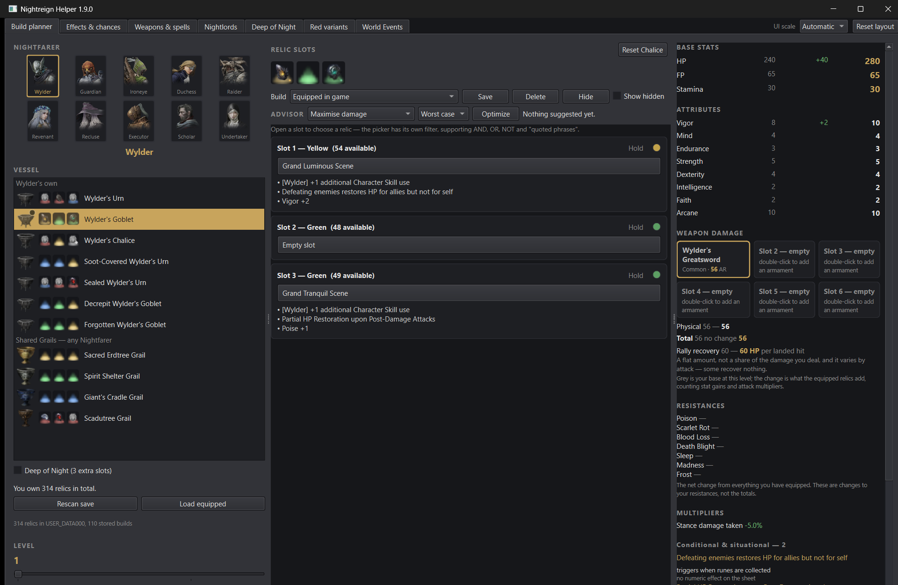
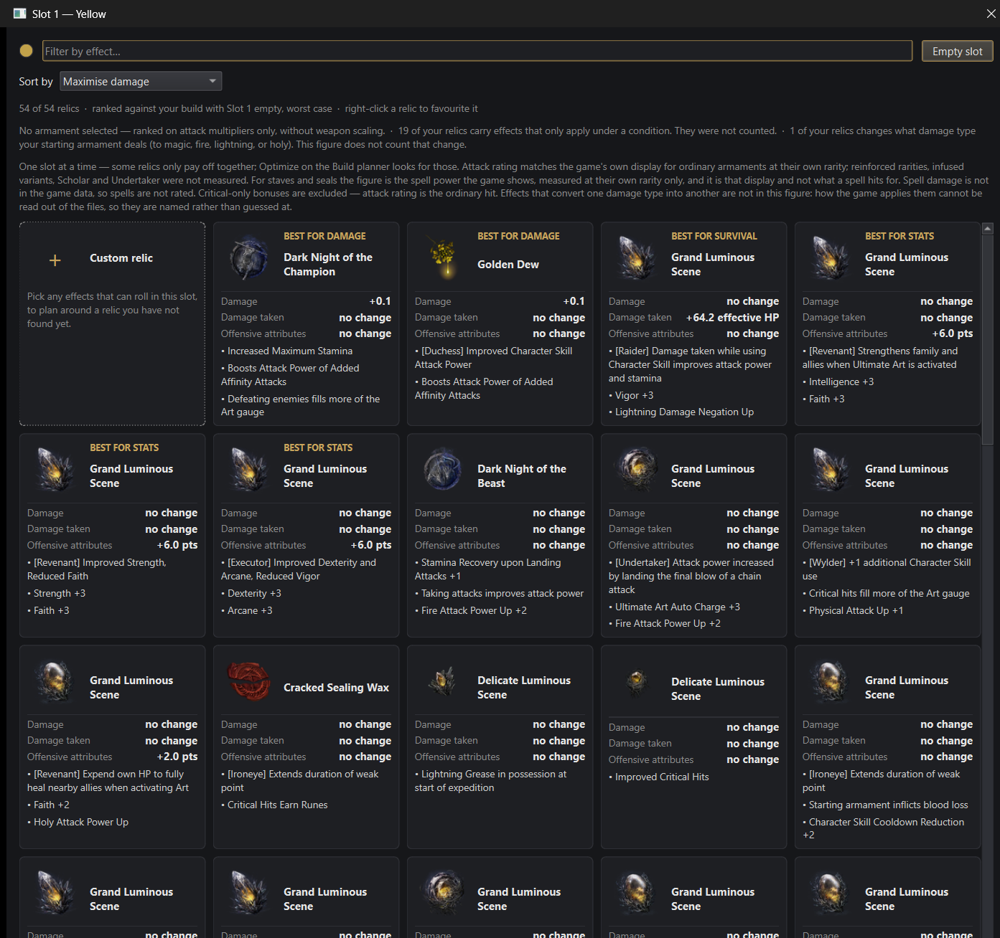
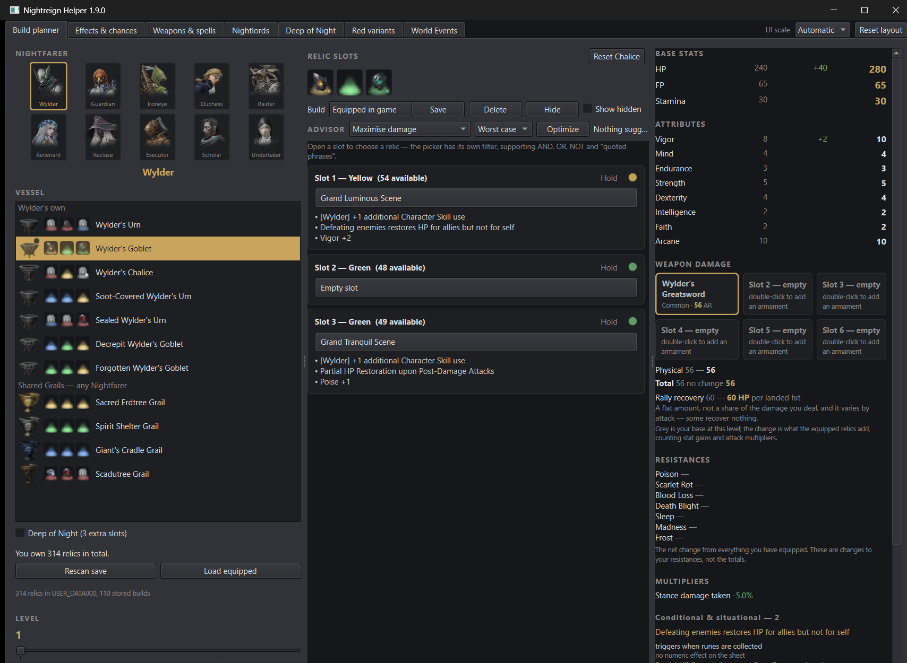

### Backlog (geparkt)

- AK-73 im neuen `statsheet.py`-Panel (sechs Waffenkacheln plus
  Schadenspanel) noch nicht mit einem mehrgruppigen `·`-Wert gepruefte, weil
  der reale Bestand des Laufs keinen ausgeruesteten Katalysator/Waffe mit
  mehreren Attributs-Abzuegen zeigte. Naechster Lauf: gezielt eine Waffe mit
  `STR`/`ARC`/`DEX`-Mehrfachwert ausruesten und nachmessen.
- AK-212 zeitkritischer Zustand nicht live reproduziert (s. oben) — auf
  Guard-Tests und die parallele `qa-engineer`-Pruefung gestuetzt, nicht
  eigenstaendig am Fenster bestaetigt.

### Positiv / beibehalten

- Chipstreifen (QA-229/QA-230, T-237) haelt unter realer Last: 6 von 6
  Chips auf dem realen 314er-Bestand vollstaendig lesbar, kein einziger
  abgeschnitten — die Zahlen aus `T-237-developer.md` reproduzieren sich
  live unveraendert.
- Picker-Oeffnungsbreite (1114 px) und Kartenbreite (208 px) sind nach der
  AD-034-Umstrukturierung exakt so geblieben, wie T-237 sie hinterlassen hat
  — der App-Split hat die Geometrie nicht angeruehrt.
- `owned relic count` liest weiterhin korrekt 314 aus dem echten Bestand,
  auch nach AD-034 (`savereader.py` uebernommen, `app.py` nicht mehr der
  Ort) — keine stille Regression bei der Kernzahl der Anwendung.

---

## Review vom 2026-09-13 (T-229c — Beraterleiste mit Lesart-Box, A16/A30-A32)

**Methode:** Live, am laufenden Fenster (Windows, kein `offscreen`, L-009),
Stil `fusion`/dunkle Palette. Kein Klon: eingefrorener Stand `8ce5b3b`
(Code `719c46d`), `git status` sauber, `qa-engineer`/`security-reviewer`
laufen parallel auf demselben eingefrorenen Stand, kein Schreibzugriff auf
diesen Baum — laut Rezept ([[ui-messung-am-laufenden-fenster]]) ist ein Klon
dann nicht zwingend. Testabzug (841 Dateien, `EXTRACT_VERSION` 11) in das
umgelenkte `LOCALAPPDATA` kopiert, `NIGHTREIGN_SETTINGS_ORG=DankYeeterT-229`,
`APPDATA` umgelenkt. Bildnachweise ausschliesslich `QWidget.grab()` auf das
eigene Fenster-/Dialogobjekt (NH-002/L-012, kein `PrintWindow`, kein
Bildschirmabzug). Screenshots: `design-review/2026-09-13/`.

**Nachweis der Umlenkung:**
```
settings fileName: \HKEY_CURRENT_USER\Software\DankYeeterT-229\NightreignHelper
cache_dir:         …\scratchpad\T-229\ui\data\Local\NightreignHelper
style:              fusion
```
Der reale Spielstand wurde trotz umgelenktem `APPDATA` gefunden, weil
`savefile.save_roots()` **zusaetzlich** `Path.home()/AppData/Roaming`
durchsucht (bewusster Fallback im Code, nicht meine Umlenkung) — Nachweis:
`owned relics: 314`. Skripte: `…/scratchpad/T-229/ui/measure_advisor_live.py`,
`measure_picker_live2.py`, `measure_e1.py`, `measure_why_block.py`,
`measure_no_save.py`, `check_status_focus.py`.

**Zahlenabweichung, nur als Hinweis an die `qa-engineer`-Nachzaehlung
(T-229a Punkt 6):** der echte Spielstand traegt **314** Kopien, nicht 312 wie
in `UI_SPEC.md` AK-187/AK-188/dem Auftragskopf angenommen (`owned.relic_count
== 314`, `Why`-Dialog druckt „314 relics considered.“ selbst). Kein
UI-Befund — die Kopfzeilen und der `Why`-Dialog lesen die Zahl korrekt aus
dem Bestand aus, das Programm behauptet nirgends 312. Die AK-187/188-Zahlen
(177/204 bzw. 67/42/426/323) bleiben eine Zaehlfrage, keine Oberflaechenfrage.

**Geprueft:** Beraterleiste mit Lesart-Box (AK-182 bis AK-188, AK-268) bei der
abgeleiteten Startbreite (real gemessen **1608 px**, deckt sich mit A32/T-225);
E1 im Herkunftsfall (AK-264, beide Headlines); Relic Picker mit realem
Bestand (AK-51, AK-196, AK-266) und im entwerteten Zustand nach einem Rescan
ohne Fund bei bereits offenem Dialog (AK-265, AK-267, AK-212); `Why`-Dialog
und Vorschlagsblock-Kopf (AK-184, AK-185, AK-186); AK-05/AK-194 an der realen
Startbreite; AK-160/AK-189 (Bezugsbreite, s. Rueckgabe an den Director).
**Nicht erneut geprueft:** die sechs Inhalts-Tabs (siehe 2026-09-12-Durchlauf,
weiterhin unveraendert offen).

**Gesamturteil:** Braucht Arbeit. Die Beraterleiste selbst — Reihenfolge,
Beschriftung, Deaktivierung zu dritt, die vier Nennungen der Lesart — trifft
ihre eigene Vorgabe wortgetreu und sauber gebaut. Der E1-Dialog trifft
AK-264 buchstabengetreu. Der Fund, der zaehlt, liegt woanders: **der Relic
Picker faellt nach einer Entwertung des Spielstands waehrend er offen ist
nicht in den in AK-212/AK-267 vorgeschriebenen Zustand zurueck**, sondern
zeigt einen inneren Widerspruch — „0 of 0 relics … ranked against your
build …“ neben einer weiterhin sichtbaren Custom-Kachel. AK-267s eigene
Begruendung nennt das Muster beim Namen: „kein Feature, sondern ein
A7-Verstoss."

---

### DR-022 — Relic Picker faellt nach Entwertung des Spielstands nicht auf AK-212 zurueck ✔ behoben (T-234, 2026-09-13)

**Status (T-239c, 14.09.2026): behoben, Retest bestanden.** Gebaut in T-230
(`4e8fec0`), Retest in T-234 bestaetigt: `qa/findings.md` QA-251 „bestaetigt
(mit DR-022), Mutation getoetet … behoben — Retest bestanden", primaerquelle
`docs/state.md` („Retest T-234: CONCERNS — alle 11 Punkte bestaetigt … DR-022/
DR-023 zieht der ui-ux-designer im naechsten Lauf auf behoben"). Ich habe den
Retest selbst nicht am laufenden Fenster wiederholt (ausserhalb des T-239c-
Auftrags); die Bestaetigung stammt aus dem primaeren QA-Register, nicht aus
einem Statusfeld. ID bleibt stehen, Befund unten unveraendert als Beleg der
urspruenglichen Ursache.

**Kritisch — A7/AK-212/AK-267.** [`nrplanner/relicpicker.py:1006` (`slot.
stock_replaced.connect(self._refresh)`), `:1387-1460` (`_refresh`),
`:1543-1547` (`NO_SAVE_WAS_READ`-Zweig)]

**Reproduktion (live, real):** Slot-1-Picker geoeffnet, echter Bestand
(314 Relikte) beantwortet die Frage normal (`picker-C`). Waehrend der Dialog
offen bleibt, `nrdata.savefile.find_saves` liefert `[]` und `Rescan save`
gedrueckt (echter Code-Pfad, keine Attrappe) — genau der AK-267/T-225-Befund-
3-Fall. `planner.owned` und `slot.owned` werden korrekt auf `None`
zurueckgesetzt (die QA-247-Behebung selbst haelt). Der **schon offene**
Picker zeigt danach:

> `0 of 0 relics · ranked against your build with Slot 1 empty, worst case ·
> right-click a relic to favourite it`

mit weiterhin sichtbarer **Custom-relic-Kachel**.

**Warum das AK-212 bricht, Punkt fuer Punkt:** AK-212 verlangt fuer genau
diesen Zustand (Spur ohne Antwort/entwerteter Bestand) *„im Rollbereich steht
kein Kartenwidget — keine Reliktkarte und auch nicht die Custom-Kachel —
[…]; die Kopfzeile ist leer"*, und AK-267/AK-265 verlangen, dass an dieser
Stelle **`No save was read, so there is nothing to rank these against — use
Rescan save.`** steht. Keine der drei Zusagen haelt: die Custom-Kachel bleibt,
die Kopfzeile ist nicht leer, sondern behauptet eine abgeschlossene Rechnung
(„ranked against your build …“), und der AK-265-Satz erscheint nirgends.

**Ursache (Code):** `stock_replaced` ist ausschliesslich mit `_refresh()`
verbunden, nie mit einem erneuten `self.advice.ask(...)`. `self.ranking`
wird nur an zwei Stellen gesetzt — im Konstruktor auf `None`, und in
`_the_answer_arrived` auf die echte Antwort — und **nirgends beim
Entwerten wieder auf `None` zurueckgesetzt**. `_refresh()` liest also weiter
das alte `ranking`-Objekt (`if self.ranking is not None` bei Zeile 1407 bleibt
wahr), waehrend `self._candidates()` ueber das jetzt leere
`slot.available_items()` null Eintraege liefert — daher „0 of 0" statt des
AK-212-Zustands. Der `NO_SAVE_WAS_READ`-Zweig in `_say_what_they_are_worth`
(Zeile 1543) wird nie erreicht, weil er an `self.ranking is None` haengt, was
hier nicht eintritt.

**Einordnung gegenueber T-225 Befund 3 / AK-267:** die urspruengliche
QA-247-Regression (alte Karten blieben nach dem Reset sichtbar) ist behoben —
`slot.owned` und `planner.owned` sind korrekt `None`. Das hier ist die
**Haelfte, die die Behebung ausgelassen hat**: der Picker selbst (nicht der
Slot) haelt noch am alten Antwortobjekt fest. **Antwort auf die Auftragsfrage
„entspricht das AK-212?": nein, nicht mehr — die urspruengliche Symptomatik
ist weg, eine neue, aus derselben Ursachenfamilie, ist an ihre Stelle
getreten.**

**Loesungsrichtung:** `stock_replaced` darf nicht direkt auf `_refresh()`
zeigen, sondern auf einen Reset, der `self.ranking = None`, `self._waiting =
False`, `self._failure = ""` setzt (den AK-212/AK-265-Ausgangszustand
herstellt) und danach `_refresh()` aufruft — oder, falls ein Weiterfragen
gewuenscht ist, `self.advice.ask(...)` erneut anstoesst statt der Kachel
stumm eine leere Antwort unterzuschieben. Der `developer` entscheidet, welche
der beiden Ursachen (Karte vs. Picker) den gemeinsamen Reset traegt.

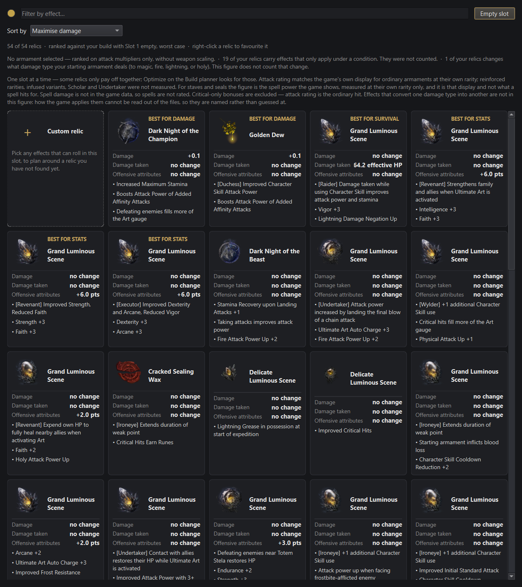
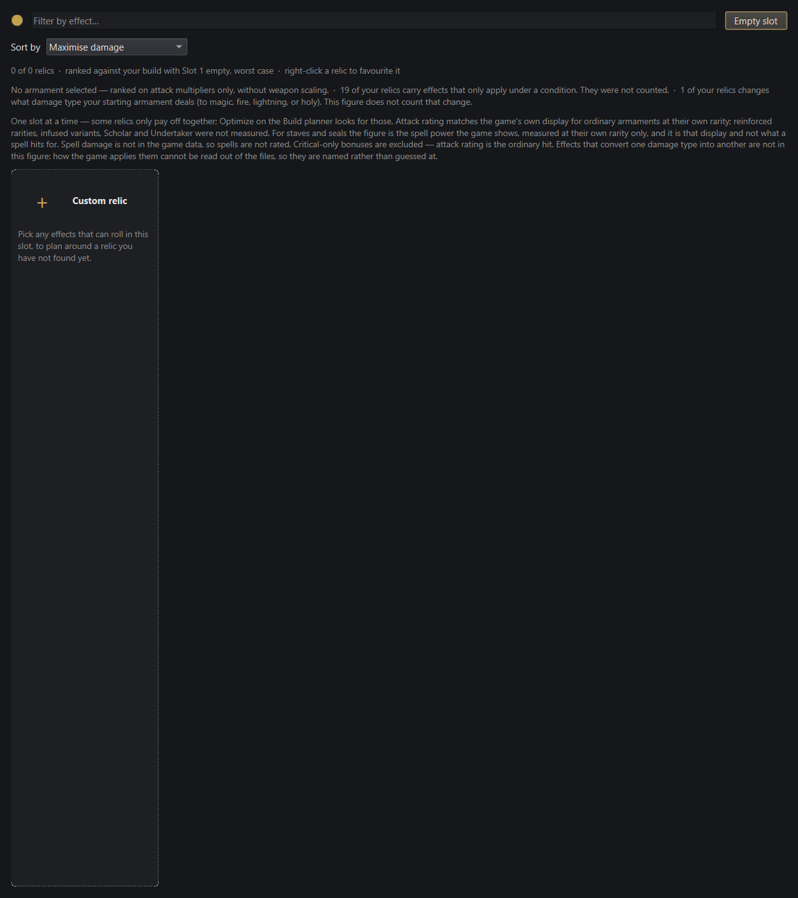

### DR-023 — Statuszeile nur per Maus-Hover vollstaendig lesbar, keine Tastatur-/Screenreader-Route ✔ behoben (T-234, 2026-09-13)

**Status (T-239c, 14.09.2026): behoben, Retest bestanden.** Gebaut in T-230
(`781ce3c`), Retest in T-234 bestaetigt: `qa/findings.md` QA-252 „bestaetigt …
behoben — Retest bestanden", primaerquelle `docs/state.md` (s. DR-022). Nicht
selbst am laufenden Fenster wiederholt gemessen; die Bestaetigung stammt aus
dem primaeren QA-Register. ID bleibt stehen, Befund unten unveraendert als
Beleg der urspruenglichen Luecke.

**Wichtig — Accessibility-Luecke neben einer bereits getroffenen
Entscheidung.** [`nrplanner/advisorbar.py:451-491` (`_ElidingLabel`)]

AK-05/AK-194 erlauben ausdruecklich, dass die Statuszeile bei der
abgeleiteten Startbreite schrumpft und ihren vollen Text nur im Tooltip
traegt — das ist eine bereits getroffene, von mir nicht in Frage gestellte
Design-Entscheidung (A31/A32) und **haelt**: real gemessen bei
`opening_width=1608`, `status_width=67` in **beiden** Zustaenden (Ruhe:
„Nothing s…", Vorschlag: „Maximise …") — genau der Wert, den A32/T-225
nennen, > 0 px, Tooltip traegt den vollen Satz.

Was die Spec nicht regelt und der Code nicht abfaengt: `_ElidingLabel` ist
ein `QLabel` mit `focusPolicy() == Qt.NoFocus` und leerem
`accessibleName()`/`accessibleDescription()` (gemessen,
`check_status_focus.py`). Ein `QLabel` ohne eigenen `accessibleName` meldet
sich bei Qts Barrierefreiheits-Bruecke mit seinem `text()` — hier also mit
dem **elidierten** String, nicht mit `whole_text()`. Ein Tastaturnutzer kann
das Feld nicht fokussieren (kein Tab-Stop, `NoFocus`), ein Screenreader liest
den abgeschnittenen Text vor. Der volle Satz ist **ausschliesslich per
Maus-Hover** erreichbar — bei 67 px ist das ein Wort plus Ellipse, in vielen
Faellen der einzige Hinweis, ob der letzte Optimize-Lauf ueberhaupt etwas
gefunden hat.

**Loesungsrichtung:** `setAccessibleName`/`setAccessibleDescription` auf
`whole_text()` pflegen (auch wenn `text()` elidiert ist), und/oder
`focusPolicy` auf `Qt.TabFocus` heben, damit `QToolTip` auch per Tab plus
"was ist das"-Taste (oder Qt-Standard: fokussierte Tooltips) erreichbar wird.
Kein Eingriff an der Breiten-Entscheidung selbst.


### Nice-to-have

- **DR-024** [`advisorbar.py`, `_ElidingLabel`] Selbst fuer sehende
  Maus-Nutzer bleibt bei der abgeleiteten Startbreite von der Statuszeile nur
  ein Wort plus Ellipse sichtbar (67 px, s. DR-023) — die Zeile existiert, um
  auf einen Blick zu sagen, was zuletzt passiert ist, und genau das leistet
  sie bei dieser Breite nicht mehr, ohne dass ein Verstoss gegen AK-05/AK-194
  vorliegt. Anregung, kein Kurswechsel: ein schmales Erfolgs-/Fehler-Symbol
  neben `Optimize`, unabhaengig von der Textbreite, koennte den
  Auf-einen-Blick-Zweck zurueckgeben, ohne die getroffene Breiten-Entscheidung
  anzutasten. Frage an den App Designer, keine an die Umsetzung.

### Backlog (geparkt)

- AK-189-Haelfte (21/22-Zeilen-Worst-Case je Lesart) nicht am realen
  Spielstand nachgemessen — Zeitbudget dieses Laufs reichte nur fuer die
  Slotgruppen, die der reale Optimize-Lauf tatsaechlich zeigte (3 Zeilen je
  Slot); 4.14 (Umbruch statt Kuerzung) hielt dort, wo gemessen wurde.
  Empfehlung an den naechsten Durchlauf: gezielt den Slot mit der laengsten
  Fluch-/Effektliste des jetzigen 314er-Bestands warm bauen und bei der
  abgeleiteten Startbreite (1608 px) nachmessen.

### Positiv / beibehalten

- **AK-182** haelt exakt: Lesart-Box zwischen Zielwahl und `Optimize`,
  genau `Worst case`/`Best case`, `Worst case` voreingestellt (real
  ausgelesen).
- **AK-183** haelt: Umschalten der Lesart waehrend eines lebenden Vorschlags
  verwirft ihn sofort (`Apply all`/`Why`/`Clear` verschwinden,
  Statuszeile faellt auf „Nothing suggested yet.", Breite springt von
  67 auf 325 px) — kein neuer Zustand, derselbe Code-Pfad wie ein
  Zielwechsel.
- **AK-184/185/186** halten am realen Optimize-Lauf: die Lesart steht in
  genau vier Nennungen (Bedienelement, Vorschlagsblock-Kopf „SUGGESTED —
  MAXIMISE DAMAGE, WORST CASE", `Why`-Dialog-Kopf, Picker-Zusammenfassung),
  keine Zahl doppelt unter zwei Lesarten gezeigt, erklaerte Bedingungen
  (`declared`) unangetastet.
- **AK-268** haelt: ohne Spielstand sind Zielwahl, Lesart-Box und `Optimize`
  gemeinsam deaktiviert (real geprueft, alle drei `isEnabled() == False`).
- **AK-264** haelt buchstabengetreu: beide E1-Headlines und die dritte
  Zeile exakt wie spezifiziert, sauberer Umbruch, kein abgeschnittener Text,
  Standardknopf `Choose a different folder...` fokussiert.
- **AK-51/AK-196/AK-266** halten am echten 314-Relikte-Bestand: keine
  waagerechte Bildlaufleiste, drei volle Kartenzeilen sichtbar (mehr als die
  geforderten zwei).
- **AK-05/AK-194** reproduziert: abgeleitete Startbreite real 1608 px,
  Statuszeile 67 px in Ruhe- und Vorschlagszustand, > 0 px, deckt sich exakt
  mit A32/T-225 — keine Regression.

---

## Review vom 2026-09-12 (T-207 — der Relic Picker mit drei Zielrichtungen, plus QA-239)

**Methode:** Live, am laufenden Fenster, **kein Screenshot vom Bildschirm** —
jedes Bild ist `QWidget.grab()` auf das eigene Dialog-/Fensterobjekt (rendert
aus Qts eigenem Zeichensystem, beruehrt den Bildschirm nie; strenger als
`PrintWindow`, erfuellt NH-002/L-012 mit Marge). Echter `Planner` mit dem
Spielstand des Nutzers, echtem `RelicPicker`, gebaut aus dem festen Testabzug
(841 Dateien, `EXTRACT_VERSION` 11) — **in** das umgelenkte `LOCALAPPDATA`
kopiert, nicht darauf verwiesen. Alle drei Variablen vor dem ersten
`nrplanner`-Import gesetzt und einzeln nachgewiesen (siehe unten). Stil
`fusion` mit der dunklen Programm-Palette (`app.apply_appearance`), kein
`QT_QPA_PLATFORM=offscreen` (L-009). Screenshots:
`design-review/2026-09-12/`.

**Nachweis der Umlenkung (positiver Pfadnachweis, kein Ruecklese-Nachweis —
QA-237):**
```
settings fileName: \HKEY_CURRENT_USER\Software\DankYeeterT-207\NightreignHelper
cache_dir:         …\scratchpad\T-207\data\Local\NightreignHelper
style:              fusion
data_version:       10350000  extract_version: 11
```
Skripte: `…/scratchpad/T-207/open_picker.py`, `measure_picker.py`,
`measure_chips.py`.

**Messumgebung (L-009):** Windows 11, Fusion-Stil/dunkle Palette, Segoe UI
9 pt, Bildschirm 4096×1728 **logische** px, `devicePixelRatio` 1,25 — jede
px-Zahl unten ist **logisch**, wie `UI_SPEC.md` §5.4 es selbst verlangt; die
gesicherten PNGs sind **physisch** (1,25×, z. B. 1280×1326 fuer eine
1024×1061-logische Ansicht) und im Dateinamen nicht verwechselbar gemacht.
Save/Slot/Richtung wie in `UI_SPEC.md` §5.4 Stichprobe S2: gelber Slot 1,
Wylder, 56 Karten (inkl. Custom-Kachel), gelesen `Maximise damage`.
**Positivkontrolle:** Fuehrende Gruppen 2 (Damage) / 1 (Survival) / 3
(Attribute) = 6 fuehrende Karten — exakt die Zahlen aus `UI_SPEC.md`s eigener
Tabelle zu AK-261 fuer S2. Eine Messumgebung, die diese vier Zahlen nicht
reproduziert, misst etwas anderes als die Vorlage.

**Geprueft:** der Relic Picker mit allen drei Zielrichtungen (AK-256 bis
AK-263) am echten, gebauten Programm — Oeffnungszustand, sechs vorgezogene
Karten, drei staendige Wertzeilen, Chip-Zuordnung, Favoritisierung und deren
Wirkung auf den Chipstreifen, sowie eine erneute, unabhaengige Messung von
QA-239. **Nicht erneut geprueft:** die sechs Inhalts-Tabs aus dem
2026-09-05-Durchlauf (DR-013 bis DR-018) — nichts an ihnen hat sich seit
damals geaendert, der Auftrag nennt sie nicht, und ihr Status ist in
`qa/findings.md` nirgends als behoben gefuehrt; sie gelten unveraendert
offen, bis sie erneut angefasst werden.

**Gesamturteil:** Fast fertig. Der Bau der dritten Zielrichtung trifft seine
eigene Vorgabe auffallend genau — AK-261/AK-262/AK-258/AK-259 halten alle
Zahl fuer Zahl, wie unten belegt. Was fehlt, ist nicht im Picker selbst,
sondern in zwei Bereichen daneben: QA-229 (Chip-Abschneidung) bleibt offen
und wird durch die dritte Richtung **sichtbar exponierter**, nicht rechnerisch
schlimmer; und die eigene `UI_SPEC.md`-Zahl zu `wanted_height` (QA-239) ist
nach dieser zweiten, unabhaengigen Messung **nicht** einfach falsch und jetzt
richtig — sie ist über drei Messlaeufe hinweg drei verschiedene Werte, und
das ist der eigentliche Befund.

---

### QA-239 nachgemessen — zwei unabhaengige Messungen stimmen nicht ueberein

**Nicht "1136 war falsch, 1121 ist richtig".** Ich habe dieselbe Groesse mit
zwei verschiedenen, beide legitimen Lesarten gemessen und **beide**
weichen von den bisher genannten Zahlen ab:

| Lesart | Wert | Quelle |
|---|---|---|
| `UI_SPEC.md:2230` (T-192, Vorabschaetzung) | 1136 px | Rechnung vor dem Einbau |
| T-199 (12.09.2026), reales Fenster | 1121 px | Bericht `docs/berichte/T-199-developer.md` |
| **Diese Messung: `dialog.wanted_height(cards)` selbst aufgerufen** | **1151 px** | `measure_picker.py`, `_fit_to_three_rows` gepatcht, Argument abgegriffen |
| **Diese Messung: `dialog.height()`, ungezwungen, nach `_refresh()`** | **1061 px** | dieselbe Session, ohne manuellen `resize()` |

Die berechnete Zahl (1151) trifft nicht meinen eigenen `dialog.height()`
(1061) — 90 px Differenz, obwohl der Code selbst `if wanted > self.height():
self.resize(self.width(), wanted)` ausfuehrt und das nachweislich passiert
(vor dem Aufruf 1061, `wanted`=1151>1061, Bedingung wahr), **aber** unmittelbar
nach dem `resize()`-Aufruf steht `dialog.height()` wieder auf 1061, nicht auf
1151 (mit `processEvents()` mehrfach abgeklopft, keine spaetere Aenderung).
Interessant: 1151 ist exakt die Zahl, die `UI_SPEC.md:2231` fuer „Hoehe des
Dialogs" (nicht fuer `wanted_height`) fuehrt — meine Rechnung deckt sich also
mit der **falschen** Zeile der eigenen Tabelle.

**Was haelt: AK-196 selbst.** Bei der tatsaechlichen, ungezwungenen Hoehe
(1061 px) sind drei ganze Kartenzeilen zu sehen, keine waagerechte
Bildlaufleiste, eine vierte Zeile beginnt sichtbar am unteren Rand (Beleg
unten) — funktional unveraendert gegenueber T-199s Urteil, nur bei einer
anderen Zahl gemessen.

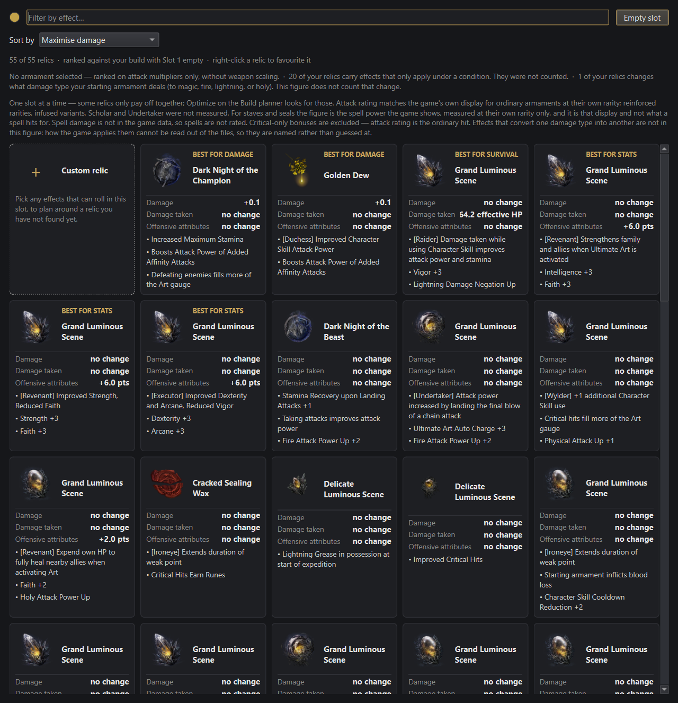


**Einordnung:** kein Nutzerschaden heute — AK-196 haelt bei jeder der vier
genannten Zahlen. Der Befund ist, dass **dieselbe Groesse auf derselben
Maschine in vier Messlaeufen vier verschiedene Werte ergeben hat**
(1136/1121/1151/1061), zwei davon (meine) aus derselben Sitzung. Eine
Vorgabe, die eine einzelne px-Zahl fuehrt und für bare Muenze nimmt, jagt
damit einer Zahl hinterher, die nicht stillsteht — das ist ein staerkerer
Befund als ein einfacher Zahlendreher, und ich korrigiere die Tabelle
deshalb nicht auf einen fuenften Einzelwert, sondern trage das Messproblem
selbst ein (`UI_SPEC.md:2230`, Nachtrag unten).

**DR-019 [`nrplanner/relicpicker.py:1170-1192` (`_fit_to_three_rows`),
`UI_SPEC.md:2230`]** *Nice-to-have, weil ohne heutigen Nutzerschaden — aber
kein Politur-Punkt: eine Zahl, der niemand zweimal hintereinander traut, ist
ein Dokumentationsrisiko.* Der interne `resize()`-Aufruf in
`_fit_to_three_rows` erreicht nachweislich nicht die von derselben Funktion
berechnete Zielhoehe (1151 vs. 1061 px, diese Messung); ob das an
`heightForWidth()` vor vollstaendiger `ensurePolished()`-Politur liegt, an
einer Layout-Rueckstellung durch die `QScrollArea`, oder an etwas drittem,
habe ich nicht weiter verfolgt — das ist eine Code-Frage, keine
Vorgabenfrage. **Loesungsrichtung:** ein Test, der `dialog.height()` nach dem
echten `_refresh()`-Lauf gegen `dialog.wanted_height(cards)` haelt (nicht nur
gegen `MINIMUM_ROWS`, wie es `test_the_height_the_picker_asks_for_shows_three_whole_rows`
heute tut, das die Groesse **von Hand** erzwingt und die Abweichung deshalb
nicht sehen kann), wuerde diese Klasse von Drift in Zukunft fangen, bevor der
Puffer zwischen berechneter und tatsaechlicher Hoehe aufgebraucht ist und
AK-196 tatsaechlich reisst.

---

### Der Bau der drei Richtungen selbst — praezise gegen die eigene Vorgabe

**Positiv/beibehalten.** Unabhaengig nachgemessen und bestaetigt, ohne
Abweichung:

- **AK-261 (sechs fuehrende Karten):** 2 (Damage) + 1 (Survival) + 3
  (Attribute) = 6, exakt wie `UI_SPEC.md` es fuer S2 vorhersagt. Karten:
  `Dark Night of the Champion`, `Golden Dew` (Damage); `Grand Luminous Scene`
  (Survival); drei verschiedene Kopien von `Grand Luminous Scene`
  (Attribute) — direkt aus dem Gitter gelesen, nicht aus dem Screenshot
  abgezaehlt.
- **AK-262 (Chip nennt die eigene Richtung):** alle sechs fuehrenden Karten
  tragen einen Chip, keine unbeschriftete Karte in der vorgezogenen Reihe —
  der Zustand, den AK-195 fuer sich beansprucht hatte, aber laut AK-262 nicht
  einloeste, haelt jetzt.
- **AK-258 (drei staendige Wertzeilen):** jede der 55 Karten zeigt `Damage`,
  `Damage taken`, `Offensive attributes` in genau dieser Reihenfolge, auch
  wo der Wert `no change` ist — keine Karte mit nur zwei Zeilen gefunden.
- **AK-259 (Beschriftung/Einheit der dritten Zeile):** `Offensive attributes
  +6.0 pts` u. ae., wie vorgeschrieben, ohne sichtbare Kuerzung.

### QA-229 — offen, unveraendert in der Zahl, exponierter in der Wirkung

**DR-020 [`nrplanner/relicpicker.py:2364-2377` in `UI_SPEC.md` (AK-262-Notiz),
QA-229]** Nachgemessen mit drei favoritisierten fuehrenden Karten (je eine
pro Richtung, echter Nightfarer `Wylder`, echte Favoriten-Einstellung):

| Chip | Streifen | benoetigt | Ergebnis |
|---|---|---|---|
| `BEST FOR DAMAGE` | 79 px | 91 px | **abgeschnitten** |
| `BEST FOR SURVIVAL` | 79 px | 95 px | **abgeschnitten** |
| `BEST FOR STATS` | 79 px | 76 px | passt, 3 px Luft |

Deckungsgleich mit den Zahlen, die T-192 schon fuer die beiden alten Chips
gefunden hatte, und mit AK-262s eigener Vorabrechnung fuer den neuen — **die
Zahl ist nicht schlimmer geworden**, `BEST FOR STATS` reisst die 79-px-Grenze
nicht.

**Aber die Frage des Auftrags war nicht die Zahl, sondern die Wirkung, und
die ist schlechter:** im selben Bild stehen jetzt drei favoritisierte,
vorgezogene Karten nebeneinander, von denen eine **sauber lesbar** ist
(`BEST FOR STATS`) und zwei **mitten im Wort** abbrechen (`BEST FOR DAMA`,
`BEST FOR SURVI`). Vorher gab es in diesem Streifen kein funktionierendes
Gegenbeispiel in Sichtweite — jetzt schon, und der Kontrast macht den Fehler
auffaelliger, nicht unauffaelliger. Dazu kommt: sechs statt vormals bis zu
drei Karten stehen vorgezogen da, und jede davon ist ein natuerlicher
Favoriten-Kandidat (das ist der Zweck der Vorziehung) — die Flaeche, auf der
ein Spieler auf den Fehler trifft, ist grösser geworden, ohne dass QA-229
selbst sich veraendert haette.

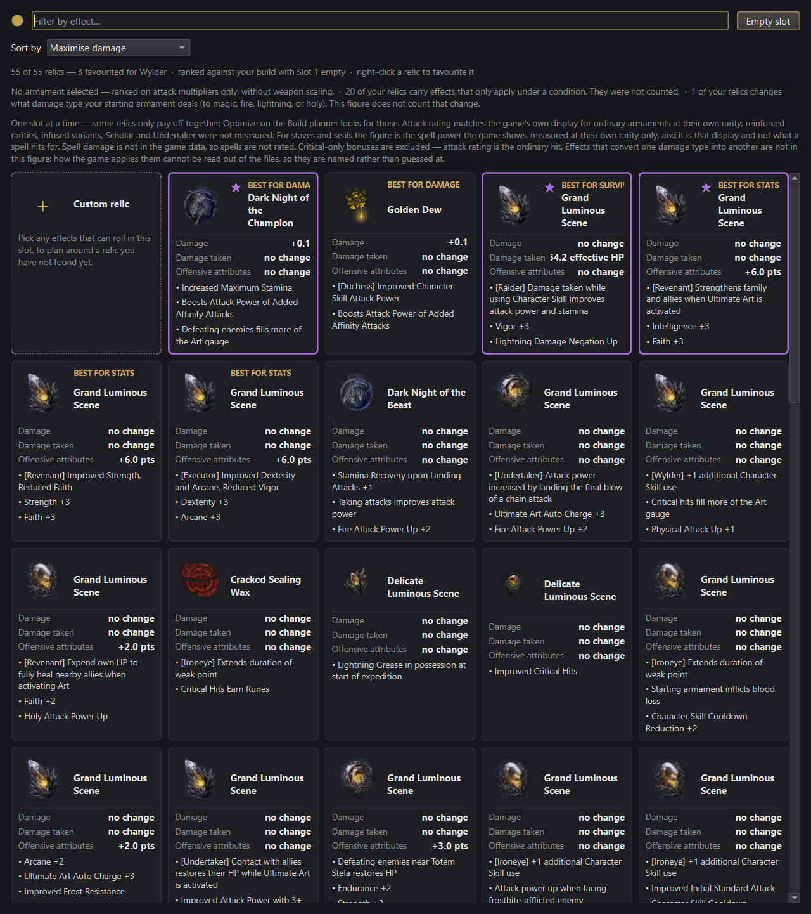

**Einordnung:** bestaetigt QA-229 (P2/Major, offen, Zustaendigkeit
`developer`) unveraendert in der Kennzahl; die Verschaerfung ist eine
Sichtbarkeits-, keine Rechenfrage, und rechtfertigt keine eigene neue
QA-Nummer — sie gehoert als Kontext an QA-229 selbst.

### Offene Frage an den App Designer

**DR-021** Sechs vorgezogene Karten statt drei — wie vom App Designer am
12.09.2026 entschieden (AK-261) — bedeuten in der gemessenen Stichprobe
(S2), dass **drei der sechs fuehrenden Karten denselben Namen tragen**
(`Grand Luminous Scene`, dreifacher Gleichstand bei +6,0 Offensiv-Punkten,
AK-45-konform markiert). Ein Spieler, der die vorgezogene Reihe ueberfliegt,
um schnell "die beste Karte je Richtung" zu finden, sieht in der
Attributs-Gruppe drei optisch fast identische Karten (gleicher Titel, gleiche
`+6.0 pts`-Zahl, unterscheidbar nur an den Stichpunkt-Effekten) — genau die
Art Verwechslungsgefahr, die AK-46/AK-262 fuer den Chip selbst schon einmal
loesen mussten (Chip statt Position als Erklaerung), hier aber auf
Kartenebene erneut auftritt. Zwei legitime Richtungen, keine davon von mir
entschieden:

1. **So lassen** — die Wertzeilen selbst unterscheiden die drei Karten
   korrekt (nur eben nicht auf den ersten Blick über den Titel), und
   Gleichstand ist ein echtes Spielfakt, keine Anzeige-Erfindung.
2. **Innerhalb einer Gleichstandsgruppe zusaetzlich nach den Stichpunkt-Zeilen
   sortieren oder gruppieren**, damit gleichnamige Karten nicht zufaellig
   nebeneinanderstehen, sondern erkennbar als Gruppe — ein Eingriff in die
   Ordnung, die AK-44 heute bewusst nicht erfindet.

Das ist eine Geschmacks-/Produktentscheidung ohne objektiv richtig/falsch
(genau der Fall, den der Auftrag mit "als Nutzer fragen" meinte), keine
eigene Vorgabe von mir.

---

## Review vom 2026-09-05 (T-056 — Sichtpruefung der sechs Inhalts-Tabs am laufenden Fenster)

**Methode:** Live, am laufenden Fenster (`.venv\Scripts\python.exe run.py`,
Titel `Nightreign Helper 1.7.1`), echte Spieldaten. Tabwechsel und
Sucheingabe ueber `UIAutomationClient` (`SelectionItemPattern`,
`ValuePattern`), Kartenklick per `SendMessage`, Screenshots nach
`SetProcessDPIAware()`. Bildschirm 2560x1600 physisch bei 150 % Skalierung.
Zusaetzlich headless gemessen (`QT_QPA_PLATFORM=offscreen`): Spaltenbreiten
der Effektetabelle bei drei Fensterbreiten und `minimumSizeHint()` aller
sieben Tab-Seiten. Screenshots: `docs/screenshots/2026-09-05-T056/`.

**Geprueft:** alle sechs Inhalts-Tabs beim Erstoeffnen, dazu `Weapons &
spells` mit Suche `Longsword` (aufgeklappt) bei 1250 / 1600 / 2100 px,
`Nightlords` mit Detailpanel (Gladius) bei 1600 und 2100 px, `Deep of Night`
mit sichtbarer Unterkante, `World Events` mit Detailpanel. **Nicht geprueft:**
`Build planner` (ausgenommen), Dark/Light-Umschaltung (das Programm hat
keine), die Inhaltswahrheit der Zahlen (das ist T-055).

**Verhaeltnis zu T-052 (Stabilitaetsregel):** T-052 hielt fest, ausserhalb
DR-008/DR-009 sei „nichts abgeschnitten, ueberlappt oder unlesbar". Das galt
fuer den damals geprueften Bereich — `Build planner`, Waffen-Slot-Kacheln,
Arsenal-Suche. Die vier Befunde unten liegen **ausserhalb** dieses Bereichs,
in den sechs Inhalts-Tabs, die T-052 nicht geoeffnet hat. Kein Kurswechsel,
sondern ein neuer Geltungsbereich.

**Gesamturteil:** Braucht Arbeit. Zwei der vier Befunde sind kritisch, weil
sie Inhalt **unerreichbar** machen, nicht nur haesslich: zwei von zehn
Nightlords sind bei der ueblichen Fensterbreite nicht sichtbar, und alle 652
Effektnamen sind es nicht. Beides ist Layout, kein Datenmangel — bei
groesserem Fenster erscheint alles. Die Vorgaben dazu stehen in `UI_SPEC.md`,
Abschnitt T-056, AK-68 bis AK-105.

### Kritisch

- **DR-013 ✔ behoben (T-236, 2026-09-14, `d5b2035`)** — am Fenster bestaetigt:
  10/10 Karten, Raster 4+4+2, kein waagerechter Bildlauf mehr (Beleg
  `docs/berichte/T-236-developer.md`). Befund unten unveraendert als
  Ursachenbeleg.

  **[`nrplanner/bosstab.py:35` (`COLUMNS = 4`), `:288`
  (`setFixedWidth(330)`), `:263-277` (`QHBoxLayout`), AK-90/AK-72]** Der
  `Nightlords`-Tab zeigt bei 1600 px Fensterbreite **acht von zehn**
  Nightlords, waehrend seine eigene Kopfzeile „10 Nightlords" sagt. Spalte 3
  (Gnoster, Caligo) bricht mitten im Blurb ab („a flying insect and living
  shears t…"), Spalte 4 — **Maris** und **Harmonia** — ist vollstaendig
  unsichtbar. Ursache ist ein fest verdrahtetes 4-Spalten-Raster neben einem
  Detailpanel fester Breite in einer `QHBoxLayout`; es gibt keinen Splitter,
  den der Nutzer verschieben koennte. Bei 2100 px erscheinen beide Karten —
  Beleg, dass es Layout ist und nicht Daten. Die waagerechte Bildlaufleiste,
  ueber die Spalte 4 theoretisch erreichbar waere, sitzt an der Unterkante
  des Tabs und liegt auf diesem Bildschirm hinter der Taskleiste (DR-015).
  **Loesungsrichtung:** Spaltenzahl aus der verfuegbaren Breite rechnen und
  nie eine Karte teilweise zeichnen (AK-72); wenn das Detailpanel bleiben
  soll, gehoert es in einen `QSplitter` mit Mindestbreite fuer beide Seiten.
  
  

- **DR-014 ✔ behoben (T-236, 2026-09-14, `0f270d8`)** — am Fenster bestaetigt:
  `Effect` 353 px, `What it does` 287 px, jetzt die breitesten Spalten der
  Tabelle, Rest per Tooltip nach AK-77 (Beleg
  `docs/berichte/T-236-developer.md`). Befund unten unveraendert als
  Ursachenbeleg.

  **[`nrplanner/effectstab.py:243-245, 445-447`, AK-77]** In der
  Effektetabelle bekommen die beiden Spalten, die die Frage des Tabs
  beantworten, zusammen **2,8 % der Tabellenbreite**. Gemessen an einer
  echten `EffectsTab` bei 1516 px Tabellenbreite: `Effect` **22 px**,
  `What it does` **21 px** — und **652 von 652** Effektnamen sowie 652 von
  652 Beschreibungen sind breiter als ihre Zelle. Auf dem Bildschirm lesen
  sich vier aufeinanderfolgende Zeilen als `Successful …`, `Successful …`,
  `Successful …`, `Successful …` und sind nicht auseinanderzuhalten. Die
  restlichen 1473 px gehen an Spalten mit sehr wenig Information: `Colours`
  295 px fuer 10 verschiedene Zeichenketten (491 Zeilen zeigen dieselbe),
  `Stacking` 343 px fuer 9, `Comes with curse` 214 px fuer 4 (302 leer),
  `Copies` 94 px fuer eine Spalte, die 638-mal `1` zeigt. Ursache:
  `resizeColumnsToContents()` bedient erst die neun Inhaltsspalten, danach
  bekommen die beiden `Stretch`-Spalten, was uebrig ist — und uebrig ist
  nichts. Selbst bei 2356 px sind noch 333 Namen elidiert.
  **Loesungsrichtung:** die Prioritaet umkehren — `Effect` und
  `What it does` zuerst bedienen (AK-77 nennt 320 bzw. 260 logische px als
  Untergrenze), die uebrigen Spalten deckeln, und die informationsarmen
  Spalten verkuerzen oder streichen (Streichvorschlaege in `UI_SPEC.md` §8).
  

### Wichtig

- **DR-015 ✔ behoben (T-236, 2026-09-14, `82cb18a`)** — am Fenster bestaetigt:
  `Deep of Night` in einer `QScrollArea`, Fenster-Minimum jetzt 588 px
  logisch statt vorher 1606 physisch (Beleg
  `docs/berichte/T-236-developer.md`). Befund unten unveraendert als
  Ursachenbeleg.

  **[`nrplanner/deeptab.py` (keine `QScrollArea`, `:162`
  `setFixedHeight`), AK-71/AK-97]** Das Fenster hat eine Mindesthoehe von
  **1606 physischen px** (gemessen: `MoveWindow` auf 500/700/1000/1300 px
  Hoehe laesst das Fenster jedes Mal bei 1606). Der Bildschirm ist 1600 px
  hoch, die Arbeitsflaeche nach Taskleiste ~1552. Verursacher ist **ein
  einziger Tab**: `Deep of Night` meldet `minimumSizeHint().height() = 949`
  logische px, die anderen fuenf melden 111 bis 443 — der Tab stapelt vier
  Tabellen mit fester Hoehe ohne Scrollbereich, und `QTabWidget` gibt das
  Maximum an das ganze Fenster weiter. Folge auf diesem Bildschirm: die
  letzten beiden Erklaerzeilen des Tabs („The cursed-relic rates do not move
  with depth.", „Read from the game's own depth table.") sind nie sichtbar
  und **nicht scrollbar erreichbar**; zugleich liegt jede Bildlaufleiste an
  der Unterkante eines Tabs hinter der Taskleiste (das ist der zweite Teil
  von DR-013).
  **Loesungsrichtung:** den Inhalt von `Deep of Night` in eine
  `QScrollArea` legen und die festen Tabellenhoehen aufgeben. Das ist ein
  Ein-Tab-Fix mit Fenster-weiter Wirkung.
  
  

- **DR-016 ✔ behoben (bereits am 05.09.2026, `a39d58f`; Retest T-237,
  2026-09-14)** — am Fenster bestaetigt: (a) 0 von 92 sichtbaren Kacheln
  abgeschnitten, kein Bildlauf mehr noetig; (b) 135 mehrgruppige Werte, 46
  umgebrochen, 0 Gruppen breiter als ihr Label, Umbruch ausschliesslich an
  ` · ` (Beleg `docs/berichte/T-237-developer.md`). Befund unten unveraendert
  als Ursachenbeleg.

  **[`nrplanner/arsenaltab.py:15` (`COLUMNS = 5`), `:44`
  (`CARD_WIDTH`), `:88-97` (Wertzeile), AK-84/AK-73]** Zwei Blessuren an
  derselben Kachel. **(a)** Das Kachelraster hat fest fuenf Spalten; die
  letzte wird abgeschnitten, und weil die Werte rechtsbuendig stehen,
  verschwinden **die Zahlen zuerst**: auf der abgeschnittenen Kachel steht
  `AR`, `Physical`, `Magic` — ohne einen einzigen Wert. Reproduziert bei
  1600 px (5. Spalte) und 1250 px (4. Spalte). **(b)** Ein langer Wert bricht
  mitten im Begriff um: `STR -7 · ARC +45 · DEX` endet die Zeile, `-7` steht
  allein auf der naechsten. Das ist dieselbe Klasse wie DR-009, eine Zeile
  tiefer — und es trifft ausgerechnet die Kachel, die ich in T-052 als
  Vorbild gegen DR-009 gelobt habe. Das Lob war fuer den kurzen Wert
  (`Spell power` / `145`) richtig und **taugt nicht als allgemeine Regel**;
  AK-73 ersetzt es.
  **Loesungsrichtung:** Spaltenzahl aus der Breite (AK-72); Wertzeilen nur
  zwischen `·`-Gruppen umbrechen, nie innerhalb einer.
  
  

### Nice-to-have

- **DR-017 [`nrplanner/arsenaltab.py:139, 297-303`, AK-83]** `Weapons &
  spells` oeffnet mit drei zugeklappten Ueberschriften und rund 95 % leerer
  schwarzer Flaeche: der Tab mit den meisten Daten des Programms (1 952
  Eintraege) sieht beim ersten Blick leer aus. Der Code loest genau dieses
  Problem bereits fuer den Suchfall („'14 shown' behind three collapsed
  headings … made searching feel broken") und zieht den Erstzustand nicht
  nach. **Loesungsrichtung:** mindestens einen Abschnitt aufgeklappt starten.
  

- **DR-018 [`nrplanner/depthstab.py:87-88`, `nrplanner/eventlore.py` u. a.,
  AK-75]** Zwei Gedankenstrich-Stile nebeneinander: 23 String-Literale in den
  sieben Tab-Modulen enthalten ` -- `, 24 enthalten `—`, und beide Sorten
  erscheinen auf dem Bildschirm — der `Red variants`-Tab zeigt „individual
  empowered enemies -- the same enemy", der Nachbartab „Lasts the rest of the
  expedition — not consumed". **Loesungsrichtung:** `—` ueberall in
  angezeigten Zeichenketten.

### Backlog (geparkt)

- Unter 1250 physischen px wird die **Tab-Leiste selbst** scrollbar (Pfeile
  ◀ ▶ statt der letzten zwei Reiter). Fensterbefund, nicht Tab-Befund;
  gehoert in einen eigenen Auftrag.
- Der `Nightlords`-Tab laesst links viel leere Flaeche unter den Karten,
  waehrend das rechte Detailpanel scrollen muss. Raumaufteilung, kein Fehler.
- `Could not parse stylesheet of object QListWidget(...)` — weiterhin nicht
  erneut geprueft.

### Positiv / beibehalten

- **`Deep of Night` ist das gestalterische Vorbild der sechs.** Vier
  Ueberschriften, die je eine Spielerfrage benennen (`WHAT EACH DEPTH IS
  WORTH`, `HOW MUCH TOUGHER ENEMIES GET`, `WHAT MOVES YOUR RATING`, `WHAT
  ELSE CHANGES WITH DEPTH`), darunter je eine Tabelle und je eine ruhige
  Erklaernote, dazu eine eigene Herkunftszeile („The only figures on this tab
  the game's own data does not state …"). Das Muster wird mit AK-68 auf alle
  sechs uebertragen und darf dabei **nicht** verwaessert werden.
- **Der `Red variants`-Tab traegt die beste Bezugsgroessen-Zeile des
  Programms**: „The figures are how many red variants of each sort a run puts
  on the selected map." Eine Zahl mit Einheit **und** Geltungsbereich, in
  einem Satz. AK-98 laesst sie ausdruecklich unangetastet.
- **`World Events` trennt Herkunftsklassen sichtbar und benennt die
  Trennung**: blaue Zeilen sind community-berichtet, alles andere sind
  Spieldaten, und der Kopfsatz sagt das. Das ist die einzige Farbrolle der
  sechs Tabs, die heute schon eine Legende hat — AK-74 macht daraus die
  Regel.
- **Die Nightlord-Karten-Portraits sind die staerkste gestalterische Idee des
  Programms:** ein Kreis, diagonal geteilt, links die normale, rechts oben
  die Everdark-Fassung — und die Kopfzeile erklaert die Teilung in einem
  Halbsatz. Bild und Erklaerung an einem Ort; das bleibt.

### Offene Fragen an den App Designer

Gesammelt in `UI_SPEC.md`, Abschnitt T-056, §10 — fuenf Stueck, davon die
beiden aus dem Auftrag (`Avg chance`, `Pools`) und dreizehn
Streichvorschlaege in §8.

---


## Review vom 2026-09-05 (T-052 — was die beiden Kalibrierungen am Bildschirm anrichten)

**Methode:** Live, am laufenden Fenster (`.venv\Scripts\python.exe run.py`),
echte Spieldaten und ein echter Snapshot dieses Rechners. Das Fenster war in
diesem Durchlauf zum ersten Mal seit 2026-09-01 tatsaechlich sichtbar und
fokussierbar — die als Bestand gefuehrte Einschraenkung „Fenster nie
fokussierbar" gilt fuer **diese** Sandbox-Instanz nicht mehr; siehe
Methodennotiz unten. Bedienung ueber `UIAutomationClient` (Invoke/Select/
SetValue auf echte Steuerelemente) statt Maussimulation, weil eine parallel
laufende, fokus-stehlende Anwendung auf demselben Desktop rohe
Cursor-Klicks wiederholt auf das falsche Fenster lenkte — dokumentiert, weil
es die Interaktionsmethode erklärt, ohne den Befund zu betreffen.
Screenshots unter `docs/screenshots/2026-09-05/`.

**Methodennotiz, damit sie nicht verloren geht:** Ein erster Rundgang bei
1600×1000 bzw. maximiert zeigte das dritte Panel (Waffenschaden, sechs
Kacheln) und die Ecken-Werkzeugleiste (`UI scale`, `Reset layout`) als
**vollstaendig verschwunden** — reproduzierbar bei mehreren Fenstergroessen,
auch nach `Reset layout` per Accessibility-Invoke. Das sah nach einem
kritischen Layout-Defekt aus. Nachpruefung ergab: **Artefakt der eigenen
Screenshot-Methode**, nicht des Programms. Der PowerShell-Prozess, mit dem
Screenshots erzeugt wurden, war nicht DPI-aware; bei 150 % Skalierung
(physisch 2560×1600, virtualisiert 1707×1067) lieferte
`CopyFromScreen` einen Ausschnitt, in dem die rechte Fensterhaelfte ausserhalb
lag, waehrend das Programm selbst korrekt bis zum echten Fensterrand
zeichnete. Nach `SetProcessDPIAware()` verschwand der Effekt vollstaendig,
bei jeder getesteten Fenstergroesse inkl. maximiert (Beleg:
`docs/screenshots/2026-09-05/build-planner-overview.png`, alle drei Panels
und die Ecken-Werkzeugleiste sichtbar). **Kein DR-Eintrag, kein Fund am
Programm** — hier vermerkt, damit ein kuenftiger Durchlauf in derselben
Sandbox nicht denselben Fehlschluss zieht, und in der Rollen-Erinnerung
festgehalten (`SetProcessDPIAware` vor jedem Screenshot/jeder
Fensterkoordinate in dieser Umgebung).

**Geprüfte Bereiche:** Build-planner-Panel (Relic slots, Waffenschaden-Panel,
sechs Waffen-Slot-Kacheln), Arsenal-Tab (`Weapons & spells`, Kachelraster und
Zusammenfassungszeile), `WeaponDialog`-Auswahl, die sechs offenen Fragen aus
`docs/tasks/T-052.md` (QA-116, QA-117, QA-119, QA-121, QA-122). Nicht
erreichbar: der Relic Picker mit Berater-Anzeige (§3 in `UI_SPEC.md`) — S10
ist laut `docs/state.md` nicht gebaut, es gibt nichts zu sehen.

**Gesamturteil:** Braucht Arbeit an einer konkreten Stelle (DR-008, die
Katalysator-Namenskollision ist jetzt sichtbar, nicht nur gemessen), eine
zweite spuerbare, aber kleinere Blessur (DR-009, Zeilenumbruch in der
Waffen-Slot-Kachel). Die beiden Kalibrierungen selbst sind unauffaellig
eingezogen — nichts ist abgeschnitten, ueberlappt oder unlesbar geworden;
QA-122s Grundsorge ("niemand hat hingesehen") ist mit diesem Durchlauf
erledigt, ihr Ergebnis ist ueberwiegend unauffaellig.

### Kritisch

- **DR-008 [`nrplanner/arsenaltab.py`, `nrplanner/weaponslots.py::WeaponDialog`,
  QA-119]** Live bestaetigt, mit Screenshot: Sucht man im Arsenal-Tab nach
  „Recluse's Staff", erscheinen **zwei identische Karten** — gleicher Name,
  gleiches Icon, `Common · Upgraded to +4 Legendary` auf **beiden** — die sich
  ausschliesslich durch die Zahl unterscheiden: `Spell power 139` gegen
  `Spell power 92`. Kein Merkmal auf der Karte sagt, welche davon die Waffe
  ist, die ein Spieler tatsaechlich ausruesten kann. Vor der
  Katalysator-Kalibrierung (T-046) lagen beide Zeilen bei ~25 AR und fielen
  nicht auf (QA-099a); die Kalibrierung selbst hat daran nichts geaendert,
  sie hat nur die Luecke sichtbar gemacht, indem der Abstand von wenigen
  Punkten auf 23-47 Punkte gewachsen ist. Das widerspricht der Grundregel
  dieses Projekts (A7): eine Anzeige, die zwei verschiedene Zahlen fuer „das
  gleiche Ding" zeigt, ohne dass ein Merkmal den Unterschied erklaert, ist
  keine Unsicherheits-Aussage mehr, sie ist irrefuehrend — ein Spieler koennte
  glauben, er habe einen Rechenfehler gefunden, oder die falsche Zeile fuer
  einen Bau-Vergleich heranziehen.

  

  **Loesungsrichtung, entschieden (`UI_SPEC.md`, Nachtrag zu QA-119, AK-66):**
  die betroffene Zeile (Id 33770000 — kein Zauberplatz, generische
  Reinforce-Gruppe, generische AEC, alle drei Kriterien einzeln eindeutig
  innerhalb der Katalysator-Familie, Beleg in
  `docs/berichte/T-046-developer.md` §7) wird aus jeder spielerseitigen
  Waffenliste gefiltert, nicht durch eine sichtbare Id unterschieden — sie ist
  keine echte Wahlmoeglichkeit, sondern ein Extraktions-Artefakt.

### Wichtig

- **DR-009 [`nrplanner/weaponslots.py:244-246`, `WeaponTile`]** Live
  bestaetigt, mit Screenshot: Die Detailzeile einer Waffen-Slot-Kachel setzt
  Raritaet, Kennzahl und Effektzahl mit `" · "` zu einer Zeichenkette
  zusammen und verlaesst sich auf `setWordWrap`. Fuer eine physische Waffe
  passt das auf eine Zeile (`Common · 56 AR`); fuer einen Katalysator bricht
  die Zeile **mitten im zweiwoertigen Einheitennamen** um: `Legendary · 145
  Spell` endet die erste Zeile, `power` steht allein auf der zweiten. Das ist
  eine direkte Folge davon, dass die Kennzahl seit T-046 `Spell power` statt
  `AR` heisst (11 gegen 2 Zeichen) — die Kachel ist dafuer nicht breiter
  geworden. Die Kachelhoehe bleibt durch das Raster gleich (kein Ueberlauf,
  kein abgeschnittener Text), aber die Karte wirkt dadurch voller/dichter als
  ihre Nachbarn und der Bruch mitten im Begriff „Spell power" liest sich wie
  ein Darstellungsfehler, nicht wie eine gestalterische Entscheidung. Vom
  `developer` in T-046 §12 selbst als ungeprueft benannt („ob 'Spell power
  237' … passt, hat niemand gesehen") — hiermit geprueft und mit „nicht ganz"
  beantwortet.

  

  Kontext-Screenshot mit allen sechs Kacheln:
  

  **Loesungsrichtung:** Der Arsenal-Tab selbst hat dieses Problem nicht (dort
  stehen Bezeichnung und Wert in getrennten, gestapelten Zeilen statt in einer
  verketteten Zeichenkette — siehe Positiv-Abschnitt) und kann als Vorbild
  dienen: entweder dieselbe zweizeilige Struktur (Bezeichnung/Wert getrennt)
  auch fuer die Slot-Kachel, oder eine kuerzere Einheit an dieser engen
  Stelle (z. B. `Spell pwr.` oder `SP`, mit dem vollen Namen im Tooltip) —
  keine Praeferenz von mir, aber der aktuelle Bruch mitten im Wort ist so
  keine Option.

- **DR-010 [`nrplanner/arsenaltab.py:306-311`, QA-121]** Live bestaetigt, mit
  Screenshot (selber Aufbau wie DR-008 — Suche „Recluse's Staff"): Werden im
  Arsenal-Tab ausschliesslich Katalysatoren angezeigt, sagt die
  Zusammenfassungszeile darunter trotzdem nur *„Attack rating is base damage,
  plus what your stats add to it, plus the +% attack effects your equipped
  relics grant."* — ein Satz ueber eine Groesse, die auf keiner sichtbaren
  Karte steht (beide zeigen `Spell power`). Seit T-046 zeigt der Tab zwei
  verschiedene Kennzahlen im selben Raster; der Erklaerungssatz kennt nur
  noch die eine Haelfte. `AK-34` regelt diese Zeichenkette, deshalb hat der
  `developer` sie nicht selbst angefasst (T-046 §8.2) und einen
  Vorschlagstext hinterlassen.

  

  **Entschieden (`UI_SPEC.md`, Nachtrag zu AK-34/QA-121, AK-64):** ein
  zusaetzlicher Satz zwischen der Attack-Rating-Definition und dem
  Zauber-Satz — *„Staves and seals show the spell scaling the game displays
  for them instead of an attack rating."* — in derselben Terminologie wie der
  Rest des Blocks (nicht der Vorschlagswortlaut woertlich, der „attack power"
  statt „attack rating" sagt und damit einen zweiten Namen fuer dieselbe
  Sache einfuehren wuerde).

- **DR-011 [`UI_SPEC.md:192, 696, 981, 1201, 1221-1222`; `ARCHITECTURE.md:513`,
  QA-116]** Volltextsuche bestaetigt (wie schon in T-045/T-046 gemeldet):
  zwei Wortlaute eines Attack-Rating-Vorbehalts stehen an sechs Stellen in
  zwei Dateien, obwohl **keiner von beiden** im Programmcode vorkommt — die
  tatsaechlich gebaute Loesung (`advisor/goals.py::_ATTACK_RATING_UNKNOWNS`,
  vier praezise Saetze mit Geltungsbereich) ist besser als beide Wortlaute
  und war zum Zeitpunkt der urspruenglichen offenen Frage (Nachtrag zu AK-47,
  03.09.2026) noch nicht gebaut. Die Spec-Frage „welcher Wortlaut gilt" hatte
  deshalb keine gute Antwort — die richtige Antwort ist „keiner".

  **Entschieden und in `UI_SPEC.md` nachgezogen (Nachtrag zu QA-116, AK-63):**
  §3.2 Zeile 4 und §3.4 Punkt 4 zeigen kuenftig **die Saetze aus
  `GoalScore.unknowns`** der gewaehlten Zielrichtung, wortgleich, statt eines
  fest verdrahteten Einzelsatzes. Das schliesst zugleich eine Luecke, die
  sonst beim Bau von S10 entstanden waere: ein hartcodierter
  Attack-Rating-Satz waere fuer die Zielrichtung „Minimise damage taken"
  schlicht falsch gewesen (dort geht es nie um Attack Rating). Betrifft nur
  noch nicht gebaute Bildschirme (S10) — **kein Fund am laufenden Programm**,
  reine Dokumentenkorrektur.

  **Nachtrag noch am selben Tag:** der `architect` hat parallel AD-025
  beschlossen (`ARCHITECTURE.md` Nachtrag VI) — ein Vorbehalt gehoert entweder
  der **Registry** (`Goal.scope`, vor dem Lauf feststehend) oder dem
  **Ergebnis** (`GoalScore.unknowns`/`SlotPool.unknowns`, ein Laufbefund).
  AK-63 wie oben beschrieben nannte nur die zweite Quelle — nach AD-025 zieht
  der Geltungsbereichs-Anteil aber nach `Goal.scope` um, und ein Laufbefund
  wie „N of your relics carry effects that only apply under a condition"
  (D2/OF-20) oder die Handle-Zeile (QA-108) haette in einer AK-63-treuen
  Umsetzung **keinen Ort mehr** gehabt — der `architect` hat das selbst als
  einzigen A7-relevanten Punkt seines Nachtrags benannt. In `UI_SPEC.md`
  korrigiert: AK-63 nennt jetzt beide Quellen und beide Orte (Zeile 4 fuer
  `Goal.scope`, neue Zeile 3b fuer `SlotPool.unknowns`); AK-67 (neu) legt den
  Wortlaut der beiden `SlotPool.unknowns`-Saetze fest (D2/OF-20 und die
  QA-108-Korrektur „of this colour" → „of any colour" am weissen Slot).
  Betrifft weiterhin nur den nicht gebauten Picker — kein neuer Fund am
  laufenden Programm, Korrektur der eigenen Vorgabe binnen desselben Tages.

  **Zweiter Nachtrag, selber Tag:** QA-113 (vier Relikte mit einer
  Schadensart-Umwandlung, die `model.compute` mit exakt 0 bewertet) ist ein
  dritter Laufbefund desselben Feldes. AK-67 auf „bis zu drei Saetze"
  erweitert, dritter Wortlaut festgelegt (nennt die Blindstelle, behauptet
  keine Hoehe oder Richtung — die ist erst durch eine Spielmessung, F-F,
  entscheidbar). Alle drei Saetze bleiben **eine** Zeile 3b (ein wachsender
  Fliesstext, kein festes Zeilenraster), und ein Relikt darf laut
  Director-Entscheidung in mehr als einer der drei Zaehlungen mitzaehlen —
  unproblematisch, weil keine der drei Zeilen ein Relikt beim Namen nennt.

### Nice-to-have

- **DR-012 [`nrplanner/app.py`, QA-117]** Entschieden, nicht veraendert: die
  Anzeigeschwellen `>= 0.5` (Zeile `From attributes`, Aenderungszelle) und
  `> 0.05` (Farbe der Aenderungszelle) bleiben **absolute** Konstanten und
  wandern nicht mit dem 0,6-Kalibrierungsfaktor mit. Begruendung und
  Akzeptanzkriterium (AK-65) in `UI_SPEC.md`, Nachtrag zu QA-117: die
  Schwelle beschreibt eine Eigenschaft der **Anzeige** (halbe darstellbare
  Einheit), nicht eine Eigenschaft der Kalibrierung; sie mitwandern zu lassen
  wuerde eine erfundene Umrechnung in die Oberflaeche selbst einziehen, und
  keine Wahl einer neuen Schwelle trifft „dieselben Faelle wie vorher" (T-045
  §4.1: Rundung von Summen skaliert nicht linear mit dem Faktor). Niedrige
  Prioritaet, weil das Verhalten schon korrekt ist (der Grundsatz „no change
  statt +0.0" gilt hier gleich) — der Eintrag existiert, damit die Frage nicht
  in einem naechsten Zyklus erneut unbeantwortet auftaucht.

### Backlog (geparkt)

- `Could not parse stylesheet of object QListWidget(...)` — weiterhin nicht
  erneut geprueft in diesem Durchlauf.

### Positiv / beibehalten

- **Der Arsenal-Tab traegt die "Spell power"-Kalibrierung sauber.** Eine
  dreistellige Zahl (`145`, Carian Regal Scepter, Legendary) passt in die
  200-px-Kachel ohne Umbruch und ohne Kuerzung — die vom `developer` in
  T-046 §12 offen gelassene Frage ist fuer **diese** Kachel mit „passt"
  beantwortet (Beleg: `docs/screenshots/2026-09-05/arsenal-tile-spell-power-145.png`).
  Der Unterschied zu DR-009: die Arsenal-Kachel setzt Bezeichnung und Wert in
  getrennte, gestapelte Zeilen (`Spell power` / `145` als eigene Zeile), statt
  sie wie die Waffen-Slot-Kachel in eine einzige verkettete Zeichenkette zu
  zwingen — dieses Muster verdient es, in DR-009 uebernommen zu werden.
- **Die Schadenstafel fuer einen Katalysator liest sich richtig.** Nach dem
  Ausruesten eines Stabes zeigt die Summenzeile korrekt `Spell power 145 no
  change 145` statt `Total …` — genau das von T-046 §12 angekuendigte
  Verhalten, live bestaetigt, keine Typ-Zeilen darunter (weil dort nichts zu
  summieren ist).
- **Die beiden Kalibrierungen selbst sind optisch unauffaellig eingezogen.**
  Ausserhalb von DR-008/DR-009 wurde in keinem geprueften Bereich ein
  abgeschnittener, ueberlappender oder unlesbarer Text durch die kleineren
  bzw. groesseren Zahlen gefunden — die grosse Sorge hinter QA-122 (dass eine
  Kalibrierung, die niemand am Bildschirm gesehen hat, die Oberflaeche
  irgendwo sichtbar zerlegt haben koennte) bestaetigt sich nicht in der
  Flaeche, sondern an der einen erwartbaren Stelle (laengere Einheit in einer
  engen Kachel).

### Offene Fragen an den App Designer

*(keine neuen — QA-116, QA-117, QA-119, QA-121 sind in diesem Durchlauf mit
Begruendung entschieden, nicht als Geschmacksfrage vorgelegt. QA-122 ist mit
diesem Durchlauf erledigt: die Oberflaeche wurde gesehen.)*

---

## Review vom 2026-09-02 (Sicherheitszyklus T-017/T-018 — sichtbare Folgen, plus QA-029)

**Methode:** Headless, gegen echte Widgets/Funktionen und echte Spieldaten
(`QT_QPA_PLATFORM=offscreen`, `.venv` des Repos, NIGHTREIGN unter
`D:\SteamLibrary\...`, Snapshot bereits unter
`%LOCALAPPDATA%\NightreignHelper\nightreign_data.json` vorhanden, zwei echte
Saves). **Kein Mensch hat die Oberflaeche in diesem Durchlauf gesehen** — das
Fenster liess sich weiterhin nicht fokussieren/anzeigen (Bestand seit
2026-09-01, siehe `docs/state.md`). Jeder Beleg unten ist als **Widget-Abfrage**
(reale Klasse/Funktion aufgerufen, reale Daten, aber kein Rendering angesehen)
oder **Codelesung** markiert — keiner ist visuell.

**Geprüfte Bereiche:** die drei benannten sichtbaren Folgen aus T-017/T-018
(`owned_label`, `nrplanner/bosstab.py` Boss-Detail und `_stance_rank` fuer alle
zehn Nightlords inkl. Everdark-Paare, Fehlermeldungen in `nrplanner/shortcut.py`
und beim Save-/Spieldaten-Lesen), die Build-Namen-Trimm-Frage in
`nrplanner/app.py::_save_build` vs. `nrplanner/chalices.py::save_build`, sowie
ein freier Rundgang durch das, was seit Zyklus 2 an sichtbarem Text neu
dazugekommen ist. QA-029 (veraltete Funktionsnamen in dieser Datei) nachgezogen.

**Gesamturteil:** Braucht Arbeit — nicht wegen der drei angefragten Punkte
(die sind sauber), sondern weil die Recherche zu Punkt 2 eine **Klasse** von
Markup-Injektion offenlegt, die SEC-004/SEC-012 nur an zwei Stellen
(`owned_label`, `bosstab.py`) geschlossen haben, waehrend derselbe Fehler in
drei weiteren, staerker frequentierten Dateien (Relic Picker, Waffen-Slots)
unveraendert steht, und weil eine Kombination aus bestehendem Code und dem
neuen SEC-002-Fix eine echte Aussage ("ein Save existiert, ist aber kaputt")
in eine falsche verwandelt ("kein Save gefunden").

---

### Entscheidung (Punkt 1 des Auftrags): Build-Namen im Dialog trimmen — ja, beibehalten

`nrplanner/app.py:2354` (`_save_build`): `name = (name or "").strip()`.
`nrplanner/chalices.py:319-324` (`save_build`) trimmt seit T-018 bewusst
**nicht** mehr — der Name kommt exakt so zurueck, wie er gespeichert wurde.

**Aus Nutzersicht bleibt das Trimmen im Dialog richtig, die Speicherschicht
soll trotzdem nicht trimmen — beides gleichzeitig, keine Symmetrie
erzwingen:**

- Ein Build-Name ist fuer den Spieler ausschliesslich das, was in der
  Dropdown-Liste (`build_box`) steht. Ein Leerzeichen am Ende ist dort in den
  allermeisten Schriftbildern **unsichtbar** — ein Spieler, der "Build" tippt,
  spaeter aus Versehen "Build " (Leerzeichen am Ende, z. B. durch Copy-Paste
  oder verrutschten Cursor) speichert, saehe zwei Eintraege, die identisch
  aussehen und sich nicht unterscheiden lassen, ausser durch Ausprobieren.
  Das ist keine Funktion, die sich irgendjemand wuenscht — es ist eine Falle,
  die die Namens-/Schluessel-Trennung aus T-018 (bewusst, korrekt: Namen
  koennen jetzt `/`, `\`, Unicode, fuehrende Leerzeichen tragen) als
  Nebenwirkung neu eroeffnet.
- Waere das Trimmen entfernt, koennte genau der Fall entstehen, den die
  Aufgabenstellung selbst nennt: "Build" und "Build " als zwei Eintraege —
  nur dass das nicht wie eine bewusste Namensgebung wirkt (ein Spieler, der
  zwei *sichtbar* verschiedene Namen fuer zwei Builds waehlt, weiss, was er
  tut), sondern wie ein Karteikarten-Duplikat, das das Programm haette
  verhindern sollen.
- Die Speicherschicht **soll** trotzdem nicht trimmen: sie ist die einzige
  Stelle, die weiss, was exakt gespeichert wurde, und ihr Vertrag ("der Name
  kommt zurueck, wie er reinging") ist wertvoll unabhaengig davon, ob der
  einzige heutige Aufrufer vorher schon normalisiert. Ein kuenftiger zweiter
  Aufrufer (z. B. eine Import-Funktion, die Namen aus einer Datei uebernimmt)
  soll sich nicht auf eine Trimm-Regel verlassen muessen, die nur zufaellig
  in `_save_build` sitzt.
- Der Dialog sollte also **weiterhin** trimmen, aber das ist eine UI-Regel
  ("was der Spieler als Namen zu erkennen glaubt"), keine Speicherregel.

**Kein Code geaendert** (nicht meine Aufgabe) — dies ist die angeforderte
Leitentscheidung an den `developer`: **Trimmen im Dialog bleibt.** Kleinerer
Folgepunkt, keine eigene Finding-Nummer wert: `if not ok or not name: return`
(Zeile 2355) bricht bei einem rein aus Leerzeichen bestehenden Namen lautlos
ab, ohne Hinweis, dass eingegeben wurde. Das ist Bestand (nicht durch T-018
veraendert) und niedrigste Prioritaet — Erwaehnung, damit es nicht verloren
geht, kein DR-Eintrag.

---

### Kritisch

- **DR-004 [`nrplanner/relicpicker.py:89`, `nrplanner/weaponslots.py:173-176`
  und `:208-221`, `nrplanner/app.py:416/434` (`show_slots`), `:614`
  (`curse_tooltip`)]** SEC-004/SEC-012 sind **als Klasse nicht geschlossen** —
  das steht in `security/findings.md` (SEC-012-Log-Zeile) schon so, aber die
  Suche nach "welche Dateien haben ueberhaupt `setTextFormat`" zeigt, wie
  gross die Luecke tatsaechlich ist: **im gesamten Baum stehen genau vier
  Aufrufe** (`app.py:1465` `owned_label`, `app.py:1665` `qual_heading`,
  plus zwei in `bosstab.py`). `nrplanner/relicpicker.py`,
  `nrplanner/weaponslots.py`, `nrplanner/effectstab.py` und
  `nrplanner/arsenaltab.py` haben **keinen einzigen**. Zwei belegte, konkrete
  Stellen (Widget-/Codeabfrage, mit echten Namen aus dem geladenen Snapshot
  gegengeprueft):
  - `RelicCard` (der Karten-Titel im Relic Picker, dem am meisten genutzten
    Bildschirm des Programms nach eigener Beschreibung in `UI_SPEC.md`, "292
    Relikte"): `title = QLabel(item.name)` — `item.name` ist ein
    Reliktname aus den Spieldaten, `title` traegt kein `setTextFormat`, bleibt
    also auf `Qt.AutoText`. Dieselbe Fehlerklasse wie die urspruengliche
    SEC-004-Reproduktion ("ein Slotname mit `` wird als Bild
    gerendert statt als Name gezeigt"), nur nicht im Save-Datenpfad, sondern
    im Reliktnamen-Pfad — beide sind laut dem eigenen Nachtrag in
    `UI_SPEC.md` §3.5 ausdruecklich dieselbe Kategorie ("Save- **und**
    Spieldateien").
  - Waffen-Slot-Kachel (`WeaponTile.show_slot`, `weaponslots.py:220-221`):
    `self.title.setText(f"<span style='color:{colour}'>{slot.weapon['name']}"
    f"</span>")` — der Waffenname wird **per Konkatenation in eine
    Rich-Text-Zeichenkette eingesetzt**, exakt das Muster, das SEC-012 in
    `bosstab.py::_stance_rank` schon als Befund kannte und dort mit
    `html.escape()` schloss. Hier fehlt das Escaping vollstaendig, und
    `self.title` traegt ebenfalls kein `setTextFormat` — das umgebende
    `<span>` zwingt es ohnehin auf Rich-Text-Rendering.
  - Zusaetzlich, niedrigere Ausnutzbarkeit, aber dieselbe Ursache:
    `curse_tooltip()` (app.py:638-651) baut einen Tooltip-Text aus
    Effekt-/Fluchnamen (`effecttext.name`, aus Spieldaten) ohne Escaping;
    Tooltips erkennen Rich Text immer automatisch (dasselbe Argument, mit
    dem SEC-013 fuer `owned_label`s Tooltip begruendet wurde). Ebenso
    `show_slots` (app.py:416, 434): `tile.setToolTip(getattr(owned, "name",
    "") or "empty slot")` fuer die Kelch-Vorschau-Kacheln der Heldenkarten.

  **Nicht mein Befund als Sicherheitsurteil** — das ist Sache des
  `security-reviewer`, der eine SEC-Nummer und eine Ausnutzbarkeitsbewertung
  vergeben muss (insbesondere: Reliktnamen stammen aus dem Spiel, nicht aus
  dem Save selbst, das Bedrohungsmodell "von einem Freund geschenktes Save"
  greift hier also schwaecher als bei `owned_label`; das Bedrohungsmodell
  "manipulierte/gemoddete Spielinstallation" dagegen genauso wie bei
  SEC-004/SEC-012 Boss-Namen). Ich melde es hier, weil es exakt das ist, was
  Punkt 2 des Auftrags verlangt hat ("sichtbare Folgen der Sicherheitsfixes
  pruefen") und weil es sonst zwischen den drei parallelen Pruefspuren
  verloren geht.

  **Loesungsrichtung:** dieselben zwei Muster, die das Projekt sich bereits
  selbst vorgeschrieben hat (`UI_SPEC.md` §3.5, dort fuer den noch nicht
  gebauten Advisor formuliert, aber inhaltlich unabhaengig vom Advisor
  richtig) auf die vier genannten Dateien ausdehnen:
  `setTextFormat(Qt.PlainText)` auf jedem `QLabel`, das nur Namen zeigt, und
  `html.escape()` auf jedem in `<span>`/`<b>`-Markup eingesetzten Namen. Fuer
  Tooltips (die kein `setTextFormat` kennen) bleibt nur `html.escape()`.

### Wichtig

- **DR-005 [`nrplanner/inventory.py:204-213` (`_scan_save`),
  `nrplanner/app.py:2997-3011` (`rescan_save`)]** Verifiziert durch direkten
  Aufruf der Produktionsfunktion mit einer synthetisch beschaedigten
  BND4-Struktur (Beleg unten). Die neue, laute Fehlerbehandlung aus SEC-002
  (`savefile._members` wirft jetzt `ValueError`, statt eine Vier-Milliarden-
  Schleife zu versuchen) erreicht den Spieler **nie**: `_scan_save` faengt
  jede Exception pro Save-Kandidat ab und liefert einfach `best` weiter — bei
  genau einem, kaputten Save also `None`. `rescan_save` unterscheidet das
  nicht von "kein Save vorhanden" und zeigt:

  ```
  No save file found. Relic slots stay empty; the Effects and Weapons tabs
  still work in full.
  ```

  Das ist eine **falsche Tatsachenaussage**, kein Fall von "die Daten geben
  keine Antwort her" — ein Save existiert, er ist nur nicht lesbar. Das
  verstoesst gegen GOAL A7 in genau der Weise, die der Sicherheitszyklus
  eigentlich beheben sollte: statt eines Einfrierens (SEC-001) oder einer
  Allokation (SEC-002) bekommt der Spieler jetzt eine ruhige, aber falsche
  Antwort. Verwandt mit dem bereits offenen **QA-008** ("No save file found."
  bei vorhandenem Save ohne Relikte) — dieselbe Nachricht, dritte
  unterschiedliche wahre Ursache, aber die schwerwiegendste bisher: hier wird
  eine erkannte Sicherheitsverletzung stillschweigend geschluckt, nicht nur
  eine leere Inventarliste.

  Beleg (Widget-/Funktionsaufruf, `.venv`, echte `inventory.load`):
  ```
  raised as expected: ValueError save container claims 4000000000 members of
  24 bytes each, which do not fit in 100 bytes
  inventory.load result: None
  ```

  **Loesungsrichtung:** `_scan_save` soll den Grund festhalten statt ihn zu
  verschlucken (Muster existiert bereits: `Inventory.loadout_error`, das
  fuer genau diesen Zweck bei gespeicherten Builds gebaut wurde — derselbe
  Mechanismus fuer die Save-Erkennung selbst). `rescan_save` unterscheidet
  dann "keine Datei gefunden" von "eine Datei gefunden, aber unlesbar: …" —
  fuer Letzteres taugt exakt der Ton, den `owned_label` an anderer Stelle
  schon benutzt (`"Save could not be read: {exc}"`).

- **DR-006 [`nrdata/savefile.py:61-65`, `nrplanner/app.py:3003`,
  `nrplanner/app.py:3654-3656` (`firstrun`-Fehlerdialog)]** Wo eine
  SEC-001/002/005/010/014-Fehlermeldung tatsaechlich beim Spieler ankommt
  (First-Run-/Rebuild-Fehlerdialog "Could not read your game:\n\n{error}"; im
  Prinzip auch `owned_label`, dort aber durch DR-005 praktisch unerreichbar),
  ist der Text Englisch (A8 erfuellt) und ehrlich (kein Raten), aber **nicht
  verstaendlich fuer einen Spieler ohne Technikhintergrund** und **ohne
  naechsten Schritt**: `"save container claims 4000000000 members of 24
  bytes each, which do not fit in 100 bytes"` oder `"a DDS header is 128
  bytes, this file is 45"` sind Parser-interne Groessen, keine Spieler-
  Sprache. Die einbettende Zeile ("Could not read your game:") ist gut, der
  Rest liest sich wie eine Stacktrace-Zeile.
  Nicht kritisch, weil der Zustand selbst (statt Einfrieren/Abstuerzen) schon
  der Fortschritt ist, und weil er in der Praxis fast nur bei einer
  manipulierten Installation eintritt — aber es lohnt sich, bevor ein Spieler
  das je zu Gesicht bekommt: eine Zeile in Spielersprache **vor** dem
  technischen Detail, z. B. "The game's own files look damaged or modified,
  so this could not be read safely." — technischer Rest bleibt als Beleg
  dahinter stehen, muss aber nicht die erste Zeile sein.

### Nice-to-have

- **DR-007 [`nrplanner/shortcut.py:118-120`]** Verifiziert per Codelesung.
  Die Meldung, wenn Windows PowerShell nicht am erwarteten Ort liegt:
  `"Windows PowerShell was not found where Windows keeps it
  (%SystemRoot%\System32\WindowsPowerShell\v1.0), so the shortcut cannot be
  written."` — Englisch (A8 erfuellt), ehrlich, nennt die Konsequenz. Fuer
  einen Spieler ohne Technikhintergrund ist `%SystemRoot%\...\v1.0` trotzdem
  Fachjargon, und es fehlt ein naechster Schritt (weil es faktisch keinen
  gibt — PowerShell fehlt auf einem Standard-Windows praktisch nie). Sehr
  niedrige Prioritaet: der Pfad ist fuer die Fehlersuche wertvoll, koennte
  aber in Klammern/Tooltip statt im Fliesstext stehen, damit der erste Satz
  ohne Windows-Interna auskommt.

### Backlog (geparkt)

- `Could not parse stylesheet of object QListWidget(...)` (aus dem
  2026-09-01-Durchlauf) — nicht erneut geprueft, unveraendert im Backlog.

---

### Positiv / beibehalten

- **Boss-Tab-Escaping haelt, gegen alle zehn Nightlords inkl. Everdark-Paare
  geprueft (Widget-Abfrage gegen den echten, geladenen Snapshot dieses
  Rechners).** `_stance_rank()` (`bosstab.py:445-468`) escaped `other["name"]`
  fuer beide genannten Bosse in jeder der zehn Zeilen; da kein Nightlord-Name
  (auch nicht "Heolstor the Nightlord") ein Zeichen traegt, das `html.escape`
  veraendert, ist der sichtbare Text vor und nach dem Fix identisch — keine
  `&amp;`-Artefakte, keine Regression. `detail_name`/`detail_text` stehen
  beide auf `Qt.PlainText` und zeigen `boss["name"]`/`boss["description"]`
  unveraendert.
- **`owned_label` verliert durch `Qt.PlainText` keine Formatierung** — per
  Git-Historie geprueft (`4c55860`, vorher/nachher): das Label hat nie
  eingebettetes Rich Text (Fettung, Farbe, Link) benutzt, nur zusammengesetzte
  Klartext-Saetze. Der aktuelle Text ist ohne Auszeichnung ausreichend; nichts
  geht verloren.
- **`_migrate_keys`/`build_key` (T-018, QA-003) sind sauber injektiv gebaut**
  (`%`-Zeichen wird mitkodiert, kein Name kann die Kodierung eines anderen
  erzeugen) — die Namens-/Schluessel-Trennung selbst ist eine gute Grundlage;
  siehe Entscheidung oben zum Trimmen, die genau darauf aufbaut.
- Die im 2026-09-01-Durchlauf bestaetigte Handle-Regel (QA-002-Kernfix) ist
  laut `qa/findings.md` inzwischen auch fuer den Restore-Pfad geschlossen
  (QA-021, T-015) — siehe Nachtrag oben.

### Offene Fragen an den App Designer

*(keine neuen in diesem Durchlauf — Punkt 1 war eine dem Designer
zugeschobene Frage, aber der Auftrag selbst nennt sie eine Nutzerfrage, die
hier mit einer Begruendung beantwortet wird, keine Geschmacksfrage ohne
objektiv richtig/falsch.)*

**Hinweis an den Director:** DR-004 sollte parallel beim
`security-reviewer` ankommen (SEC-Nummer, Ausnutzbarkeit, Prioritaet) — ich
kann das als UX-Befund nur benennen, nicht sicherheitstechnisch einordnen.

---

## Review vom 2026-09-01 (T-008 — sichtbare Auswirkungen von T-006)

> **Nachtrag 2026-09-02 (QA-029):** `select_saved` und `select_handle`, an
> drei Stellen unten genannt, gibt es seit T-015 nicht mehr — ersetzt durch
> `RelicSlot.select_copy` (handle-genau) und `RelicSlot.select_roll`
> (Roll-Fallback). Die Stellen sind unten in eckigen Klammern korrigiert,
> nicht stillschweigend umgeschrieben, damit der historische Befundtext
> nachvollziehbar bleibt. **DR-002 ist behoben** ✔ 2026-09-02 — siehe Marke
> bei der Fundstelle und den neuen Durchlauf oben.

**Methode:** Gemischt. Ein echter Start gelang (Screenshot unten, First-Run-Dialog,
`design-review/2026-09-01/00-startup.png`), danach liess sich das App-Fenster in
dieser Umgebung wiederholt nicht mehr sichtbar/fokussierbar machen — mehrere
Neustarts blieben bei 0 % CPU und ohne erzeugtes Qt-Top-Level-Fenster stehen
(nur die Konsole war als Fenster auffindbar), vermutlich ein Artefakt der
Session/Fenster-Fokus-Regeln dieser Sandbox, kein Befund am Programm selbst.
Die drei konkret angefragten Punkte und die weiteren T-006-Auswirkungen sind
daher **Code-Analyse**, ergänzt um ein bereits im Repo vorhandenes,
mitgeliefertes Referenz-Screenshot (`docs/screenshots/build_planner.png`,
Stand vor T-006, aber für den betroffenen Codepfad unverändert — siehe DR-003).
Alle Befunde unten sind entsprechend als **unverifiziert (Code-Analyse)**
markiert, mit exakten Zeilenverweisen, damit qa-engineer sie gegen ein
laufendes Artefakt leicht nachstellen kann.

**Geprüfte Bereiche:** `RelicSlot`-Kopfzeile und -Kartenkörper
(`nrplanner/app.py`), `RelicPicker`-Zusammenfassungszeile
(`nrplanner/relicpicker.py`), Waffen-Slot-Kacheln (`nrplanner/weaponslots.py`)
und das Waffenschaden-Panel (`Planner._refresh_weapon_damage`,
`nrplanner/app.py:2472+`), Restore-Pfade (`select_saved` [seit T-015:
`select_roll`], `select_handle` [seit T-015: `select_copy`],
`_apply_saved_state`/Kelchwechsel um `app.py:2040-2059`).

**Gesamturteil:** Fast fertig, aber nicht ship-ready — die Handle-Regel selbst
(T-006, QA-002) ist sauber umgesetzt und die Wortwahl der Kopfzeile ist richtig;
das offene Problem ist, dass ihre Auswirkung an zwei Stellen für den Spieler
unsichtbar bleibt: einmal harmlos (Picker nennt keinen Grund), einmal mit
echtem Vertrauensschaden (ein wiederhergestellter alter Build zählt eine
Duplikat-Relikt kurzzeitig doppelt und verliert sie dann kommentarlos).

---

### Kritisch

- **DR-002 ✔ behoben 2026-09-02 (QA-021, T-015) [`nrplanner/app.py:676-747`,
  `:2040-2059`, `:2362-2372`]** Ein
  **wiederhergestellter alter Build** (Kelchwechsel-Restore, `select_saved`
  [seit T-015: `select_roll`]/`select_handle` [seit T-015: `select_copy`])
  mit einem physisch doppelt besessenen Relikt in zwei Slots
  zeigt **beide Slots korrekt befüllt und beide Werte im Statblatt gezählt**
  — die Handle-Regel greift beim Restore nicht, weil der Restore-Pfad
  `recompute()` aufruft, nicht `_relic_changed()`, und `populate()` (welches
  filtert) deshalb nicht erneut läuft (Code-Beleg: `_apply_saved_state`-artiger
  Block `app.py:2040-2059` endet in `self.recompute()`, nicht in
  `self._relic_changed()`). Erst wenn der Spieler danach **irgendeinen**
  Slot ändert, läuft `_relic_changed()` → `populate()` für alle Slots, und
  genau der Slot mit dem **niedrigeren Index** der beiden Duplikat-Halter
  verliert sein Relikt (nachvollzogen über `available_items()`,
  `app.py:693-702`: beim iterativen Repopulate sieht der zuerst behandelte
  Slot das Relikt noch beim anderen Slot als "belegt" und wird geleert; der
  danach behandelte Slot findet es frei und behält es — deterministisch nach
  Slot-Reihenfolge, nicht zufällig).

  **Zwei Probleme in einem:**
  1. Direkt nach dem Restore ist das Statblatt für genau diesen Fall wieder
     falsch (derselbe Fehlerklasse wie QA-002, nur im Restore-Pfad
     überlebend) — ohne jeden Hinweis.
  2. Der spätere, durch eine unabhängige Handlung ausgelöste Verlust des
     Relikts in einem der beiden Slots ist **lautlos**: die Kopfzeilenzahl
     sinkt, der Slot zeigt "Empty slot", nirgends steht warum.

  Das widerspricht der eigenen Hausregel des Projekts (GOAL A7 — Unsicherheit/
  Änderung wird ausgesprochen, nicht verschwiegen) und dem Muster, das QA-002
  ursprünglich als P1/Major eingestuft hat ("plausible Zahl, keine Warnung").

  **Empfohlene Lösung, zwei Teile:**
  - **Zeitpunkt vorziehen:** Die Bereinigung sollte **beim Restore selbst**
    laufen (z. B. `populate()` für alle Slots nach dem `select_saved`-Loop
    [seit T-015: `select_roll`/`select_copy`] vor
    `recompute()`, statt erst beim nächsten fremden Slot-Wechsel) — dann ist
    das Statblatt nie kurzzeitig falsch, und die Erklärung kann sofort stehen,
    statt auf eine zufällige Folgeaktion zu warten.
  - **Text am betroffenen Slot**, sobald er dadurch geleert wird — nicht nur
    stillschweigend "Empty slot". Vorschlag, im Ton des Programms (vgl.
    `"Already equipped — nothing to change here."` aus der bestehenden
    `UI_SPEC.md` §3.2, `"No save was read, so there are no relics to choose
    from — use Rescan save."` aus §4.8):

    ```
    Already worn in Slot 2 — pick another relic for this slot.
    ```

    Platzierung: dort, wo bei einem leeren Slot heute nichts steht —
    `rolled_label` wird bei `item is None` aktuell komplett geleert und
    versteckt (`_sync_mode`, `app.py:523-530`). Der Text passt in dieselbe
    Fläche (`MUTED`, `setWordWrap(True)`, bereits vorhanden), erfordert also
    keinen neuen Bereich — nur dass der Slot sich merkt, *warum* er geleert
    wurde, und das dem generischen "leer, nie befüllt" vorzieht.

  **Empfehlung an den Director:** Das ist inhaltlich ein Wiederauftauchen von
  QA-002 in einem Pfad, den T-006 nicht abgedeckt hat. Ob das QA-002 wieder
  öffnet oder eine neue QA-Nummer bekommt, entscheidet der `qa-engineer` — ich
  liefere hier nur die Nutzeraussage, nicht die Priorisierung der zugrunde
  liegenden Rechenkorrektheit.

  **Behoben-Vermerk 2026-09-02:** `qa/findings.md` fuehrt QA-021 (T-015) als
  "behoben" — "beim Restore aufgeloest, erster Slot behaelt, Zahl sofort
  richtig" — und QA-002 selbst als "behoben ... interaktiv und ueber
  gespeicherte Builds". Der Wortlautvorschlag oben ("Already worn in Slot
  2 — pick another relic for this slot.") ist laut `qa/findings.md` Zeile
  111-113 tatsaechlich der Wortlaut, den QA-015 fuer den Hinweis nach dem
  Aufloesen uebernommen hat. Ich habe das **nicht selbst erneut nachgetestet**
  (ausserhalb des Auftrags 2026-09-02, Status aus dem QA-Register
  uebernommen) — bei Zweifel gilt `qa/findings.md` als Quelle, nicht diese
  Zeile.

---

### Wichtig

- **DR-001 [`nrplanner/app.py:738-746` (Kopfzeile), `nrplanner/relicpicker.py:479-492`
  (Picker-Zusammenfassung)]** Die vom `developer` vorgelegte Umbenennung
  **"N owned" → "N available" ist korrekt und wird bestätigt** — die Zahl zählt
  jetzt tatsächlich, was dieser Slot bekommen kann, und "available" ist dafür
  das richtige Wort (kein neuer Begriff nötig, keine Kollision mit anderer
  Verwendung von "available" im UI-Text geprüft). **Kein Wortlautwechsel
  empfohlen.**

  Was fehlt, ist nicht das Wort, sondern die **Begründung dahinter**: Die Regel
  "ein physisches Relikt kann nicht in zwei Slots liegen" steht heute nur im
  README (Commit `2766229`), nirgends im Programm selbst. Zwei Stellen, an
  denen ein Spieler auf die Regel stösst, ohne sie erklärt zu bekommen:
  - Die Kopfzeile selbst — kein Tooltip auf `self.title` (`app.py:478-480`;
    `setToolTip` kommt im ganzen `RelicSlot` nirgends vor).
  - Der Picker — ein Relikt, das der Spieler besitzt, aber gerade in einem
    anderen Slot trägt, ist in der Liste **restlos abwesend**, und die
    Zusammenfassungszeile ("N of N relics", `relicpicker.py:487-492`) sagt
    nichts dazu, dass die Gesamtzahl bereits um solche Relikte reduziert ist.
    Ein Spieler, der ein bekanntes Relikt sucht und es nicht findet, hat
    keinen Anhaltspunkt, ob es fehlt, weil es nirgends passt, oder weil es
    schon anderswo liegt.

  **Lösungsrichtung:** Tooltip auf die Slot-Kopfzeile, wörtlich aus dem README
  übernommen (Konsistenz zur bereits verifizierten Prosa):

  ```
  A relic already in a slot is not offered in the others — you own one of
  it, and it can only be worn once.
  ```

  Im Picker genügt niedrigere Priorität: entweder derselbe Tooltip auf der
  Zusammenfassungszeile, oder — falls das zu teuer zu ermitteln ist, wie viele
  Relikte aus diesem Grund fehlen — zumindest ein Verweis auf "Custom relic"
  als Ausweg, wenn die Trefferliste für eine Farbe ungewöhnlich kurz ausfällt.
  Das ist eine kleinere Ergänzung als DR-002 und blockiert nichts.

- **DR-003 [`nrplanner/weaponslots.py:227-228` vs. `nrplanner/app.py:2527-2538`]**
  Bestätigt, **Bestand, nicht durch T-006 verursacht** — aber neu relevant, weil
  T-006 die Rechnung genau der Zahl, die fehlt, nach `nrplanner/damage.py`
  zentralisiert hat (`attack_rating()`), was die Behebung jetzt deutlich
  billiger macht als vorher.

  Die sechs Waffen-Slot-Kacheln zeigen `rating.total` aus `weapons.rate()`
  (reine Attributskalierung, **ohne** Relikt-/Fluch-Multiplikatoren,
  `weaponslots.py:227-228`: `f"<b style='color:{ACCENT}'>{rating.total:.0f}</b> AR"`).
  Das Panel für den aktiven Slot rechnet mit `damage.attack_rating()` **inklusive**
  aller Multiplikatoren und zeigt `Total {base} → {final}` (`app.py:2530-2538`).
  Für dieselbe Waffe stehen dadurch zwei verschiedene Zahlen gleichzeitig auf dem
  Bildschirm. Am mitgelieferten Referenz-Screenshot (kein Fluch-Fall, aber
  derselbe Mechanismus, Code-Pfad seit T-006 unverändert) belegt:
  Kachel "Wylder's Greatsword — Common · **203 AR**", Panel darunter
  "Total 203 +12 **216** (+6.0%)" — 6,4 % Differenz zwischen den beiden
  gleichzeitig sichtbaren Zahlen für dieselbe Waffe.

  

  Relevanz für den kommenden Build-Berater: `UI_SPEC.md` AK-24 verlangt, dass
  der Berater "Schaden maximieren" konsistent mit dem bewertet, was das
  Programm sonst als Wahrheit ausweist — das ist eindeutig die Panel-Zahl
  (die einzige mit vollem Multiplikatorsatz). Bleibt die Kachel bei der
  unmultiplizierten Zahl, kann ein Spieler beim manuellen Waffenvergleich zu
  einer anderen Reihenfolge kommen als der Berater, ohne dass der Widerspruch
  irgendwo benannt wird — insbesondere weil klassengebundene Multiplikatoren
  (`model.WEAPON_CLASS_PREFIX`) Waffen unterschiedlich stark verschieben
  können, die Kachel-Reihenfolge also nicht einmal proportional zur echten
  ist.

  **Lösungsrichtung (bevorzugt):** Kacheln auf dieselbe `damage.attack_rating()`
  umstellen, die das Panel schon nutzt — durch die T-006-Extraktion technisch
  jetzt eine einzige zusätzliche Aufrufstelle, kein Duplikat einer Rechnung
  mehr. **Fallback**, falls das an fehlendem Build-Kontext beim Kachel-Rendern
  scheitert: Kachel-Beschriftung von "AR" auf "Base AR" ändern, damit die
  beiden Zahlen als unterschiedliche Grössen erkennbar sind, statt als
  Widerspruch zu wirken.

---

### Nice-to-have

*(keine eigenen Punkte in diesem Durchlauf — Backlog unten)*

---

### Backlog (geparkt)

- `Could not parse stylesheet of object QListWidget(...)` erscheint bei jedem
  Start in `stderr` (beobachtet während der Startversuche). Nicht geprüft, ob
  T-006-bezogen oder älter; kein sichtbarer UI-Schaden erkennbar, aber ein
  Stylesheet, das Qt nicht parsen kann, ist meist ein totes CSS-Fragment.
  Für den `developer` zum Aufräumen bei Gelegenheit, keine Priorität hier.

---

### Positiv / beibehalten

- Die Handle-Regel selbst (QA-002-Fix) ist im Kern richtig gebaut:
  `available_items()` schliesst korrekt nur das *physische* Duplikat aus
  (`copy_key`), nicht die Rolle, und lässt den eigenen Slot unangetastet
  (`taken_elsewhere` überspringt `asking`). "Custom relic" bleibt unangetastet
  von der Regel, exakt wie in `UI_SPEC.md` gefordert.
- Die Wortwahl "N available" statt "N owned" ist präziser als vorher und
  stimmt jetzt mit der Picker-Zusammenfassung überein (beide zählen über
  `available_items()`) — die alte Diskrepanz "50 owned" vs. "49 of 49" ist
  behoben.
- Der First-Run-Dialog (`design-review/2026-09-01/00-startup.png`) ist klar,
  nennt eine ehrliche Zeitangabe ("about a minute") und lässt während der
  Wartezeit nichts rätseln.

---

### Offene Fragen an den App Designer

*(keine — beide Entscheidungen in diesem Durchlauf sind fachlich eindeutig:
Wortlaut bestätigt in DR-001, Timing/Text in DR-002 sind UX-Notwendigkeiten,
keine Geschmacksfragen.)*

**Hinweis an den Director:** DR-002 berührt möglicherweise, ob QA-002 als
"geschlossen" gelten darf (GOAL A2: kein Release, solange QA-001/QA-002 offen
sind) — das ist eine Priorisierungsfrage für `qa-engineer`/Director, keine
Design-Frage, aber sie sollte nicht zwischen den Berichten verloren gehen.
