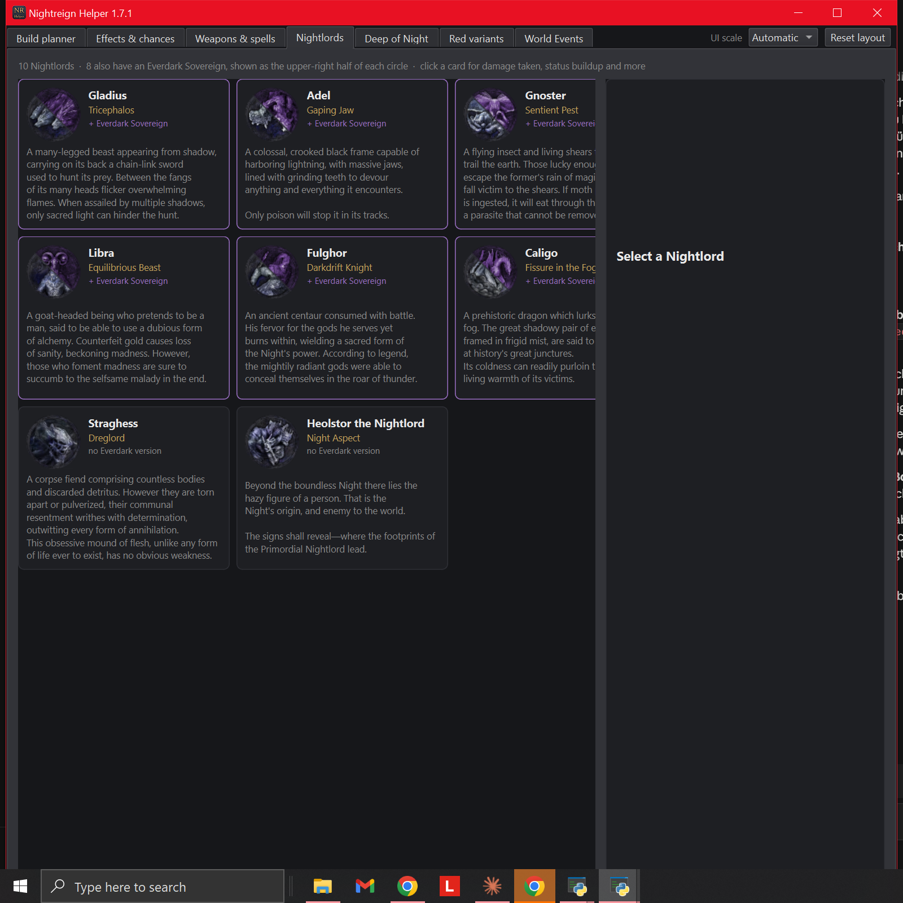
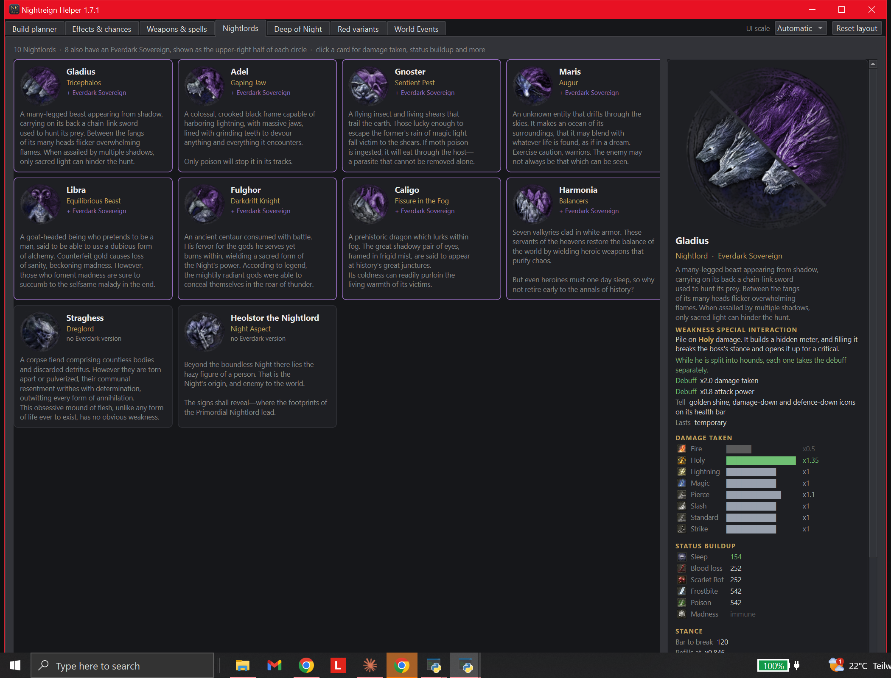
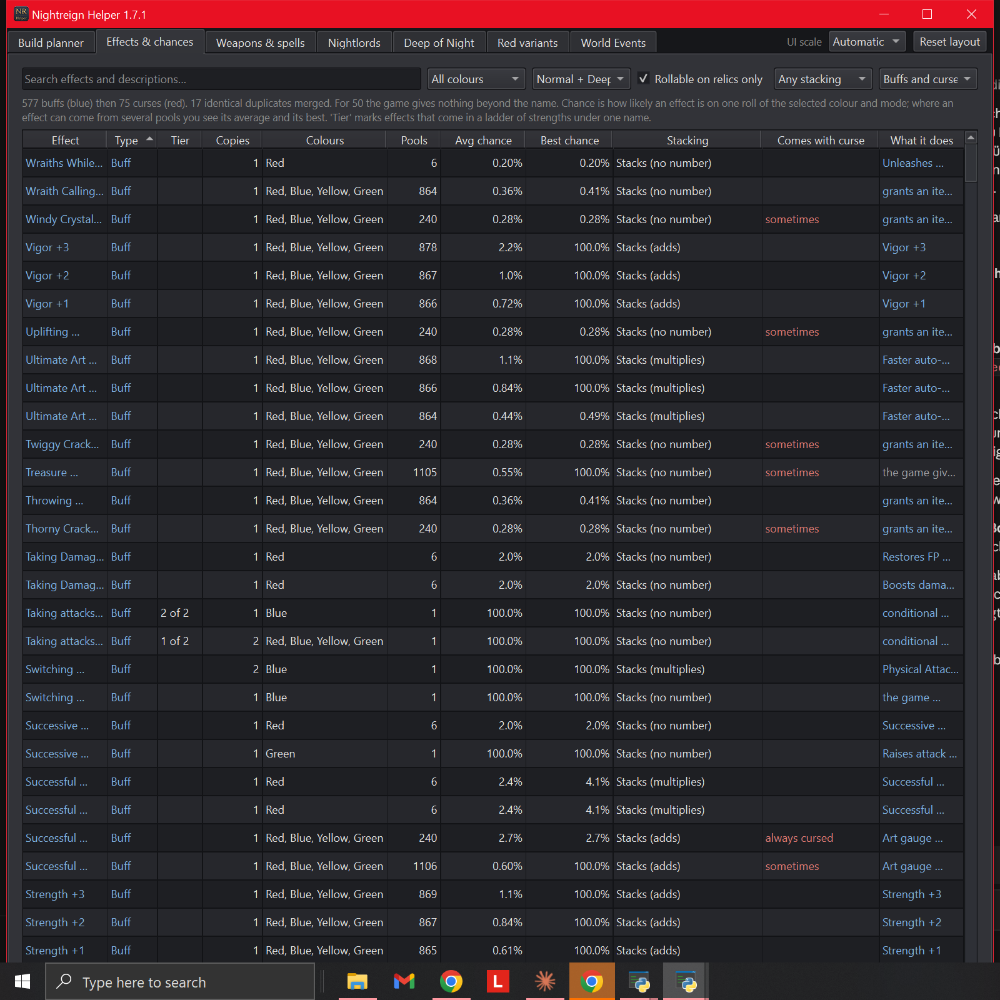
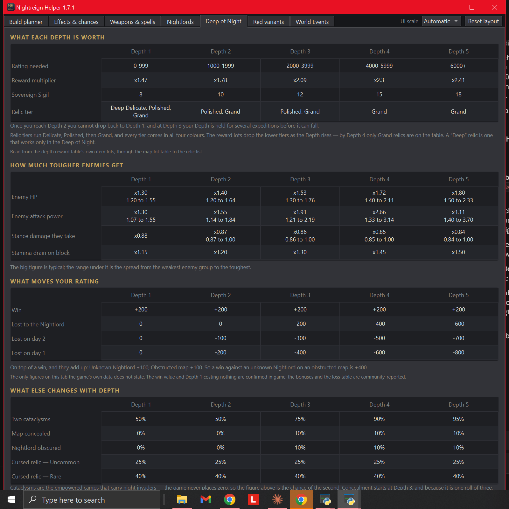
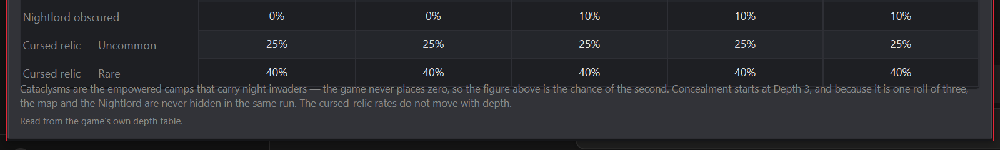
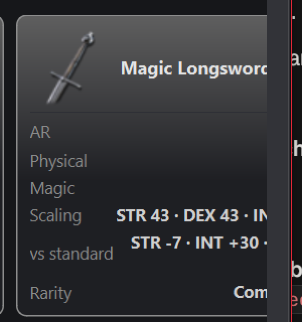
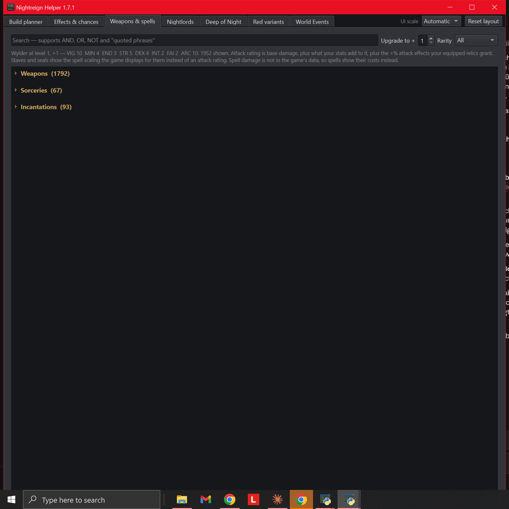
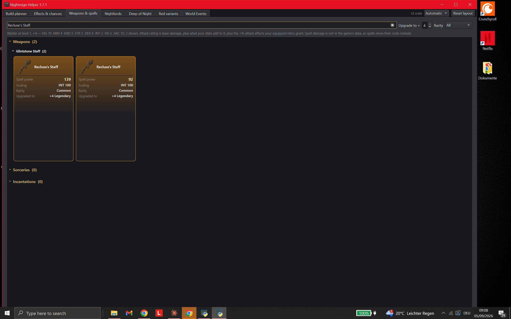
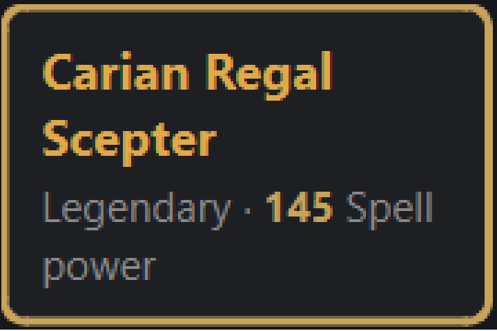
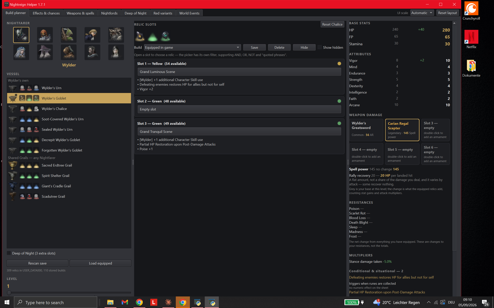

# Design & UX Review — Nightreign Helper

## Review vom 2026-09-05 (T-056 — Sichtpruefung der sechs Inhalts-Tabs am laufenden Fenster)

**Methode:** Live, am laufenden Fenster (`.venv\Scripts\python.exe run.py`,
Titel `Nightreign Helper 1.7.1`), echte Spieldaten. Tabwechsel und
Sucheingabe ueber `UIAutomationClient` (`SelectionItemPattern`,
`ValuePattern`), Kartenklick per `SendMessage`, Screenshots nach
`SetProcessDPIAware()`. Bildschirm 2560x1600 physisch bei 150 % Skalierung.
Zusaetzlich headless gemessen (`QT_QPA_PLATFORM=offscreen`): Spaltenbreiten
der Effektetabelle bei drei Fensterbreiten und `minimumSizeHint()` aller
sieben Tab-Seiten. Screenshots: `docs/screenshots/2026-09-05-T056/`.

**Geprueft:** alle sechs Inhalts-Tabs beim Erstoeffnen, dazu `Weapons &
spells` mit Suche `Longsword` (aufgeklappt) bei 1250 / 1600 / 2100 px,
`Nightlords` mit Detailpanel (Gladius) bei 1600 und 2100 px, `Deep of Night`
mit sichtbarer Unterkante, `World Events` mit Detailpanel. **Nicht geprueft:**
`Build planner` (ausgenommen), Dark/Light-Umschaltung (das Programm hat
keine), die Inhaltswahrheit der Zahlen (das ist T-055).

**Verhaeltnis zu T-052 (Stabilitaetsregel):** T-052 hielt fest, ausserhalb
DR-008/DR-009 sei „nichts abgeschnitten, ueberlappt oder unlesbar". Das galt
fuer den damals geprueften Bereich — `Build planner`, Waffen-Slot-Kacheln,
Arsenal-Suche. Die vier Befunde unten liegen **ausserhalb** dieses Bereichs,
in den sechs Inhalts-Tabs, die T-052 nicht geoeffnet hat. Kein Kurswechsel,
sondern ein neuer Geltungsbereich.

**Gesamturteil:** Braucht Arbeit. Zwei der vier Befunde sind kritisch, weil
sie Inhalt **unerreichbar** machen, nicht nur haesslich: zwei von zehn
Nightlords sind bei der ueblichen Fensterbreite nicht sichtbar, und alle 652
Effektnamen sind es nicht. Beides ist Layout, kein Datenmangel — bei
groesserem Fenster erscheint alles. Die Vorgaben dazu stehen in `UI_SPEC.md`,
Abschnitt T-056, AK-68 bis AK-105.

### Kritisch

- **DR-013 [`nrplanner/bosstab.py:35` (`COLUMNS = 4`), `:288`
  (`setFixedWidth(330)`), `:263-277` (`QHBoxLayout`), AK-90/AK-72]** Der
  `Nightlords`-Tab zeigt bei 1600 px Fensterbreite **acht von zehn**
  Nightlords, waehrend seine eigene Kopfzeile „10 Nightlords" sagt. Spalte 3
  (Gnoster, Caligo) bricht mitten im Blurb ab („a flying insect and living
  shears t…"), Spalte 4 — **Maris** und **Harmonia** — ist vollstaendig
  unsichtbar. Ursache ist ein fest verdrahtetes 4-Spalten-Raster neben einem
  Detailpanel fester Breite in einer `QHBoxLayout`; es gibt keinen Splitter,
  den der Nutzer verschieben koennte. Bei 2100 px erscheinen beide Karten —
  Beleg, dass es Layout ist und nicht Daten. Die waagerechte Bildlaufleiste,
  ueber die Spalte 4 theoretisch erreichbar waere, sitzt an der Unterkante
  des Tabs und liegt auf diesem Bildschirm hinter der Taskleiste (DR-015).
  **Loesungsrichtung:** Spaltenzahl aus der verfuegbaren Breite rechnen und
  nie eine Karte teilweise zeichnen (AK-72); wenn das Detailpanel bleiben
  soll, gehoert es in einen `QSplitter` mit Mindestbreite fuer beide Seiten.
  
  

- **DR-014 [`nrplanner/effectstab.py:243-245, 445-447`, AK-77]** In der
  Effektetabelle bekommen die beiden Spalten, die die Frage des Tabs
  beantworten, zusammen **2,8 % der Tabellenbreite**. Gemessen an einer
  echten `EffectsTab` bei 1516 px Tabellenbreite: `Effect` **22 px**,
  `What it does` **21 px** — und **652 von 652** Effektnamen sowie 652 von
  652 Beschreibungen sind breiter als ihre Zelle. Auf dem Bildschirm lesen
  sich vier aufeinanderfolgende Zeilen als `Successful …`, `Successful …`,
  `Successful …`, `Successful …` und sind nicht auseinanderzuhalten. Die
  restlichen 1473 px gehen an Spalten mit sehr wenig Information: `Colours`
  295 px fuer 10 verschiedene Zeichenketten (491 Zeilen zeigen dieselbe),
  `Stacking` 343 px fuer 9, `Comes with curse` 214 px fuer 4 (302 leer),
  `Copies` 94 px fuer eine Spalte, die 638-mal `1` zeigt. Ursache:
  `resizeColumnsToContents()` bedient erst die neun Inhaltsspalten, danach
  bekommen die beiden `Stretch`-Spalten, was uebrig ist — und uebrig ist
  nichts. Selbst bei 2356 px sind noch 333 Namen elidiert.
  **Loesungsrichtung:** die Prioritaet umkehren — `Effect` und
  `What it does` zuerst bedienen (AK-77 nennt 320 bzw. 260 logische px als
  Untergrenze), die uebrigen Spalten deckeln, und die informationsarmen
  Spalten verkuerzen oder streichen (Streichvorschlaege in `UI_SPEC.md` §8).
  

### Wichtig

- **DR-015 [`nrplanner/deeptab.py` (keine `QScrollArea`, `:162`
  `setFixedHeight`), AK-71/AK-97]** Das Fenster hat eine Mindesthoehe von
  **1606 physischen px** (gemessen: `MoveWindow` auf 500/700/1000/1300 px
  Hoehe laesst das Fenster jedes Mal bei 1606). Der Bildschirm ist 1600 px
  hoch, die Arbeitsflaeche nach Taskleiste ~1552. Verursacher ist **ein
  einziger Tab**: `Deep of Night` meldet `minimumSizeHint().height() = 949`
  logische px, die anderen fuenf melden 111 bis 443 — der Tab stapelt vier
  Tabellen mit fester Hoehe ohne Scrollbereich, und `QTabWidget` gibt das
  Maximum an das ganze Fenster weiter. Folge auf diesem Bildschirm: die
  letzten beiden Erklaerzeilen des Tabs („The cursed-relic rates do not move
  with depth.", „Read from the game's own depth table.") sind nie sichtbar
  und **nicht scrollbar erreichbar**; zugleich liegt jede Bildlaufleiste an
  der Unterkante eines Tabs hinter der Taskleiste (das ist der zweite Teil
  von DR-013).
  **Loesungsrichtung:** den Inhalt von `Deep of Night` in eine
  `QScrollArea` legen und die festen Tabellenhoehen aufgeben. Das ist ein
  Ein-Tab-Fix mit Fenster-weiter Wirkung.
  
  

- **DR-016 [`nrplanner/arsenaltab.py:15` (`COLUMNS = 5`), `:44`
  (`CARD_WIDTH`), `:88-97` (Wertzeile), AK-84/AK-73]** Zwei Blessuren an
  derselben Kachel. **(a)** Das Kachelraster hat fest fuenf Spalten; die
  letzte wird abgeschnitten, und weil die Werte rechtsbuendig stehen,
  verschwinden **die Zahlen zuerst**: auf der abgeschnittenen Kachel steht
  `AR`, `Physical`, `Magic` — ohne einen einzigen Wert. Reproduziert bei
  1600 px (5. Spalte) und 1250 px (4. Spalte). **(b)** Ein langer Wert bricht
  mitten im Begriff um: `STR -7 · ARC +45 · DEX` endet die Zeile, `-7` steht
  allein auf der naechsten. Das ist dieselbe Klasse wie DR-009, eine Zeile
  tiefer — und es trifft ausgerechnet die Kachel, die ich in T-052 als
  Vorbild gegen DR-009 gelobt habe. Das Lob war fuer den kurzen Wert
  (`Spell power` / `145`) richtig und **taugt nicht als allgemeine Regel**;
  AK-73 ersetzt es.
  **Loesungsrichtung:** Spaltenzahl aus der Breite (AK-72); Wertzeilen nur
  zwischen `·`-Gruppen umbrechen, nie innerhalb einer.
  
  

### Nice-to-have

- **DR-017 [`nrplanner/arsenaltab.py:139, 297-303`, AK-83]** `Weapons &
  spells` oeffnet mit drei zugeklappten Ueberschriften und rund 95 % leerer
  schwarzer Flaeche: der Tab mit den meisten Daten des Programms (1 952
  Eintraege) sieht beim ersten Blick leer aus. Der Code loest genau dieses
  Problem bereits fuer den Suchfall („'14 shown' behind three collapsed
  headings … made searching feel broken") und zieht den Erstzustand nicht
  nach. **Loesungsrichtung:** mindestens einen Abschnitt aufgeklappt starten.
  

- **DR-018 [`nrplanner/depthstab.py:87-88`, `nrplanner/eventlore.py` u. a.,
  AK-75]** Zwei Gedankenstrich-Stile nebeneinander: 23 String-Literale in den
  sieben Tab-Modulen enthalten ` -- `, 24 enthalten `—`, und beide Sorten
  erscheinen auf dem Bildschirm — der `Red variants`-Tab zeigt „individual
  empowered enemies -- the same enemy", der Nachbartab „Lasts the rest of the
  expedition — not consumed". **Loesungsrichtung:** `—` ueberall in
  angezeigten Zeichenketten.

### Backlog (geparkt)

- Unter 1250 physischen px wird die **Tab-Leiste selbst** scrollbar (Pfeile
  ◀ ▶ statt der letzten zwei Reiter). Fensterbefund, nicht Tab-Befund;
  gehoert in einen eigenen Auftrag.
- Der `Nightlords`-Tab laesst links viel leere Flaeche unter den Karten,
  waehrend das rechte Detailpanel scrollen muss. Raumaufteilung, kein Fehler.
- `Could not parse stylesheet of object QListWidget(...)` — weiterhin nicht
  erneut geprueft.

### Positiv / beibehalten

- **`Deep of Night` ist das gestalterische Vorbild der sechs.** Vier
  Ueberschriften, die je eine Spielerfrage benennen (`WHAT EACH DEPTH IS
  WORTH`, `HOW MUCH TOUGHER ENEMIES GET`, `WHAT MOVES YOUR RATING`, `WHAT
  ELSE CHANGES WITH DEPTH`), darunter je eine Tabelle und je eine ruhige
  Erklaernote, dazu eine eigene Herkunftszeile („The only figures on this tab
  the game's own data does not state …"). Das Muster wird mit AK-68 auf alle
  sechs uebertragen und darf dabei **nicht** verwaessert werden.
- **Der `Red variants`-Tab traegt die beste Bezugsgroessen-Zeile des
  Programms**: „The figures are how many red variants of each sort a run puts
  on the selected map." Eine Zahl mit Einheit **und** Geltungsbereich, in
  einem Satz. AK-98 laesst sie ausdruecklich unangetastet.
- **`World Events` trennt Herkunftsklassen sichtbar und benennt die
  Trennung**: blaue Zeilen sind community-berichtet, alles andere sind
  Spieldaten, und der Kopfsatz sagt das. Das ist die einzige Farbrolle der
  sechs Tabs, die heute schon eine Legende hat — AK-74 macht daraus die
  Regel.
- **Die Nightlord-Karten-Portraits sind die staerkste gestalterische Idee des
  Programms:** ein Kreis, diagonal geteilt, links die normale, rechts oben
  die Everdark-Fassung — und die Kopfzeile erklaert die Teilung in einem
  Halbsatz. Bild und Erklaerung an einem Ort; das bleibt.

### Offene Fragen an den App Designer

Gesammelt in `UI_SPEC.md`, Abschnitt T-056, §10 — fuenf Stueck, davon die
beiden aus dem Auftrag (`Avg chance`, `Pools`) und dreizehn
Streichvorschlaege in §8.

---


## Review vom 2026-09-05 (T-052 — was die beiden Kalibrierungen am Bildschirm anrichten)

**Methode:** Live, am laufenden Fenster (`.venv\Scripts\python.exe run.py`),
echte Spieldaten und ein echter Snapshot dieses Rechners. Das Fenster war in
diesem Durchlauf zum ersten Mal seit 2026-09-01 tatsaechlich sichtbar und
fokussierbar — die als Bestand gefuehrte Einschraenkung „Fenster nie
fokussierbar" gilt fuer **diese** Sandbox-Instanz nicht mehr; siehe
Methodennotiz unten. Bedienung ueber `UIAutomationClient` (Invoke/Select/
SetValue auf echte Steuerelemente) statt Maussimulation, weil eine parallel
laufende, fokus-stehlende Anwendung auf demselben Desktop rohe
Cursor-Klicks wiederholt auf das falsche Fenster lenkte — dokumentiert, weil
es die Interaktionsmethode erklärt, ohne den Befund zu betreffen.
Screenshots unter `docs/screenshots/2026-09-05/`.

**Methodennotiz, damit sie nicht verloren geht:** Ein erster Rundgang bei
1600×1000 bzw. maximiert zeigte das dritte Panel (Waffenschaden, sechs
Kacheln) und die Ecken-Werkzeugleiste (`UI scale`, `Reset layout`) als
**vollstaendig verschwunden** — reproduzierbar bei mehreren Fenstergroessen,
auch nach `Reset layout` per Accessibility-Invoke. Das sah nach einem
kritischen Layout-Defekt aus. Nachpruefung ergab: **Artefakt der eigenen
Screenshot-Methode**, nicht des Programms. Der PowerShell-Prozess, mit dem
Screenshots erzeugt wurden, war nicht DPI-aware; bei 150 % Skalierung
(physisch 2560×1600, virtualisiert 1707×1067) lieferte
`CopyFromScreen` einen Ausschnitt, in dem die rechte Fensterhaelfte ausserhalb
lag, waehrend das Programm selbst korrekt bis zum echten Fensterrand
zeichnete. Nach `SetProcessDPIAware()` verschwand der Effekt vollstaendig,
bei jeder getesteten Fenstergroesse inkl. maximiert (Beleg:
`docs/screenshots/2026-09-05/build-planner-overview.png`, alle drei Panels
und die Ecken-Werkzeugleiste sichtbar). **Kein DR-Eintrag, kein Fund am
Programm** — hier vermerkt, damit ein kuenftiger Durchlauf in derselben
Sandbox nicht denselben Fehlschluss zieht, und in der Rollen-Erinnerung
festgehalten (`SetProcessDPIAware` vor jedem Screenshot/jeder
Fensterkoordinate in dieser Umgebung).

**Geprüfte Bereiche:** Build-planner-Panel (Relic slots, Waffenschaden-Panel,
sechs Waffen-Slot-Kacheln), Arsenal-Tab (`Weapons & spells`, Kachelraster und
Zusammenfassungszeile), `WeaponDialog`-Auswahl, die sechs offenen Fragen aus
`docs/tasks/T-052.md` (QA-116, QA-117, QA-119, QA-121, QA-122). Nicht
erreichbar: der Relic Picker mit Berater-Anzeige (§3 in `UI_SPEC.md`) — S10
ist laut `docs/state.md` nicht gebaut, es gibt nichts zu sehen.

**Gesamturteil:** Braucht Arbeit an einer konkreten Stelle (DR-008, die
Katalysator-Namenskollision ist jetzt sichtbar, nicht nur gemessen), eine
zweite spuerbare, aber kleinere Blessur (DR-009, Zeilenumbruch in der
Waffen-Slot-Kachel). Die beiden Kalibrierungen selbst sind unauffaellig
eingezogen — nichts ist abgeschnitten, ueberlappt oder unlesbar geworden;
QA-122s Grundsorge ("niemand hat hingesehen") ist mit diesem Durchlauf
erledigt, ihr Ergebnis ist ueberwiegend unauffaellig.

### Kritisch

- **DR-008 [`nrplanner/arsenaltab.py`, `nrplanner/weaponslots.py::WeaponDialog`,
  QA-119]** Live bestaetigt, mit Screenshot: Sucht man im Arsenal-Tab nach
  „Recluse's Staff", erscheinen **zwei identische Karten** — gleicher Name,
  gleiches Icon, `Common · Upgraded to +4 Legendary` auf **beiden** — die sich
  ausschliesslich durch die Zahl unterscheiden: `Spell power 139` gegen
  `Spell power 92`. Kein Merkmal auf der Karte sagt, welche davon die Waffe
  ist, die ein Spieler tatsaechlich ausruesten kann. Vor der
  Katalysator-Kalibrierung (T-046) lagen beide Zeilen bei ~25 AR und fielen
  nicht auf (QA-099a); die Kalibrierung selbst hat daran nichts geaendert,
  sie hat nur die Luecke sichtbar gemacht, indem der Abstand von wenigen
  Punkten auf 23-47 Punkte gewachsen ist. Das widerspricht der Grundregel
  dieses Projekts (A7): eine Anzeige, die zwei verschiedene Zahlen fuer „das
  gleiche Ding" zeigt, ohne dass ein Merkmal den Unterschied erklaert, ist
  keine Unsicherheits-Aussage mehr, sie ist irrefuehrend — ein Spieler koennte
  glauben, er habe einen Rechenfehler gefunden, oder die falsche Zeile fuer
  einen Bau-Vergleich heranziehen.

  

  **Loesungsrichtung, entschieden (`UI_SPEC.md`, Nachtrag zu QA-119, AK-66):**
  die betroffene Zeile (Id 33770000 — kein Zauberplatz, generische
  Reinforce-Gruppe, generische AEC, alle drei Kriterien einzeln eindeutig
  innerhalb der Katalysator-Familie, Beleg in
  `docs/berichte/T-046-developer.md` §7) wird aus jeder spielerseitigen
  Waffenliste gefiltert, nicht durch eine sichtbare Id unterschieden — sie ist
  keine echte Wahlmoeglichkeit, sondern ein Extraktions-Artefakt.

### Wichtig

- **DR-009 [`nrplanner/weaponslots.py:244-246`, `WeaponTile`]** Live
  bestaetigt, mit Screenshot: Die Detailzeile einer Waffen-Slot-Kachel setzt
  Raritaet, Kennzahl und Effektzahl mit `" · "` zu einer Zeichenkette
  zusammen und verlaesst sich auf `setWordWrap`. Fuer eine physische Waffe
  passt das auf eine Zeile (`Common · 56 AR`); fuer einen Katalysator bricht
  die Zeile **mitten im zweiwoertigen Einheitennamen** um: `Legendary · 145
  Spell` endet die erste Zeile, `power` steht allein auf der zweiten. Das ist
  eine direkte Folge davon, dass die Kennzahl seit T-046 `Spell power` statt
  `AR` heisst (11 gegen 2 Zeichen) — die Kachel ist dafuer nicht breiter
  geworden. Die Kachelhoehe bleibt durch das Raster gleich (kein Ueberlauf,
  kein abgeschnittener Text), aber die Karte wirkt dadurch voller/dichter als
  ihre Nachbarn und der Bruch mitten im Begriff „Spell power" liest sich wie
  ein Darstellungsfehler, nicht wie eine gestalterische Entscheidung. Vom
  `developer` in T-046 §12 selbst als ungeprueft benannt („ob 'Spell power
  237' … passt, hat niemand gesehen") — hiermit geprueft und mit „nicht ganz"
  beantwortet.

  

  Kontext-Screenshot mit allen sechs Kacheln:
  

  **Loesungsrichtung:** Der Arsenal-Tab selbst hat dieses Problem nicht (dort
  stehen Bezeichnung und Wert in getrennten, gestapelten Zeilen statt in einer
  verketteten Zeichenkette — siehe Positiv-Abschnitt) und kann als Vorbild
  dienen: entweder dieselbe zweizeilige Struktur (Bezeichnung/Wert getrennt)
  auch fuer die Slot-Kachel, oder eine kuerzere Einheit an dieser engen
  Stelle (z. B. `Spell pwr.` oder `SP`, mit dem vollen Namen im Tooltip) —
  keine Praeferenz von mir, aber der aktuelle Bruch mitten im Wort ist so
  keine Option.

- **DR-010 [`nrplanner/arsenaltab.py:306-311`, QA-121]** Live bestaetigt, mit
  Screenshot (selber Aufbau wie DR-008 — Suche „Recluse's Staff"): Werden im
  Arsenal-Tab ausschliesslich Katalysatoren angezeigt, sagt die
  Zusammenfassungszeile darunter trotzdem nur *„Attack rating is base damage,
  plus what your stats add to it, plus the +% attack effects your equipped
  relics grant."* — ein Satz ueber eine Groesse, die auf keiner sichtbaren
  Karte steht (beide zeigen `Spell power`). Seit T-046 zeigt der Tab zwei
  verschiedene Kennzahlen im selben Raster; der Erklaerungssatz kennt nur
  noch die eine Haelfte. `AK-34` regelt diese Zeichenkette, deshalb hat der
  `developer` sie nicht selbst angefasst (T-046 §8.2) und einen
  Vorschlagstext hinterlassen.

  

  **Entschieden (`UI_SPEC.md`, Nachtrag zu AK-34/QA-121, AK-64):** ein
  zusaetzlicher Satz zwischen der Attack-Rating-Definition und dem
  Zauber-Satz — *„Staves and seals show the spell scaling the game displays
  for them instead of an attack rating."* — in derselben Terminologie wie der
  Rest des Blocks (nicht der Vorschlagswortlaut woertlich, der „attack power"
  statt „attack rating" sagt und damit einen zweiten Namen fuer dieselbe
  Sache einfuehren wuerde).

- **DR-011 [`UI_SPEC.md:192, 696, 981, 1201, 1221-1222`; `ARCHITECTURE.md:513`,
  QA-116]** Volltextsuche bestaetigt (wie schon in T-045/T-046 gemeldet):
  zwei Wortlaute eines Attack-Rating-Vorbehalts stehen an sechs Stellen in
  zwei Dateien, obwohl **keiner von beiden** im Programmcode vorkommt — die
  tatsaechlich gebaute Loesung (`advisor/goals.py::_ATTACK_RATING_UNKNOWNS`,
  vier praezise Saetze mit Geltungsbereich) ist besser als beide Wortlaute
  und war zum Zeitpunkt der urspruenglichen offenen Frage (Nachtrag zu AK-47,
  03.09.2026) noch nicht gebaut. Die Spec-Frage „welcher Wortlaut gilt" hatte
  deshalb keine gute Antwort — die richtige Antwort ist „keiner".

  **Entschieden und in `UI_SPEC.md` nachgezogen (Nachtrag zu QA-116, AK-63):**
  §3.2 Zeile 4 und §3.4 Punkt 4 zeigen kuenftig **die Saetze aus
  `GoalScore.unknowns`** der gewaehlten Zielrichtung, wortgleich, statt eines
  fest verdrahteten Einzelsatzes. Das schliesst zugleich eine Luecke, die
  sonst beim Bau von S10 entstanden waere: ein hartcodierter
  Attack-Rating-Satz waere fuer die Zielrichtung „Minimise damage taken"
  schlicht falsch gewesen (dort geht es nie um Attack Rating). Betrifft nur
  noch nicht gebaute Bildschirme (S10) — **kein Fund am laufenden Programm**,
  reine Dokumentenkorrektur.

  **Nachtrag noch am selben Tag:** der `architect` hat parallel AD-025
  beschlossen (`ARCHITECTURE.md` Nachtrag VI) — ein Vorbehalt gehoert entweder
  der **Registry** (`Goal.scope`, vor dem Lauf feststehend) oder dem
  **Ergebnis** (`GoalScore.unknowns`/`SlotPool.unknowns`, ein Laufbefund).
  AK-63 wie oben beschrieben nannte nur die zweite Quelle — nach AD-025 zieht
  der Geltungsbereichs-Anteil aber nach `Goal.scope` um, und ein Laufbefund
  wie „N of your relics carry effects that only apply under a condition"
  (D2/OF-20) oder die Handle-Zeile (QA-108) haette in einer AK-63-treuen
  Umsetzung **keinen Ort mehr** gehabt — der `architect` hat das selbst als
  einzigen A7-relevanten Punkt seines Nachtrags benannt. In `UI_SPEC.md`
  korrigiert: AK-63 nennt jetzt beide Quellen und beide Orte (Zeile 4 fuer
  `Goal.scope`, neue Zeile 3b fuer `SlotPool.unknowns`); AK-67 (neu) legt den
  Wortlaut der beiden `SlotPool.unknowns`-Saetze fest (D2/OF-20 und die
  QA-108-Korrektur „of this colour" → „of any colour" am weissen Slot).
  Betrifft weiterhin nur den nicht gebauten Picker — kein neuer Fund am
  laufenden Programm, Korrektur der eigenen Vorgabe binnen desselben Tages.

  **Zweiter Nachtrag, selber Tag:** QA-113 (vier Relikte mit einer
  Schadensart-Umwandlung, die `model.compute` mit exakt 0 bewertet) ist ein
  dritter Laufbefund desselben Feldes. AK-67 auf „bis zu drei Saetze"
  erweitert, dritter Wortlaut festgelegt (nennt die Blindstelle, behauptet
  keine Hoehe oder Richtung — die ist erst durch eine Spielmessung, F-F,
  entscheidbar). Alle drei Saetze bleiben **eine** Zeile 3b (ein wachsender
  Fliesstext, kein festes Zeilenraster), und ein Relikt darf laut
  Director-Entscheidung in mehr als einer der drei Zaehlungen mitzaehlen —
  unproblematisch, weil keine der drei Zeilen ein Relikt beim Namen nennt.

### Nice-to-have

- **DR-012 [`nrplanner/app.py`, QA-117]** Entschieden, nicht veraendert: die
  Anzeigeschwellen `>= 0.5` (Zeile `From attributes`, Aenderungszelle) und
  `> 0.05` (Farbe der Aenderungszelle) bleiben **absolute** Konstanten und
  wandern nicht mit dem 0,6-Kalibrierungsfaktor mit. Begruendung und
  Akzeptanzkriterium (AK-65) in `UI_SPEC.md`, Nachtrag zu QA-117: die
  Schwelle beschreibt eine Eigenschaft der **Anzeige** (halbe darstellbare
  Einheit), nicht eine Eigenschaft der Kalibrierung; sie mitwandern zu lassen
  wuerde eine erfundene Umrechnung in die Oberflaeche selbst einziehen, und
  keine Wahl einer neuen Schwelle trifft „dieselben Faelle wie vorher" (T-045
  §4.1: Rundung von Summen skaliert nicht linear mit dem Faktor). Niedrige
  Prioritaet, weil das Verhalten schon korrekt ist (der Grundsatz „no change
  statt +0.0" gilt hier gleich) — der Eintrag existiert, damit die Frage nicht
  in einem naechsten Zyklus erneut unbeantwortet auftaucht.

### Backlog (geparkt)

- `Could not parse stylesheet of object QListWidget(...)` — weiterhin nicht
  erneut geprueft in diesem Durchlauf.

### Positiv / beibehalten

- **Der Arsenal-Tab traegt die "Spell power"-Kalibrierung sauber.** Eine
  dreistellige Zahl (`145`, Carian Regal Scepter, Legendary) passt in die
  200-px-Kachel ohne Umbruch und ohne Kuerzung — die vom `developer` in
  T-046 §12 offen gelassene Frage ist fuer **diese** Kachel mit „passt"
  beantwortet (Beleg: `docs/screenshots/2026-09-05/arsenal-tile-spell-power-145.png`).
  Der Unterschied zu DR-009: die Arsenal-Kachel setzt Bezeichnung und Wert in
  getrennte, gestapelte Zeilen (`Spell power` / `145` als eigene Zeile), statt
  sie wie die Waffen-Slot-Kachel in eine einzige verkettete Zeichenkette zu
  zwingen — dieses Muster verdient es, in DR-009 uebernommen zu werden.
- **Die Schadenstafel fuer einen Katalysator liest sich richtig.** Nach dem
  Ausruesten eines Stabes zeigt die Summenzeile korrekt `Spell power 145 no
  change 145` statt `Total …` — genau das von T-046 §12 angekuendigte
  Verhalten, live bestaetigt, keine Typ-Zeilen darunter (weil dort nichts zu
  summieren ist).
- **Die beiden Kalibrierungen selbst sind optisch unauffaellig eingezogen.**
  Ausserhalb von DR-008/DR-009 wurde in keinem geprueften Bereich ein
  abgeschnittener, ueberlappender oder unlesbarer Text durch die kleineren
  bzw. groesseren Zahlen gefunden — die grosse Sorge hinter QA-122 (dass eine
  Kalibrierung, die niemand am Bildschirm gesehen hat, die Oberflaeche
  irgendwo sichtbar zerlegt haben koennte) bestaetigt sich nicht in der
  Flaeche, sondern an der einen erwartbaren Stelle (laengere Einheit in einer
  engen Kachel).

### Offene Fragen an den App Designer

*(keine neuen — QA-116, QA-117, QA-119, QA-121 sind in diesem Durchlauf mit
Begruendung entschieden, nicht als Geschmacksfrage vorgelegt. QA-122 ist mit
diesem Durchlauf erledigt: die Oberflaeche wurde gesehen.)*

---

## Review vom 2026-09-02 (Sicherheitszyklus T-017/T-018 — sichtbare Folgen, plus QA-029)

**Methode:** Headless, gegen echte Widgets/Funktionen und echte Spieldaten
(`QT_QPA_PLATFORM=offscreen`, `.venv` des Repos, NIGHTREIGN unter
`D:\SteamLibrary\...`, Snapshot bereits unter
`%LOCALAPPDATA%\NightreignHelper\nightreign_data.json` vorhanden, zwei echte
Saves). **Kein Mensch hat die Oberflaeche in diesem Durchlauf gesehen** — das
Fenster liess sich weiterhin nicht fokussieren/anzeigen (Bestand seit
2026-09-01, siehe `docs/state.md`). Jeder Beleg unten ist als **Widget-Abfrage**
(reale Klasse/Funktion aufgerufen, reale Daten, aber kein Rendering angesehen)
oder **Codelesung** markiert — keiner ist visuell.

**Geprüfte Bereiche:** die drei benannten sichtbaren Folgen aus T-017/T-018
(`owned_label`, `nrplanner/bosstab.py` Boss-Detail und `_stance_rank` fuer alle
zehn Nightlords inkl. Everdark-Paare, Fehlermeldungen in `nrplanner/shortcut.py`
und beim Save-/Spieldaten-Lesen), die Build-Namen-Trimm-Frage in
`nrplanner/app.py::_save_build` vs. `nrplanner/chalices.py::save_build`, sowie
ein freier Rundgang durch das, was seit Zyklus 2 an sichtbarem Text neu
dazugekommen ist. QA-029 (veraltete Funktionsnamen in dieser Datei) nachgezogen.

**Gesamturteil:** Braucht Arbeit — nicht wegen der drei angefragten Punkte
(die sind sauber), sondern weil die Recherche zu Punkt 2 eine **Klasse** von
Markup-Injektion offenlegt, die SEC-004/SEC-012 nur an zwei Stellen
(`owned_label`, `bosstab.py`) geschlossen haben, waehrend derselbe Fehler in
drei weiteren, staerker frequentierten Dateien (Relic Picker, Waffen-Slots)
unveraendert steht, und weil eine Kombination aus bestehendem Code und dem
neuen SEC-002-Fix eine echte Aussage ("ein Save existiert, ist aber kaputt")
in eine falsche verwandelt ("kein Save gefunden").

---

### Entscheidung (Punkt 1 des Auftrags): Build-Namen im Dialog trimmen — ja, beibehalten

`nrplanner/app.py:2354` (`_save_build`): `name = (name or "").strip()`.
`nrplanner/chalices.py:319-324` (`save_build`) trimmt seit T-018 bewusst
**nicht** mehr — der Name kommt exakt so zurueck, wie er gespeichert wurde.

**Aus Nutzersicht bleibt das Trimmen im Dialog richtig, die Speicherschicht
soll trotzdem nicht trimmen — beides gleichzeitig, keine Symmetrie
erzwingen:**

- Ein Build-Name ist fuer den Spieler ausschliesslich das, was in der
  Dropdown-Liste (`build_box`) steht. Ein Leerzeichen am Ende ist dort in den
  allermeisten Schriftbildern **unsichtbar** — ein Spieler, der "Build" tippt,
  spaeter aus Versehen "Build " (Leerzeichen am Ende, z. B. durch Copy-Paste
  oder verrutschten Cursor) speichert, saehe zwei Eintraege, die identisch
  aussehen und sich nicht unterscheiden lassen, ausser durch Ausprobieren.
  Das ist keine Funktion, die sich irgendjemand wuenscht — es ist eine Falle,
  die die Namens-/Schluessel-Trennung aus T-018 (bewusst, korrekt: Namen
  koennen jetzt `/`, `\`, Unicode, fuehrende Leerzeichen tragen) als
  Nebenwirkung neu eroeffnet.
- Waere das Trimmen entfernt, koennte genau der Fall entstehen, den die
  Aufgabenstellung selbst nennt: "Build" und "Build " als zwei Eintraege —
  nur dass das nicht wie eine bewusste Namensgebung wirkt (ein Spieler, der
  zwei *sichtbar* verschiedene Namen fuer zwei Builds waehlt, weiss, was er
  tut), sondern wie ein Karteikarten-Duplikat, das das Programm haette
  verhindern sollen.
- Die Speicherschicht **soll** trotzdem nicht trimmen: sie ist die einzige
  Stelle, die weiss, was exakt gespeichert wurde, und ihr Vertrag ("der Name
  kommt zurueck, wie er reinging") ist wertvoll unabhaengig davon, ob der
  einzige heutige Aufrufer vorher schon normalisiert. Ein kuenftiger zweiter
  Aufrufer (z. B. eine Import-Funktion, die Namen aus einer Datei uebernimmt)
  soll sich nicht auf eine Trimm-Regel verlassen muessen, die nur zufaellig
  in `_save_build` sitzt.
- Der Dialog sollte also **weiterhin** trimmen, aber das ist eine UI-Regel
  ("was der Spieler als Namen zu erkennen glaubt"), keine Speicherregel.

**Kein Code geaendert** (nicht meine Aufgabe) — dies ist die angeforderte
Leitentscheidung an den `developer`: **Trimmen im Dialog bleibt.** Kleinerer
Folgepunkt, keine eigene Finding-Nummer wert: `if not ok or not name: return`
(Zeile 2355) bricht bei einem rein aus Leerzeichen bestehenden Namen lautlos
ab, ohne Hinweis, dass eingegeben wurde. Das ist Bestand (nicht durch T-018
veraendert) und niedrigste Prioritaet — Erwaehnung, damit es nicht verloren
geht, kein DR-Eintrag.

---

### Kritisch

- **DR-004 [`nrplanner/relicpicker.py:89`, `nrplanner/weaponslots.py:173-176`
  und `:208-221`, `nrplanner/app.py:416/434` (`show_slots`), `:614`
  (`curse_tooltip`)]** SEC-004/SEC-012 sind **als Klasse nicht geschlossen** —
  das steht in `security/findings.md` (SEC-012-Log-Zeile) schon so, aber die
  Suche nach "welche Dateien haben ueberhaupt `setTextFormat`" zeigt, wie
  gross die Luecke tatsaechlich ist: **im gesamten Baum stehen genau vier
  Aufrufe** (`app.py:1465` `owned_label`, `app.py:1665` `qual_heading`,
  plus zwei in `bosstab.py`). `nrplanner/relicpicker.py`,
  `nrplanner/weaponslots.py`, `nrplanner/effectstab.py` und
  `nrplanner/arsenaltab.py` haben **keinen einzigen**. Zwei belegte, konkrete
  Stellen (Widget-/Codeabfrage, mit echten Namen aus dem geladenen Snapshot
  gegengeprueft):
  - `RelicCard` (der Karten-Titel im Relic Picker, dem am meisten genutzten
    Bildschirm des Programms nach eigener Beschreibung in `UI_SPEC.md`, "292
    Relikte"): `title = QLabel(item.name)` — `item.name` ist ein
    Reliktname aus den Spieldaten, `title` traegt kein `setTextFormat`, bleibt
    also auf `Qt.AutoText`. Dieselbe Fehlerklasse wie die urspruengliche
    SEC-004-Reproduktion ("ein Slotname mit `` wird als Bild
    gerendert statt als Name gezeigt"), nur nicht im Save-Datenpfad, sondern
    im Reliktnamen-Pfad — beide sind laut dem eigenen Nachtrag in
    `UI_SPEC.md` §3.5 ausdruecklich dieselbe Kategorie ("Save- **und**
    Spieldateien").
  - Waffen-Slot-Kachel (`WeaponTile.show_slot`, `weaponslots.py:220-221`):
    `self.title.setText(f"<span style='color:{colour}'>{slot.weapon['name']}"
    f"</span>")` — der Waffenname wird **per Konkatenation in eine
    Rich-Text-Zeichenkette eingesetzt**, exakt das Muster, das SEC-012 in
    `bosstab.py::_stance_rank` schon als Befund kannte und dort mit
    `html.escape()` schloss. Hier fehlt das Escaping vollstaendig, und
    `self.title` traegt ebenfalls kein `setTextFormat` — das umgebende
    `<span>` zwingt es ohnehin auf Rich-Text-Rendering.
  - Zusaetzlich, niedrigere Ausnutzbarkeit, aber dieselbe Ursache:
    `curse_tooltip()` (app.py:638-651) baut einen Tooltip-Text aus
    Effekt-/Fluchnamen (`effecttext.name`, aus Spieldaten) ohne Escaping;
    Tooltips erkennen Rich Text immer automatisch (dasselbe Argument, mit
    dem SEC-013 fuer `owned_label`s Tooltip begruendet wurde). Ebenso
    `show_slots` (app.py:416, 434): `tile.setToolTip(getattr(owned, "name",
    "") or "empty slot")` fuer die Kelch-Vorschau-Kacheln der Heldenkarten.

  **Nicht mein Befund als Sicherheitsurteil** — das ist Sache des
  `security-reviewer`, der eine SEC-Nummer und eine Ausnutzbarkeitsbewertung
  vergeben muss (insbesondere: Reliktnamen stammen aus dem Spiel, nicht aus
  dem Save selbst, das Bedrohungsmodell "von einem Freund geschenktes Save"
  greift hier also schwaecher als bei `owned_label`; das Bedrohungsmodell
  "manipulierte/gemoddete Spielinstallation" dagegen genauso wie bei
  SEC-004/SEC-012 Boss-Namen). Ich melde es hier, weil es exakt das ist, was
  Punkt 2 des Auftrags verlangt hat ("sichtbare Folgen der Sicherheitsfixes
  pruefen") und weil es sonst zwischen den drei parallelen Pruefspuren
  verloren geht.

  **Loesungsrichtung:** dieselben zwei Muster, die das Projekt sich bereits
  selbst vorgeschrieben hat (`UI_SPEC.md` §3.5, dort fuer den noch nicht
  gebauten Advisor formuliert, aber inhaltlich unabhaengig vom Advisor
  richtig) auf die vier genannten Dateien ausdehnen:
  `setTextFormat(Qt.PlainText)` auf jedem `QLabel`, das nur Namen zeigt, und
  `html.escape()` auf jedem in `<span>`/`<b>`-Markup eingesetzten Namen. Fuer
  Tooltips (die kein `setTextFormat` kennen) bleibt nur `html.escape()`.

### Wichtig

- **DR-005 [`nrplanner/inventory.py:204-213` (`_scan_save`),
  `nrplanner/app.py:2997-3011` (`rescan_save`)]** Verifiziert durch direkten
  Aufruf der Produktionsfunktion mit einer synthetisch beschaedigten
  BND4-Struktur (Beleg unten). Die neue, laute Fehlerbehandlung aus SEC-002
  (`savefile._members` wirft jetzt `ValueError`, statt eine Vier-Milliarden-
  Schleife zu versuchen) erreicht den Spieler **nie**: `_scan_save` faengt
  jede Exception pro Save-Kandidat ab und liefert einfach `best` weiter — bei
  genau einem, kaputten Save also `None`. `rescan_save` unterscheidet das
  nicht von "kein Save vorhanden" und zeigt:

  ```
  No save file found. Relic slots stay empty; the Effects and Weapons tabs
  still work in full.
  ```

  Das ist eine **falsche Tatsachenaussage**, kein Fall von "die Daten geben
  keine Antwort her" — ein Save existiert, er ist nur nicht lesbar. Das
  verstoesst gegen GOAL A7 in genau der Weise, die der Sicherheitszyklus
  eigentlich beheben sollte: statt eines Einfrierens (SEC-001) oder einer
  Allokation (SEC-002) bekommt der Spieler jetzt eine ruhige, aber falsche
  Antwort. Verwandt mit dem bereits offenen **QA-008** ("No save file found."
  bei vorhandenem Save ohne Relikte) — dieselbe Nachricht, dritte
  unterschiedliche wahre Ursache, aber die schwerwiegendste bisher: hier wird
  eine erkannte Sicherheitsverletzung stillschweigend geschluckt, nicht nur
  eine leere Inventarliste.

  Beleg (Widget-/Funktionsaufruf, `.venv`, echte `inventory.load`):
  ```
  raised as expected: ValueError save container claims 4000000000 members of
  24 bytes each, which do not fit in 100 bytes
  inventory.load result: None
  ```

  **Loesungsrichtung:** `_scan_save` soll den Grund festhalten statt ihn zu
  verschlucken (Muster existiert bereits: `Inventory.loadout_error`, das
  fuer genau diesen Zweck bei gespeicherten Builds gebaut wurde — derselbe
  Mechanismus fuer die Save-Erkennung selbst). `rescan_save` unterscheidet
  dann "keine Datei gefunden" von "eine Datei gefunden, aber unlesbar: …" —
  fuer Letzteres taugt exakt der Ton, den `owned_label` an anderer Stelle
  schon benutzt (`"Save could not be read: {exc}"`).

- **DR-006 [`nrdata/savefile.py:61-65`, `nrplanner/app.py:3003`,
  `nrplanner/app.py:3654-3656` (`firstrun`-Fehlerdialog)]** Wo eine
  SEC-001/002/005/010/014-Fehlermeldung tatsaechlich beim Spieler ankommt
  (First-Run-/Rebuild-Fehlerdialog "Could not read your game:\n\n{error}"; im
  Prinzip auch `owned_label`, dort aber durch DR-005 praktisch unerreichbar),
  ist der Text Englisch (A8 erfuellt) und ehrlich (kein Raten), aber **nicht
  verstaendlich fuer einen Spieler ohne Technikhintergrund** und **ohne
  naechsten Schritt**: `"save container claims 4000000000 members of 24
  bytes each, which do not fit in 100 bytes"` oder `"a DDS header is 128
  bytes, this file is 45"` sind Parser-interne Groessen, keine Spieler-
  Sprache. Die einbettende Zeile ("Could not read your game:") ist gut, der
  Rest liest sich wie eine Stacktrace-Zeile.
  Nicht kritisch, weil der Zustand selbst (statt Einfrieren/Abstuerzen) schon
  der Fortschritt ist, und weil er in der Praxis fast nur bei einer
  manipulierten Installation eintritt — aber es lohnt sich, bevor ein Spieler
  das je zu Gesicht bekommt: eine Zeile in Spielersprache **vor** dem
  technischen Detail, z. B. "The game's own files look damaged or modified,
  so this could not be read safely." — technischer Rest bleibt als Beleg
  dahinter stehen, muss aber nicht die erste Zeile sein.

### Nice-to-have

- **DR-007 [`nrplanner/shortcut.py:118-120`]** Verifiziert per Codelesung.
  Die Meldung, wenn Windows PowerShell nicht am erwarteten Ort liegt:
  `"Windows PowerShell was not found where Windows keeps it
  (%SystemRoot%\System32\WindowsPowerShell\v1.0), so the shortcut cannot be
  written."` — Englisch (A8 erfuellt), ehrlich, nennt die Konsequenz. Fuer
  einen Spieler ohne Technikhintergrund ist `%SystemRoot%\...\v1.0` trotzdem
  Fachjargon, und es fehlt ein naechster Schritt (weil es faktisch keinen
  gibt — PowerShell fehlt auf einem Standard-Windows praktisch nie). Sehr
  niedrige Prioritaet: der Pfad ist fuer die Fehlersuche wertvoll, koennte
  aber in Klammern/Tooltip statt im Fliesstext stehen, damit der erste Satz
  ohne Windows-Interna auskommt.

### Backlog (geparkt)

- `Could not parse stylesheet of object QListWidget(...)` (aus dem
  2026-09-01-Durchlauf) — nicht erneut geprueft, unveraendert im Backlog.

---

### Positiv / beibehalten

- **Boss-Tab-Escaping haelt, gegen alle zehn Nightlords inkl. Everdark-Paare
  geprueft (Widget-Abfrage gegen den echten, geladenen Snapshot dieses
  Rechners).** `_stance_rank()` (`bosstab.py:445-468`) escaped `other["name"]`
  fuer beide genannten Bosse in jeder der zehn Zeilen; da kein Nightlord-Name
  (auch nicht "Heolstor the Nightlord") ein Zeichen traegt, das `html.escape`
  veraendert, ist der sichtbare Text vor und nach dem Fix identisch — keine
  `&amp;`-Artefakte, keine Regression. `detail_name`/`detail_text` stehen
  beide auf `Qt.PlainText` und zeigen `boss["name"]`/`boss["description"]`
  unveraendert.
- **`owned_label` verliert durch `Qt.PlainText` keine Formatierung** — per
  Git-Historie geprueft (`4c55860`, vorher/nachher): das Label hat nie
  eingebettetes Rich Text (Fettung, Farbe, Link) benutzt, nur zusammengesetzte
  Klartext-Saetze. Der aktuelle Text ist ohne Auszeichnung ausreichend; nichts
  geht verloren.
- **`_migrate_keys`/`build_key` (T-018, QA-003) sind sauber injektiv gebaut**
  (`%`-Zeichen wird mitkodiert, kein Name kann die Kodierung eines anderen
  erzeugen) — die Namens-/Schluessel-Trennung selbst ist eine gute Grundlage;
  siehe Entscheidung oben zum Trimmen, die genau darauf aufbaut.
- Die im 2026-09-01-Durchlauf bestaetigte Handle-Regel (QA-002-Kernfix) ist
  laut `qa/findings.md` inzwischen auch fuer den Restore-Pfad geschlossen
  (QA-021, T-015) — siehe Nachtrag oben.

### Offene Fragen an den App Designer

*(keine neuen in diesem Durchlauf — Punkt 1 war eine dem Designer
zugeschobene Frage, aber der Auftrag selbst nennt sie eine Nutzerfrage, die
hier mit einer Begruendung beantwortet wird, keine Geschmacksfrage ohne
objektiv richtig/falsch.)*

**Hinweis an den Director:** DR-004 sollte parallel beim
`security-reviewer` ankommen (SEC-Nummer, Ausnutzbarkeit, Prioritaet) — ich
kann das als UX-Befund nur benennen, nicht sicherheitstechnisch einordnen.

---

## Review vom 2026-09-01 (T-008 — sichtbare Auswirkungen von T-006)

> **Nachtrag 2026-09-02 (QA-029):** `select_saved` und `select_handle`, an
> drei Stellen unten genannt, gibt es seit T-015 nicht mehr — ersetzt durch
> `RelicSlot.select_copy` (handle-genau) und `RelicSlot.select_roll`
> (Roll-Fallback). Die Stellen sind unten in eckigen Klammern korrigiert,
> nicht stillschweigend umgeschrieben, damit der historische Befundtext
> nachvollziehbar bleibt. **DR-002 ist behoben** ✔ 2026-09-02 — siehe Marke
> bei der Fundstelle und den neuen Durchlauf oben.

**Methode:** Gemischt. Ein echter Start gelang (Screenshot unten, First-Run-Dialog,
`design-review/2026-09-01/00-startup.png`), danach liess sich das App-Fenster in
dieser Umgebung wiederholt nicht mehr sichtbar/fokussierbar machen — mehrere
Neustarts blieben bei 0 % CPU und ohne erzeugtes Qt-Top-Level-Fenster stehen
(nur die Konsole war als Fenster auffindbar), vermutlich ein Artefakt der
Session/Fenster-Fokus-Regeln dieser Sandbox, kein Befund am Programm selbst.
Die drei konkret angefragten Punkte und die weiteren T-006-Auswirkungen sind
daher **Code-Analyse**, ergänzt um ein bereits im Repo vorhandenes,
mitgeliefertes Referenz-Screenshot (`docs/screenshots/build_planner.png`,
Stand vor T-006, aber für den betroffenen Codepfad unverändert — siehe DR-003).
Alle Befunde unten sind entsprechend als **unverifiziert (Code-Analyse)**
markiert, mit exakten Zeilenverweisen, damit qa-engineer sie gegen ein
laufendes Artefakt leicht nachstellen kann.

**Geprüfte Bereiche:** `RelicSlot`-Kopfzeile und -Kartenkörper
(`nrplanner/app.py`), `RelicPicker`-Zusammenfassungszeile
(`nrplanner/relicpicker.py`), Waffen-Slot-Kacheln (`nrplanner/weaponslots.py`)
und das Waffenschaden-Panel (`Planner._refresh_weapon_damage`,
`nrplanner/app.py:2472+`), Restore-Pfade (`select_saved` [seit T-015:
`select_roll`], `select_handle` [seit T-015: `select_copy`],
`_apply_saved_state`/Kelchwechsel um `app.py:2040-2059`).

**Gesamturteil:** Fast fertig, aber nicht ship-ready — die Handle-Regel selbst
(T-006, QA-002) ist sauber umgesetzt und die Wortwahl der Kopfzeile ist richtig;
das offene Problem ist, dass ihre Auswirkung an zwei Stellen für den Spieler
unsichtbar bleibt: einmal harmlos (Picker nennt keinen Grund), einmal mit
echtem Vertrauensschaden (ein wiederhergestellter alter Build zählt eine
Duplikat-Relikt kurzzeitig doppelt und verliert sie dann kommentarlos).

---

### Kritisch

- **DR-002 ✔ behoben 2026-09-02 (QA-021, T-015) [`nrplanner/app.py:676-747`,
  `:2040-2059`, `:2362-2372`]** Ein
  **wiederhergestellter alter Build** (Kelchwechsel-Restore, `select_saved`
  [seit T-015: `select_roll`]/`select_handle` [seit T-015: `select_copy`])
  mit einem physisch doppelt besessenen Relikt in zwei Slots
  zeigt **beide Slots korrekt befüllt und beide Werte im Statblatt gezählt**
  — die Handle-Regel greift beim Restore nicht, weil der Restore-Pfad
  `recompute()` aufruft, nicht `_relic_changed()`, und `populate()` (welches
  filtert) deshalb nicht erneut läuft (Code-Beleg: `_apply_saved_state`-artiger
  Block `app.py:2040-2059` endet in `self.recompute()`, nicht in
  `self._relic_changed()`). Erst wenn der Spieler danach **irgendeinen**
  Slot ändert, läuft `_relic_changed()` → `populate()` für alle Slots, und
  genau der Slot mit dem **niedrigeren Index** der beiden Duplikat-Halter
  verliert sein Relikt (nachvollzogen über `available_items()`,
  `app.py:693-702`: beim iterativen Repopulate sieht der zuerst behandelte
  Slot das Relikt noch beim anderen Slot als "belegt" und wird geleert; der
  danach behandelte Slot findet es frei und behält es — deterministisch nach
  Slot-Reihenfolge, nicht zufällig).

  **Zwei Probleme in einem:**
  1. Direkt nach dem Restore ist das Statblatt für genau diesen Fall wieder
     falsch (derselbe Fehlerklasse wie QA-002, nur im Restore-Pfad
     überlebend) — ohne jeden Hinweis.
  2. Der spätere, durch eine unabhängige Handlung ausgelöste Verlust des
     Relikts in einem der beiden Slots ist **lautlos**: die Kopfzeilenzahl
     sinkt, der Slot zeigt "Empty slot", nirgends steht warum.

  Das widerspricht der eigenen Hausregel des Projekts (GOAL A7 — Unsicherheit/
  Änderung wird ausgesprochen, nicht verschwiegen) und dem Muster, das QA-002
  ursprünglich als P1/Major eingestuft hat ("plausible Zahl, keine Warnung").

  **Empfohlene Lösung, zwei Teile:**
  - **Zeitpunkt vorziehen:** Die Bereinigung sollte **beim Restore selbst**
    laufen (z. B. `populate()` für alle Slots nach dem `select_saved`-Loop
    [seit T-015: `select_roll`/`select_copy`] vor
    `recompute()`, statt erst beim nächsten fremden Slot-Wechsel) — dann ist
    das Statblatt nie kurzzeitig falsch, und die Erklärung kann sofort stehen,
    statt auf eine zufällige Folgeaktion zu warten.
  - **Text am betroffenen Slot**, sobald er dadurch geleert wird — nicht nur
    stillschweigend "Empty slot". Vorschlag, im Ton des Programms (vgl.
    `"Already equipped — nothing to change here."` aus der bestehenden
    `UI_SPEC.md` §3.2, `"No save was read, so there are no relics to choose
    from — use Rescan save."` aus §4.8):

    ```
    Already worn in Slot 2 — pick another relic for this slot.
    ```

    Platzierung: dort, wo bei einem leeren Slot heute nichts steht —
    `rolled_label` wird bei `item is None` aktuell komplett geleert und
    versteckt (`_sync_mode`, `app.py:523-530`). Der Text passt in dieselbe
    Fläche (`MUTED`, `setWordWrap(True)`, bereits vorhanden), erfordert also
    keinen neuen Bereich — nur dass der Slot sich merkt, *warum* er geleert
    wurde, und das dem generischen "leer, nie befüllt" vorzieht.

  **Empfehlung an den Director:** Das ist inhaltlich ein Wiederauftauchen von
  QA-002 in einem Pfad, den T-006 nicht abgedeckt hat. Ob das QA-002 wieder
  öffnet oder eine neue QA-Nummer bekommt, entscheidet der `qa-engineer` — ich
  liefere hier nur die Nutzeraussage, nicht die Priorisierung der zugrunde
  liegenden Rechenkorrektheit.

  **Behoben-Vermerk 2026-09-02:** `qa/findings.md` fuehrt QA-021 (T-015) als
  "behoben" — "beim Restore aufgeloest, erster Slot behaelt, Zahl sofort
  richtig" — und QA-002 selbst als "behoben ... interaktiv und ueber
  gespeicherte Builds". Der Wortlautvorschlag oben ("Already worn in Slot
  2 — pick another relic for this slot.") ist laut `qa/findings.md` Zeile
  111-113 tatsaechlich der Wortlaut, den QA-015 fuer den Hinweis nach dem
  Aufloesen uebernommen hat. Ich habe das **nicht selbst erneut nachgetestet**
  (ausserhalb des Auftrags 2026-09-02, Status aus dem QA-Register
  uebernommen) — bei Zweifel gilt `qa/findings.md` als Quelle, nicht diese
  Zeile.

---

### Wichtig

- **DR-001 [`nrplanner/app.py:738-746` (Kopfzeile), `nrplanner/relicpicker.py:479-492`
  (Picker-Zusammenfassung)]** Die vom `developer` vorgelegte Umbenennung
  **"N owned" → "N available" ist korrekt und wird bestätigt** — die Zahl zählt
  jetzt tatsächlich, was dieser Slot bekommen kann, und "available" ist dafür
  das richtige Wort (kein neuer Begriff nötig, keine Kollision mit anderer
  Verwendung von "available" im UI-Text geprüft). **Kein Wortlautwechsel
  empfohlen.**

  Was fehlt, ist nicht das Wort, sondern die **Begründung dahinter**: Die Regel
  "ein physisches Relikt kann nicht in zwei Slots liegen" steht heute nur im
  README (Commit `2766229`), nirgends im Programm selbst. Zwei Stellen, an
  denen ein Spieler auf die Regel stösst, ohne sie erklärt zu bekommen:
  - Die Kopfzeile selbst — kein Tooltip auf `self.title` (`app.py:478-480`;
    `setToolTip` kommt im ganzen `RelicSlot` nirgends vor).
  - Der Picker — ein Relikt, das der Spieler besitzt, aber gerade in einem
    anderen Slot trägt, ist in der Liste **restlos abwesend**, und die
    Zusammenfassungszeile ("N of N relics", `relicpicker.py:487-492`) sagt
    nichts dazu, dass die Gesamtzahl bereits um solche Relikte reduziert ist.
    Ein Spieler, der ein bekanntes Relikt sucht und es nicht findet, hat
    keinen Anhaltspunkt, ob es fehlt, weil es nirgends passt, oder weil es
    schon anderswo liegt.

  **Lösungsrichtung:** Tooltip auf die Slot-Kopfzeile, wörtlich aus dem README
  übernommen (Konsistenz zur bereits verifizierten Prosa):

  ```
  A relic already in a slot is not offered in the others — you own one of
  it, and it can only be worn once.
  ```

  Im Picker genügt niedrigere Priorität: entweder derselbe Tooltip auf der
  Zusammenfassungszeile, oder — falls das zu teuer zu ermitteln ist, wie viele
  Relikte aus diesem Grund fehlen — zumindest ein Verweis auf "Custom relic"
  als Ausweg, wenn die Trefferliste für eine Farbe ungewöhnlich kurz ausfällt.
  Das ist eine kleinere Ergänzung als DR-002 und blockiert nichts.

- **DR-003 [`nrplanner/weaponslots.py:227-228` vs. `nrplanner/app.py:2527-2538`]**
  Bestätigt, **Bestand, nicht durch T-006 verursacht** — aber neu relevant, weil
  T-006 die Rechnung genau der Zahl, die fehlt, nach `nrplanner/damage.py`
  zentralisiert hat (`attack_rating()`), was die Behebung jetzt deutlich
  billiger macht als vorher.

  Die sechs Waffen-Slot-Kacheln zeigen `rating.total` aus `weapons.rate()`
  (reine Attributskalierung, **ohne** Relikt-/Fluch-Multiplikatoren,
  `weaponslots.py:227-228`: `f"<b style='color:{ACCENT}'>{rating.total:.0f}</b> AR"`).
  Das Panel für den aktiven Slot rechnet mit `damage.attack_rating()` **inklusive**
  aller Multiplikatoren und zeigt `Total {base} → {final}` (`app.py:2530-2538`).
  Für dieselbe Waffe stehen dadurch zwei verschiedene Zahlen gleichzeitig auf dem
  Bildschirm. Am mitgelieferten Referenz-Screenshot (kein Fluch-Fall, aber
  derselbe Mechanismus, Code-Pfad seit T-006 unverändert) belegt:
  Kachel "Wylder's Greatsword — Common · **203 AR**", Panel darunter
  "Total 203 +12 **216** (+6.0%)" — 6,4 % Differenz zwischen den beiden
  gleichzeitig sichtbaren Zahlen für dieselbe Waffe.

  

  Relevanz für den kommenden Build-Berater: `UI_SPEC.md` AK-24 verlangt, dass
  der Berater "Schaden maximieren" konsistent mit dem bewertet, was das
  Programm sonst als Wahrheit ausweist — das ist eindeutig die Panel-Zahl
  (die einzige mit vollem Multiplikatorsatz). Bleibt die Kachel bei der
  unmultiplizierten Zahl, kann ein Spieler beim manuellen Waffenvergleich zu
  einer anderen Reihenfolge kommen als der Berater, ohne dass der Widerspruch
  irgendwo benannt wird — insbesondere weil klassengebundene Multiplikatoren
  (`model.WEAPON_CLASS_PREFIX`) Waffen unterschiedlich stark verschieben
  können, die Kachel-Reihenfolge also nicht einmal proportional zur echten
  ist.

  **Lösungsrichtung (bevorzugt):** Kacheln auf dieselbe `damage.attack_rating()`
  umstellen, die das Panel schon nutzt — durch die T-006-Extraktion technisch
  jetzt eine einzige zusätzliche Aufrufstelle, kein Duplikat einer Rechnung
  mehr. **Fallback**, falls das an fehlendem Build-Kontext beim Kachel-Rendern
  scheitert: Kachel-Beschriftung von "AR" auf "Base AR" ändern, damit die
  beiden Zahlen als unterschiedliche Grössen erkennbar sind, statt als
  Widerspruch zu wirken.

---

### Nice-to-have

*(keine eigenen Punkte in diesem Durchlauf — Backlog unten)*

---

### Backlog (geparkt)

- `Could not parse stylesheet of object QListWidget(...)` erscheint bei jedem
  Start in `stderr` (beobachtet während der Startversuche). Nicht geprüft, ob
  T-006-bezogen oder älter; kein sichtbarer UI-Schaden erkennbar, aber ein
  Stylesheet, das Qt nicht parsen kann, ist meist ein totes CSS-Fragment.
  Für den `developer` zum Aufräumen bei Gelegenheit, keine Priorität hier.

---

### Positiv / beibehalten

- Die Handle-Regel selbst (QA-002-Fix) ist im Kern richtig gebaut:
  `available_items()` schliesst korrekt nur das *physische* Duplikat aus
  (`copy_key`), nicht die Rolle, und lässt den eigenen Slot unangetastet
  (`taken_elsewhere` überspringt `asking`). "Custom relic" bleibt unangetastet
  von der Regel, exakt wie in `UI_SPEC.md` gefordert.
- Die Wortwahl "N available" statt "N owned" ist präziser als vorher und
  stimmt jetzt mit der Picker-Zusammenfassung überein (beide zählen über
  `available_items()`) — die alte Diskrepanz "50 owned" vs. "49 of 49" ist
  behoben.
- Der First-Run-Dialog (`design-review/2026-09-01/00-startup.png`) ist klar,
  nennt eine ehrliche Zeitangabe ("about a minute") und lässt während der
  Wartezeit nichts rätseln.

---

### Offene Fragen an den App Designer

*(keine — beide Entscheidungen in diesem Durchlauf sind fachlich eindeutig:
Wortlaut bestätigt in DR-001, Timing/Text in DR-002 sind UX-Notwendigkeiten,
keine Geschmacksfragen.)*

**Hinweis an den Director:** DR-002 berührt möglicherweise, ob QA-002 als
"geschlossen" gelten darf (GOAL A2: kein Release, solange QA-001/QA-002 offen
sind) — das ist eine Priorisierungsfrage für `qa-engineer`/Director, keine
Design-Frage, aber sie sollte nicht zwischen den Berichten verloren gehen.
