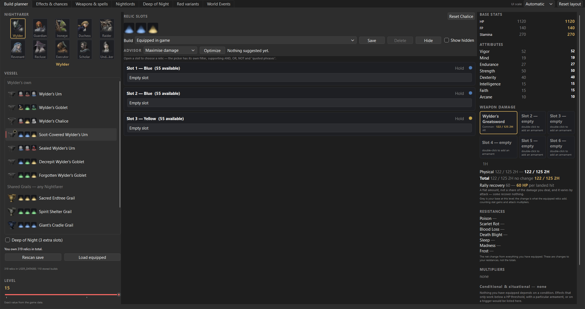
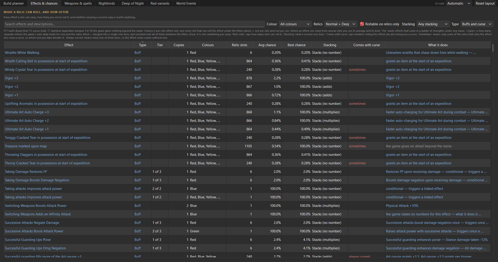
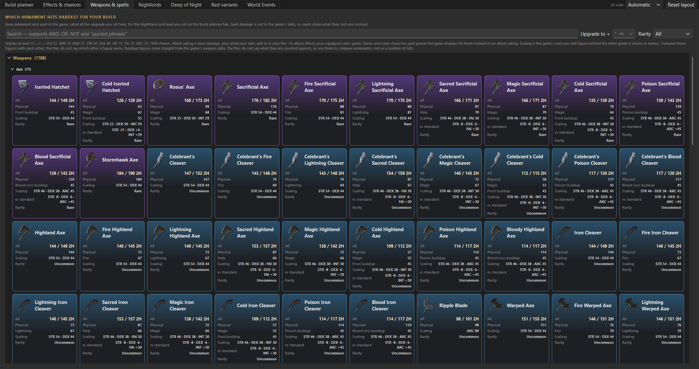
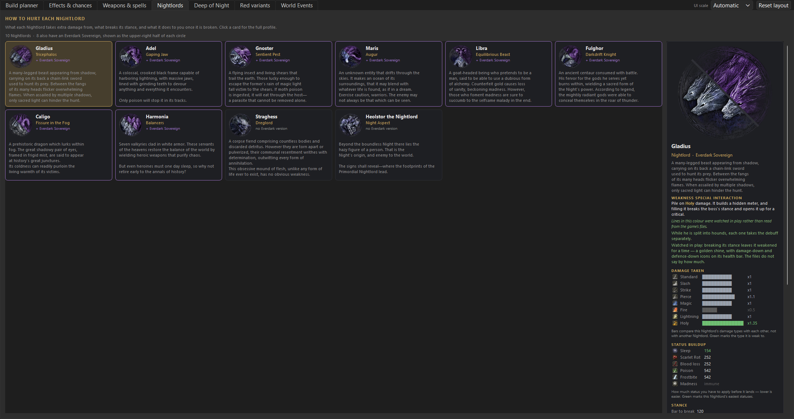
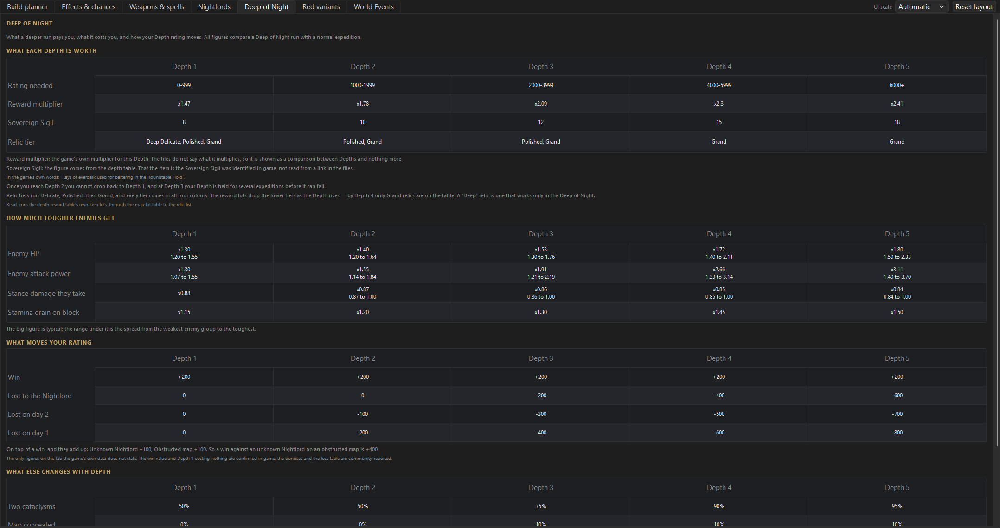
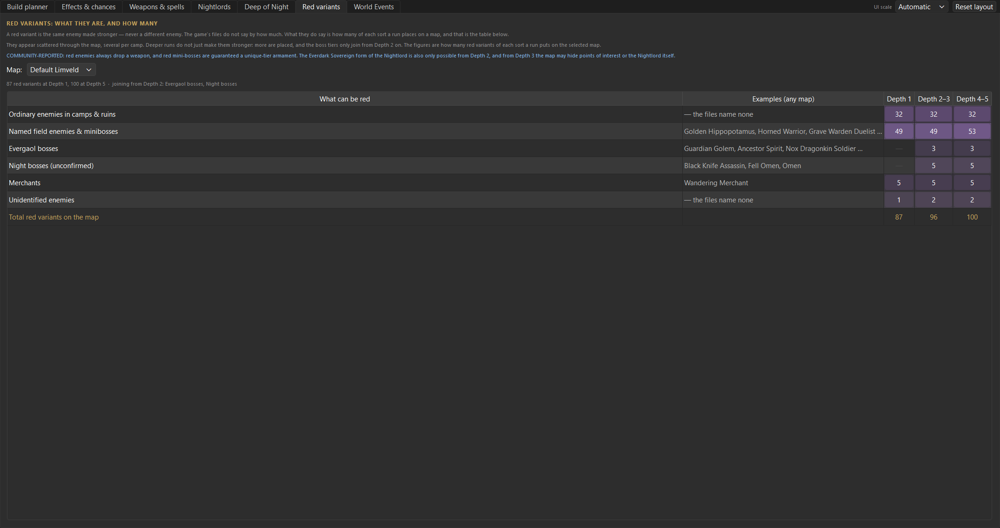
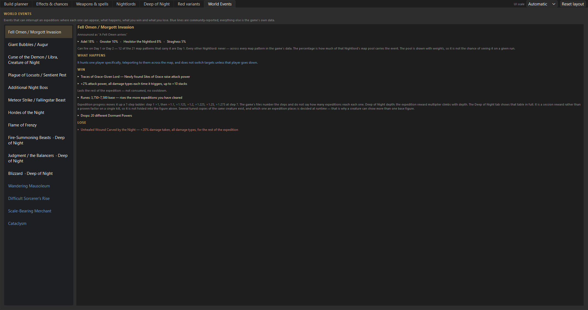

<div align="center">


# Nightreign Helper

**A build planner and reference for ELDEN RING NIGHTREIGN that reads your own game install.**

Every number here is read out of the game's own files on your machine. Nothing is
copied from a wiki, and nothing is typed in by hand. Where the game files do not
answer a question, the tool says so instead of guessing.

</div>

---

## Contents

- [What it is](#what-it-is)
- [Requirements](#requirements)
- [Install](#install)
- **The guide**
  - [1. Build planner](#1-build-planner)
  - [2. Effects & chances](#2-effects--chances)
  - [3. Weapons & spells](#3-weapons--spells)
  - [4. Nightlords](#4-nightlords)
  - [5. Deep of Night](#5-deep-of-night)
  - [6. Depth weighting](#6-depth-weighting)
  - [7. World Events](#7-world-events)
- [Searching](#searching)
- [Where your data lives](#where-your-data-lives)
- [Running from source](#running-from-source)
- [How values are derived](#how-values-are-derived)
- [Known limits](#known-limits)
- [Disclaimer](#disclaimer)

---

## What it is

A desktop tool for planning relic builds and for looking up things the game does
not tell you: what an effect actually does, which effects refuse to stack, how
much tougher enemies get at Depth 4, what a world event pays out.

It reads your save file, so the relics it offers are the relics you own, and it
can pull a Nightfarer's current loadout straight out of the game.

**What it is not.** Your save is opened **read-only**. This tool never writes to
it. It is not a mod, a trainer, a save editor, or anything that touches the game
while it runs.

## Requirements

- **Windows**
- **ELDEN RING NIGHTREIGN installed.** Not optional — the tool ships no game data
  and reads yours instead. See [Where your data lives](#where-your-data-lives).
- A save file is optional. Without one the relic slots stay empty and every
  reference tab still works in full.

## Install

Download `NightreignHelper.exe` from the [Releases](../../releases) page and run
it. No Python, no installer, no admin rights.

**First launch takes about a minute.** It reads your installation and builds a
local copy of the data. Every launch after that is immediate, until the game is
patched — then it re-reads itself and tells you why.

---

# The guide

## 1. Build planner



The main screen. Pick a Nightfarer, pick a vessel, fill the slots, read the
consequences on the right.

**Nightfarer** — the ten portraits at the top left. Some have alternate artwork;
your choice is remembered between sessions.

**Vessel** — split into that Nightfarer's own vessels and the **Shared Grails**,
which any Nightfarer can carry. The vessel decides how many relic slots you get
and what colour each one is.

**Relic slots** — each slot names its colour and how many relics of that colour
you own. Open one to choose from a picker that lists only relics which fit. A
relic's three effects appear under it once slotted.

**Favourites** — mark a relic in the picker as wanted for one or more
Nightfarers, and it leads the grid the next time you open a slot for that
Nightfarer. It changes nothing about the build; it just saves hunting for a good
roll in a grid of two hundred.

A favourite follows the **roll**, not the copy. Two relics with the same effects
and curses are interchangeable in a build, so they count as the same favourite —
and melting one down and earning another with the same roll keeps the mark.
Curses are part of that identity: the same relic with and without a curse is not
the same thing. The picker also collapses duplicate rolls down to one tile for
the same reason.

**Deep of Night** — the checkbox under the vessel list adds the three extra
slots that Deep of Night runs give you.

**Rescan save** re-reads your save from disk. **Load equipped** pulls the
selected Nightfarer's currently equipped vessel and relics out of the save, so
you can start from what you actually have on.

**Level** — the slider runs 1 to 15, and the attribute figures come from the
game's own per-Nightfarer level tables, not a formula.

### Reading the right-hand panel

| Section | What it shows |
|---|---|
| **Base stats** | HP, FP and Stamina — your base, the change, and the total. |
| **Attributes** | All eight, same three-column layout. |
| **Weapon damage** | Six armament tiles. Double-click one to choose a weapon; the panel below breaks its attack rating down. |
| **Rally recovery** | How much HP a landed hit rallies back. A flat amount, not a share of damage dealt. |
| **Resistances** | The net change from everything equipped — changes, not totals. |
| **Multipliers** | Anything applying as a multiplier rather than a flat figure. |

Grey is your base at that level; the coloured figure is what the equipped relics
add. **Curses are shown in red** with a ✦, both on the slot and in the totals —
they are folded into the maths rather than quietly ignored.

**Every figure is clickable** for a per-buff breakdown showing which relic and
which effect contributed what.

---

## 2. Effects & chances



Every relic effect in the game — 577 buffs and 75 curses — with what each one
actually does and how likely you are to roll it.

| Column | Meaning |
|---|---|
| **Type** | Buff or curse. |
| **Tier** | Where an effect sits in a ladder of strengths sharing one name — "2 of 2" is the stronger. |
| **Copies** | How many times it can appear on a single relic. |
| **Colours** | Which relic colours can roll it. |
| **Pools** | How many draw pools contain it. |
| **Avg / Best chance** | How likely on one roll of the selected colour and mode. Where an effect comes from several pools you get its average and its best. |
| **Stacks** | Whether a second copy adds anything. Read from the game's own mutual-exclusion keys, not guessed from a shared category. |
| **Comes with curse** | Whether rolling it drags a curse along — *sometimes* or *always cursed*. |
| **What it does** | The game's own caption paired with the derived numbers. |

**Filters** — colour, Normal or Deep, *Rollable on relics only*, *Non-stacking
only*, *Stacking only*, and a buffs/curses selector.

Identical duplicates are merged. Around 50 effects carry nothing beyond a name in
the game files; they are labelled as such rather than padded out.

---

## 3. Weapons & spells



Every armament, sorcery and incantation, grouped by family with counts.

- **Upgrade to +N** recalculates at that upgrade level.
- **Rarity** filters to a tier.
- **Meets requirements** hides what the selected Nightfarer cannot wield at the
  chosen level.

The line under the search box states exactly what is being assumed — the
Nightfarer, the level, the upgrade, and every attribute feeding the calculation.

Attack rating is base damage plus what your stats add to it. **Spell damage is
not in the game data**, so sorceries and incantations show their costs instead of
an invented figure.

---

## 4. Nightlords



Ten Nightlords, each carrying its Everdark Sovereign rather than repeating it.
The two are the same character and every extracted figure is identical between
them, so one entry shows both: the portrait is a single circle split on the
diagonal, regular art in the lower-left and Everdark in the upper-right.
Straghess and Heolstor have no Everdark version. Select one for its detail
panel.

**What a weakness is for.** The panel opens with the interaction rather than
the chart: the right damage type builds a hidden meter, and filling it breaks
the boss's stance and opens it up for a critical. Three bosses are also seen to
take a debuff while broken — double damage taken, a fifth off their attack —
shown with the visual tell that says it has landed.

**Also on the panel.** Damage and status charts. The stance bar, its refill
rate and where the boss ranks among the ten. The attack buff each boss puts on
itself, whether it stacks and what sets it off. Per-part damage where a boss
tunes it — only Gladius has a soft spot and only Caligo has armour. Libra's
defence buff, which no other boss has.

**Where the figures stop.** The break threshold is not extracted: the chain is
named in the game's own AI script, but those scripts are compiled and their
constants are not yet tied to the functions that use them. Which body part a
number refers to is not in the files either, so the panel says "Part 1" rather
than naming it. Both say so on the page instead of guessing.

---

## 5. Deep of Night



What each of the five Depths changes.

- **Rewards by depth** — the reward multiplier and the Sovereign Sigil award.
- **What depth means** — the rating band for each Depth.
- **Rating per expedition** — what a win, a loss, an unknown Nightlord and an
  obstructed map are worth. This block is **not** from the game files, and says
  so on itself: no param holds it. Each line is marked *confirmed in game* or
  *community-reported*.
- **How much tougher enemies get** — HP, attack power, stance damage taken and
  stamina drain on block, per Depth. The top figure is the typical multiplier and
  the range below is the spread across enemy groups. The game sorts enemies into
  89 groups but never records which creature is in which, so the spread is shown
  rather than a single invented number.
- **Cataclysms and concealment** — how often each outcome comes up, as shares out
  of 100 read from the game's own depth table, with the reasoning for each
  reading written out underneath.

---

## 6. Depth weighting



Which mutations can appear at which Depth. One row per mutation category, one
column per Depth, showing the game's own draw weights.

- **Only categories that change with depth** hides the flat ones — 20 of the 46
  categories actually move.
- **Show share within category** converts weights to percentages, on the
  assumption that the category is the pool.

The weights are shown **raw**. What pool they are drawn against is not stated
anywhere in the files, and the categories themselves are unnamed, so only their
ids appear. Inventing labels for them would be inventing data.

---

## 7. World Events



The events that can interrupt an expedition, and how each one can end.

Select an event for its reward, its drop table, its penalty and which Nightlords
it can appear under. Rune values are broken down properly: the base value on the
creature, then the multipliers that apply — expeditions completed, and Depth.

Each block is marked **from the game files**. Anything shown in blue is
community-reported and could not be verified against the files. DLC events are
tagged, and events with no announcement banner are marked *no banner*.

---

## Searching

The **relic picker** and the **Weapons** tab take a query syntax:

| Query | Finds |
|---|---|
| `poise stamina` | entries matching **both** words |
| `poise OR stamina` | either |
| `poise NOT curse` | poise, excluding anything matching *curse* |
| `"attack power"` | that exact phrase |

The **Effects** box is simpler — a plain substring match, no operators. It
searches descriptions as well as names. The Nightlords tab has no search: ten
entries fit on screen at once.

## Where your data lives

Everything the tool extracts goes to:

```
%LOCALAPPDATA%\NightreignHelper
```

That folder holds the data snapshot and the icon pack, both built from your
installation on first run. **Nothing is written anywhere else**, and nothing is
sent anywhere — the tool makes no network connections at all. Uninstalling means
deleting that folder and the EXE.

When the game is patched, `regulation.bin` changes, the tool notices on the next
launch, rebuilds, and tells you it has done so.

## Running from source

Install Python 3.12 from [python.org](https://www.python.org/downloads/), then:

```bat
py -3.12 scripts\setup_check.py --fix
```

That one command creates the virtual environment, installs every dependency and
verifies the result:

```
[  ok   ] Python interpreter                    3.12.10
[  ok   ] virtual environment                   ...\.venv
[  ok   ] python packages                       pycryptodome, zstandard, PySide6, ...
[  ok   ] paramdefs (required to read the game) 226 files
[  ok   ] Nightreign installation               D:\SteamLibrary\...\Game
[  ok   ] save file                             2 profile(s)
```

Then start it — the first launch builds the data itself:

```bat
.venv\Scripts\python.exe run.py
```

To build the data deliberately instead:

```bat
.venv\Scripts\python.exe scripts\build_snapshot.py
.venv\Scripts\python.exe scripts\build_icons.py
```

To package your own EXE:

```bat
.venv\Scripts\pyinstaller.exe NightreignHelper.spec --noconfirm
```

Close any running copy first, or Windows' file lock makes PyInstaller fail with
`PermissionError`.

### Layout

| Path | Purpose |
|---|---|
| `nrdata/` | Reading the game's own formats — archives, params, textures, saves. No GUI code. |
| `nrplanner/` | The GUI, the build maths, and save inventory. |
| `scripts/` | Environment check, data builders, icon generator. |
| `vendor/Paramdex/NR/Defs` | Field schemas for the params. Required to read anything. |

## How values are derived

One rule runs through the whole project: **every value comes from the game files,
and anything that does not is labelled.**

In practice that means stacking rules are read from the game's own exclusivity
keys rather than inferred from a shared category; conditional effects stay out of
the flat totals rather than being applied unconditionally; and where a chain from
the menu to the underlying data cannot be closed, the tab says so on itself.

The handful of figures that genuinely are not in the files — the expedition
rating table, the cataclysm split — are marked *confirmed in game* or
*community-reported* where they appear, never presented as extracted data.

## Known limits

Stated plainly rather than hidden:

- **Attack rating has not been verified against an in-game number.** The maths
  follows the game's own fields, but the final figure has not been checked
  against what the game displays.
- **The relic scan can over-count.** It currently reports slightly more owned
  relics than the game shows; the extras follow gaps in the save's record run and
  no loadout uses them.
- **The break threshold is unknown.** The weakness chain is named in the AI
  scripts, but their constants are not yet scoped to the functions using them.
- **Weak parts are numbered, not named.** Nothing in the files says which body
  part a slot refers to.
- **Spell damage is unavailable** — no such field exists in the data.
- **Mutation categories are unnamed** in the files, so the Depth weighting tab
  shows ids.

## Disclaimer

Nightreign Helper is an unofficial fan project. It is **not affiliated with,
endorsed by, sponsored by, or approved by** FromSoftware, Inc. or Bandai Namco
Entertainment Inc.

ELDEN RING NIGHTREIGN, its data, artwork, text and trademarks are the property of
their respective owners. This project distributes none of that content. All game
values and images the tool displays are read at runtime from the copy of the game
on the user's own machine, into that machine's local storage only.

Screenshots in this README show the tool's own interface displaying data read
from a personal installation.

The application icon was generated with Google Gemini and contains no game
assets. The source artwork is in `art/`; `scripts/make_icon.py` produces the
shipped PNG and ICO from it.

The byte layouts of the game's param tables come from the community
[Paramdex](https://github.com/soulsmods/Paramdex) project — the schema only,
which is what makes an otherwise opaque binary readable. Everything built on
top of it is this project's own. See [`vendor/Paramdex/NOTICE`](vendor/Paramdex/NOTICE).

## Licence

[MIT](LICENSE) © DankYeeter — source code only. See the disclaimer above for game
content.

The released executable bundles its runtime dependencies, so their terms travel
with it — most notably **Qt, via PySide6, under the LGPL-3.0**. What is included
and how the LGPL obligations are met is set out in
[THIRD_PARTY.md](THIRD_PARTY.md), and `scripts/check_licences.py` fails the
build if a dependency is added without being recorded there.
