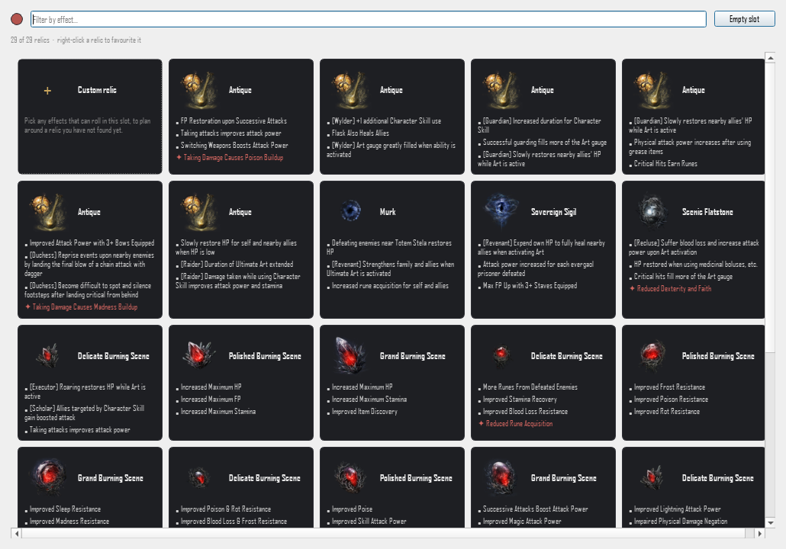
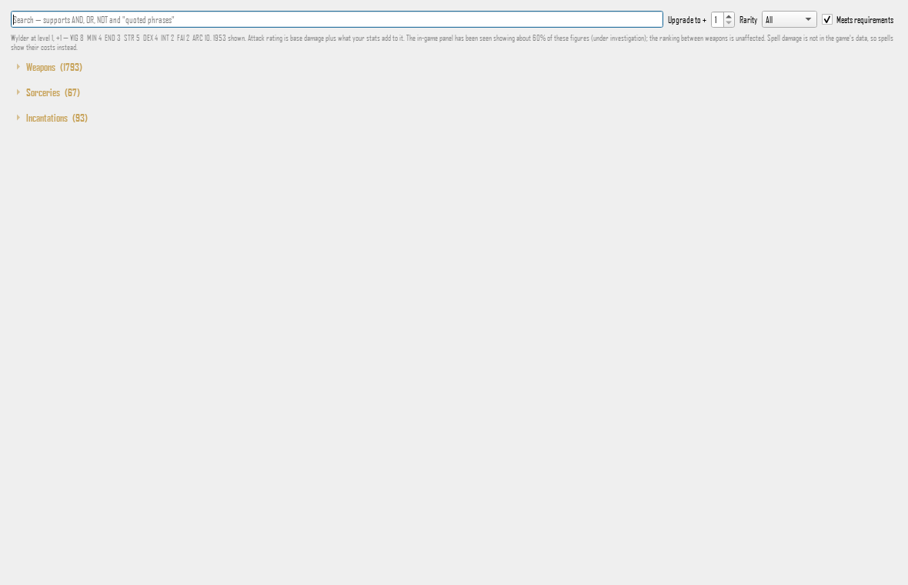
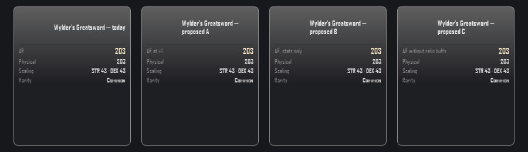

# UI_SPEC — Nightreign Helper

Verbindliche Oberflaechen-Vorgaben, gegen die der `developer` baut und der
`qa-engineer` prueft. Ein `##`-Abschnitt je Auftrag, mit Datum. Bestehende
Abschnitte werden nie ueberschrieben — eine spaetere Korrektur bekommt einen
eigenen Nachtrag mit Begruendung.

Dokumentsprache ist Deutsch wie `GOAL.md` und `docs/state.md`. **Jede
Zeichenkette, die im Programm erscheint, steht hier woertlich auf Englisch**
und ist so zu uebernehmen (Projektregel, GOAL A8).

---

## Build Advisor (T-004) — 2026-09-01

### 0. Grundlage

Gelesen: `docs/tasks/T-004.md`, `GOAL.md`, `docs/state.md`, `README.md`,
`nrplanner/app.py`, `relicpicker.py`, `effectstab.py`, `arsenaltab.py`,
`firstrun.py`, `inventory.py`, `stacking.py`, `uiscale.py`, `effecttext.py`
sowie die Screenshots unter `docs/screenshots/` (angesehen: `build_planner.png`,
`effects.png`).

**Korrektur zur Auftragsbeschreibung:** T-004 und `GOAL.md` nennen die
Oberflaeche "Tkinter". Das Programm benutzt **PySide6 6.11.1 / Qt Widgets**
(`requirements.txt`, `app.py`); `tkinter` kommt im Quellbaum nicht vor. Alle
Vorgaben hier sind Qt-Widget-Vorgaben. Der Director hat den Irrtum am
2026-09-01 bestaetigt und zieht `GOAL.md` nach; "kein UI-Framework-Wechsel"
heisst also: bei Qt bleiben.

**Nicht live gesehen.** PySide6 ist im System-Python (3.12) nicht installiert
und es liegt kein Daten-Snapshot im Benutzer-Cache; ein Start haette eine
Abhaengigkeitsinstallation und einen Erstlauf-Build gegen die Spielinstallation
erfordert — beides Seiteneffekte auf einer Arbeitskopie, auf der zeitgleich
drei andere Rollen arbeiten. Grundlage sind daher Quelltext und die im Repo
mitgelieferten Screenshots. Kontrastwerte sind aus den Farbkonstanten in
`app.py` gerechnet, nicht vom Bildschirm gemessen.

---

### 1. Zweck & Nutzerziel

Der Spieler besitzt Hunderte Relikte (im Beleg-Screenshot: 292) und kann nicht
ueberblicken, welche Kombination ein benanntes Ziel am besten bedient. Der
Build Advisor beantwortet in einem Schritt: *"Welche Relikte aus meinem Besitz
fuellen die Slots dieses Kelchs am besten fuer `<Ziel>`, und warum?"* — ohne
dass etwas veraendert wird, bis der Spieler zustimmt.

---

### 2. Entscheidung: wo der Berater lebt

Drei Wege standen zur Wahl.

**(a) Eigener Tab "Advisor" — verworfen.**
Der Berater braucht Nightfarer, Vessel, Deep-of-Night-Schalter und Level als
Eingabe. Alle vier leben in der linken Spalte des Build planner. Ein eigener
Tab muesste sie entweder duplizieren (zwei Wahrheiten ueber denselben Zustand)
oder auf einen anderen Tab verweisen (der Spieler wechselt hin und her, um ein
Ergebnis anzuwenden). Zudem ist das Ergebnis eine Belegung genau der Slots, die
im Build planner sichtbar sind — es zwei Tabs entfernt anzuzeigen erzwingt das
Vergleichen aus dem Gedaechtnis. Achter Tab in der Leiste ohne Gegenwert.

**(b) Nur Markierung im Relic Picker — verworfen als alleiniger Weg.**
Der Picker (`relicpicker.RelicPicker`) ist ein **modaler Dialog pro Slot**.
Eine Empfehlung, die nur dort sichtbar ist, hat drei Bruchstellen: sie ist erst
zu sehen, nachdem der Spieler einen Slot geoeffnet hat — also nachdem er die
Entscheidung, die der Berater abnehmen soll, schon selbst getroffen hat; sie
kann keine Aussage ueber die **Menge** treffen, obwohl Ziel, Stacking-Regeln
und Slot-Farben nur ueber alle Slots zusammen sinnvoll sind (GOAL A3/A4); und
Warten, Fehler sowie "hierzu schweigt das Spiel" haetten in sechs modalen
Dialogen nacheinander erscheinen muessen. Als *alleiniger* Ort untauglich.

**(c) Gewaehlt: schmale Leiste im Build planner + Vorschlag im Slot +
Markierung im Picker.**
Genau eine Steuerstelle, das Ergebnis dort, wo es wirkt, und die Markierung im
Picker als Echo fuer den, der doch selbst waehlt.

| Ort | Traegt |
|---|---|
| **Advisor bar** — eine Zeile in der mittleren Spalte, oberhalb der Slots, nicht mitscrollend | Zielwahl, Ausloeser, Wartezustand, Ergebniszusammenfassung, Anwenden/Rueckgaengig, Zugang zur Begruendung |
| **Vorschlagsblock im Slot** — in jeder `RelicSlot`-Karte, nur solange ein Vorschlag lebt | Vorgeschlagenes Relikt, seine Effekte, seine Fluche, ein Satz Begruendung, "Use" fuer diesen einen Slot |
| **Karte im Relic Picker** — bestehende `RelicCard` | Kennzeichen "ADVISOR PICK", Karte fuehrt das Raster an |

Der Wunsch des Nutzers ("empfohlene Relikte direkt in der Relikt-Uebersicht
markieren") ist damit erfuellt, **aber eine Ebene frueher** als vorgeschlagen:
markiert wird zuerst im Slot selbst — dort steht das aktuell Bestueckte direkt
darueber, der Vergleich ist ein Blick — und zusaetzlich im Picker.

---

### 3. Aufbau

#### 3.1 Advisor bar

Position: mittlere Spalte des Build planner, **zwischen der Zeile "Build …"
und dem Hinweistext "Open a slot to choose a relic …"**, ausserhalb der
`QScrollArea` (der Wartezustand darf nicht wegscrollen).

Eine einzige Zeile, in dieser Reihenfolge:

```
ADVISOR  [ Maximise damage   v ]  [ Suggest ]   <status …>   [ Apply all ] [ Why ] [ Clear ]
```

- `ADVISOR` in der Schrift von `app._heading` (8 pt, fett, +1.2 Sperrung,
  `MUTED`), inline statt als Blockzeile.
- Zielwahl: `QComboBox`, `setSizeAdjustPolicy(AdjustToContents)`,
  `setMaximumWidth(200)`. Eintraege in dieser Reihenfolge:
  `Maximise damage`, `Minimise damage taken`. Bewusst eine Combobox und nicht
  zwei Knoepfe, damit weitere Ziele ohne Layoutaenderung dazukommen koennen.
- `Suggest`: `QPushButton`. Waehrend der Rechnung traegt derselbe Knopf
  `Cancel`.
- Statusbereich: `QLabel`, **darf zur Breite der Leiste nichts beitragen**
  (horizontal `QSizePolicy.Ignored`, Text bei Platzmangel per `QFontMetrics`
  auf `…` gekuerzt, ungekuerzter Text immer als Tooltip). Rechts daneben, nur
  waehrend der Rechnung, ein `QProgressBar` mit `setRange(0, 0)`,
  `setTextVisible(False)`, `setFixedHeight(6)`, `setMinimumWidth(0)` —
  dasselbe Muster wie `firstrun._Window`.
- Aktionsknoepfe rechts, **nie mehr als drei gleichzeitig sichtbar**:
  - kein Vorschlag: keiner
  - Vorschlag lebt: `Apply all`, `Why`, `Clear`
  - nach dem Anwenden: `Undo apply`, `Why`, `Clear`

Vertikales Budget: **hoechstens 32 px Inhaltshoehe bei UI scale "Automatic" auf
einem 100-%-Bildschirm**, plus 6 px Abstand oben und unten. Das ist der gesamte
Flaechenpreis des Beraters ausserhalb der scrollenden Slots.

#### 3.2 Vorschlagsblock im Slot

Erscheint innerhalb der `RelicSlot`-Karte unter `rolled_label`, **nur solange
ein Vorschlag lebt**. Rahmen `1px dashed ACCENT`, Radius 5, Hintergrund
`PANEL`, Innenabstand 8. Der gestrichelte Rahmen ist bewusst derselbe Griff,
den `CustomRelicCard` schon benutzt — gestrichelt heisst in diesem Programm
bereits "hypothetisch, noch nicht real".

```
SUGGESTED — MAXIMISE DAMAGE                                   [ Use ]
The Will of the Balancers
• Improved Melee Attack Power
• Improved Skill Attack Power
• Continuous FP Recovery
✦ <Fluchname>                                       (rot, nur wenn vorhanden)
Chosen for +15.0% Skill Attack Power and +6.0% all damage — the largest gain
of any Blue relic you own.
```

- Kopfzeile im `_heading`-Stil, `MUTED`; das Ziel wird mitgenannt, damit der
  Block auch nach dem Wegscrollen der Leiste fuer sich steht.
- Relikt- und Effektzeilen genau so formatiert wie im bestehenden
  `_sync_mode` — dieselben Aufzaehlungszeichen, dieselbe Farbe, dasselbe `⚠`
  fuer nicht stapelnde Effekte.
- **Fluche werden im Vorschlag genannt**, in `CURSE`, mit `✦`, mit demselben
  Tooltip wie `curse_tooltip`. Ein Vorschlag, dessen Preis erst nach dem
  Anwenden sichtbar wird, ist eine Falle.
- Begruendungssatz: **ein** Satz, `MUTED`, 11 px, `setWordWrap(True)`,
  hoechstens 160 Zeichen, in der Sprache des Statblatts (dieselben Feldnamen
  und Zahlenformate wie in `MULTIPLIERS` / `FLAT BONUSES`).
- `Use` wendet nur diesen einen Slot an.
- Ist der Vorschlag identisch mit dem, was bereits im Slot liegt, entfaellt
  alles ausser einer Zeile: `Already equipped — nothing to change here.`

#### 3.3 Markierung im Relic Picker

`RelicCard` bekommt einen optionalen Chip in der Kopfzeile, rechts neben dem
Namen: Text `ADVISOR PICK`, 10 px, Farbe `ACCENT`, kein Rahmen. Die Karte wird
im Raster **vor** die Favoriten sortiert, solange fuer diesen Slot ein
Vorschlag lebt.

**Kein vierter Rahmenfarbzustand.** Rahmen bedeuten im Picker bereits
"ausgewaehlt" (`ACCENT`) und "Favorit" (`FAVOURITE`); eine dritte Bedeutung
darauf zu legen macht die drei ununterscheidbar. Der Chip traegt Text, ist also
auch ohne Farbwahrnehmung lesbar.

Die Zusammenfassungszeile des Pickers bekommt einen Zusatz:

- normal: `  ·  the advisor's pick leads the grid`
- wenn der Filter die Karte ausblendet:
  `  ·  the advisor's pick is hidden by your filter`

#### 3.4 Dialog "Why"

Modaler `QDialog`, Titel `Why this build — <Ziel>`, `resize(640, 620)` wie
`CustomRelicDialog`, einziger Knopf `Close`. Inhalt in dieser Reihenfolge:

1. Kopf: Ziel, Nightfarer, Vessel, Deep of Night an/aus, wie viele Relikte
   betrachtet wurden.
2. Je Slot: Reliktname, darunter die Effekte, die den Ausschlag gaben, mit
   ihrem Beitrag im Format des Statblatts (`+15.0%`, `+1`).
3. Abschnitt `What could not be ranked` — Effekte ohne Zahlen (siehe 4.9).
4. Vorbehaltszeile, wo das Ziel auf Attack Rating beruht (README, "Known
   limits"): `Attack rating has not been verified against an in-game number.`

Kein `Apply` in diesem Dialog. Anwenden hat genau zwei Orte — die Leiste und
den Slot; ein dritter macht die Handlung unauffindbar statt zugaenglicher.

#### 3.5 Rich-Text-Sicherheit (Nachtrag Director, 2026-09-01)

Der `security-reviewer` hat im Bestand eine Markup-Injektion gefunden: Labels
laufen auf Qt-Voreinstellung `Qt.AutoText`, und Zeichenketten aus Save- und
Spieldateien werden per f-String ungefiltert in Rich Text interpoliert. Der
Berater fasst genau solche Zeichenketten an — Reliktnamen, Effektnamen,
Fluchnamen, den Nightfarer-Namen in 4.10, den Farbnamen in 4.11 — und wuerde
die Luecke sonst ein zweites Mal einbauen. Deshalb verbindlich:

- **Jedes** neue Label, jeder neue Tooltip und jeder Textbereich des Beraters
  setzt sein Format ausdruecklich: `setTextFormat(Qt.PlainText)`, wo keine
  Auszeichnung noetig ist, `setTextFormat(Qt.RichText)` nur dort, wo der Block
  seine Auszeichnung selbst erzeugt. Die `AutoText`-Heuristik entscheidet
  nirgends.
- In jedem `RichText`-Block wird **jede** aus Save- oder Spieldateien
  stammende Zeichenkette vor der Interpolation durch `html.escape()` geführt —
  Reliktname, Effektname, Fluchname, Vessel-Name, Nightfarer-Name,
  Fehlergrund. Auch dann, wenn sie heute harmlos aussieht.
- Tooltips zaehlen mit. Qt erkennt auch dort Rich Text selbsttaetig; ein
  Fluch-Tooltip aus `curse_tooltip` ist derselbe Weg.
- Wo Rich Text nur wegen Farbe oder Fettdruck gewaehlt wuerde, ist einfacher
  Text mit Stylesheet vorzuziehen. Der Vorschlagsblock braucht Rich Text nur
  fuer die Effektzeilen, die `_sync_mode` nachbilden.

---

### 4. Zustaende — vollstaendig

Jeder Zustand hat genau einen sichtbaren Ort: die Statuszeile der Leiste, bei
slot-spezifischen Aussagen zusaetzlich den Vorschlagsblock.

| # | Zustand | Statuszeile (woertlich) | Sonst |
|---|---|---|---|
| 4.1 | Ruhe, nie gerechnet | `Nothing suggested yet.` | Tooltip auf `Suggest`: `Fills every slot from the relics in your save. Nothing changes until you apply it.` |
| 4.2 | Rechnet, < 250 ms | *nichts* | keine Progressanzeige, kein Aufblitzen |
| 4.3 | Rechnet, ≥ 250 ms | `Working out maximise damage…` | Progressbar sichtbar, `Suggest` heisst `Cancel` |
| 4.4 | Rechnet, ≥ 3 s | `Working out maximise damage — 292 relics, 6 slots.` | Zahlen nur, wenn der Scorer sie liefert; sonst bleibt 4.3 stehen |
| 4.5 | Abgebrochen | `Stopped. Nothing was changed.` | Vorschlagsbloecke verschwinden |
| 4.6 | Ergebnis | `Maximise damage — 6 of 6 slots filled.` | Vorschlagsbloecke in allen Slots; `Apply all` / `Why` / `Clear` |
| 4.7 | Ergebnis veraltet (Nightfarer, Vessel, Deep, Level oder eine Slot-Belegung hat sich waehrend der Rechnung geaendert) | `Your build changed while this was working out. Suggest again.` | Ergebnis wird **verworfen**, nicht angezeigt |
| 4.8 | Kein Save gelesen (`owned is None`) | `No save was read, so there are no relics to choose from — use Rescan save.` | Zielwahl und `Suggest` deaktiviert |
| 4.9 | Teilweise stumm | `Maximise damage — 6 of 6 slots filled  ·  some effects carry no numbers.` | im `Why`-Dialog: `The game files carry no numbers for these, so they counted for nothing:` gefolgt von den Effektnamen |
| 4.10 | Ziel gar nicht bewertbar | `The game files carry no figures this goal can be ranked on for <Nightfarer>, so there is nothing to suggest.` | kein Vorschlagsblock; `Why` bleibt erreichbar und erklaert es lang |
| 4.11 | Keine Relikte fuer eine Slot-Farbe | `Maximise damage — 3 of 4 slots filled  ·  1 slot has nothing to choose from.` | betroffener Slot: `No <colour> relic in your save fits this slot.` |
| 4.12 | Rechnung schlug fehl | `Could not work that out — <kurzer Grund>.` | kein Stacktrace in der Oberflaeche |
| 4.13 | Angewendet | `Applied. Undo puts your slots back as they were.` | `Apply all` wird zu `Undo apply` |
| 4.14 | Sehr lange Reliktnamen, sehr viele Effekte | — | jede neue Beschriftung `setWordWrap(True)`; nichts wird abgeschnitten, nichts erzwingt Breite |

**4.9 und 4.10 sind nicht dasselbe** und duerfen nicht in einen Text
zusammenfallen: einmal schweigt das Spiel so, dass gar nichts gesagt werden
kann, einmal so, dass ein Teil der Kandidaten unbewertet blieb. Die Hausregel
(GOAL A7) verlangt beide Male eine Aussage, aber verschiedene.

---

### 5. Interaktion, Tastatur, Nebenlaeufigkeit

1. **Nichts aendert sich ohne Zustimmung.** `Suggest` schreibt in keinen Slot.
   Erst `Apply all` bzw. `Use` belegen Slots.
2. **Anwenden geht durch den bestehenden Weg**, den auch der Picker benutzt
   (`RelicSlot.relic_box.setCurrentIndex` → `_on_relic_changed` → `recompute`).
   Damit gelten Persistenz je Kelch, Neuberechnung des Statblatts und der
   Zustand der Build-Liste unveraendert weiter — der Berater erfindet keinen
   zweiten Weg, ein Relikt in einen Slot zu bekommen.
3. **`Undo apply` stellt die vorherige Slot-Belegung exakt wieder her**,
   einschliesslich eines vorher dort liegenden Custom relic und eines vorher
   leeren Slots. Verfuegbar, solange der Vorschlag lebt.
4. **Die Oberflaeche bleibt waehrend der Rechnung vollstaendig bedienbar**:
   kein modaler Dialog, kein `WaitCursor` ueber dem Fenster, kein Deaktivieren
   von Slots, Tabs, Nightfarer- oder Vessel-Auswahl. Muster: `QThread` +
   `moveToThread` wie in `firstrun.ensure_data`, aber ohne die dortige
   `processEvents`-Schleife — die gehoert zum Erstlauf-Fenster, nicht ins
   Hauptfenster.
5. **Ein ueberholtes Ergebnis wird nie angewendet** (4.7).
6. **Nur Relikte aus dem Besitz.** Nie "Custom relic", nie ein Relikt, das der
   Save nicht hergibt (GOAL A3).
7. **Tab-Reihenfolge**: Zielwahl → `Suggest`/`Cancel` → `Apply all`/`Undo
   apply` → `Why` → `Clear` → erster Slot. Innerhalb eines Slots liegt `Use`
   direkt hinter dem Reliktknopf des Slots.
8. Jede Aktion des Beraters ist ohne Maus erreichbar; jedes fokussierte
   Bedienelement zeigt den Fokus sichtbar (der Qt-Standardring genuegt, er darf
   nicht per Stylesheet entfernt werden).
9. **Die Suche bleibt unberuehrt.** `search.parse` und das Filterfeld des
   Pickers arbeiten unveraendert; die Advisor-Karte unterliegt demselben Filter
   wie jede andere und wird nicht davon ausgenommen.

---

### 6. Verwendete Token

Alles aus dem Bestand (`app.py`, `relicpicker.py`) — **kein neuer Farbwert,
keine neue Schriftgroesse.**

| Token | Wert | Verwendung im Berater | Kontrast auf `PANEL` |
|---|---|---|---|
| `ACCENT` | `#c8a45c` | Chip `ADVISOR PICK`, gestrichelter Rahmen des Vorschlags | 6,99:1 |
| `MUTED` | `#8a8a8a` | Kopfzeilen, Statuszeile, Begruendungssatz | 4,77:1 |
| `CURSE` / `BAD` | `#d1655f` | Fluche im Vorschlag | 4,50:1 |
| `GOOD` | `#6fbf73` | positive Betraege in der Begruendung, sofern verwendet | 7,35:1 |
| `PANEL` / `BORDER` | `#1e1f23` / `#2e2f35` | Flaeche und Rahmen | — |
| `_heading()` | 8 pt fett, +1.2 Sperrung | `ADVISOR`, `SUGGESTED — <Ziel>` | — |
| Fliesstext | 11 px | Effektzeilen, Begruendung | — |

Anmerkung fuer den `developer`: `CURSE` auf `PANEL` liegt mit 4,50:1 **exakt**
auf der WCAG-AA-Grenze. Fluchtext im Berater darf diese Farbe nicht abdunkeln
und nicht unter 11 px gesetzt werden. (Werte aus den Hex-Konstanten gerechnet,
nicht vom Bildschirm gemessen.)

---

### 7. Plattformkonventionen und kleine Bildschirme

Zielsystem Windows 10/11, Qt Widgets, dunkle Palette. Maus- und
Tastaturbedienung, keine Touch-Ziele.

Release 1.7.1 wurde von genau einem Fehler ausgeloest: **eine nicht umbrechende
Beschriftung setzte eine Mindestbreite von ~3900 px auf das ganze Fenster**
(Commit 7bf1f7e). Der Berater darf das nicht wiederholen. Daraus:

- Jede neue `QLabel` mit variablem Text: `setWordWrap(True)`.
- Kein neues Widget mit fester oder Mindestbreite ueber 200 px.
- Die Statuszeile traegt **nichts** zur Mindestbreite bei (siehe 3.1).
- Die Advisor bar darf die Mindestbreite der mittleren Spalte nicht ueber die
  der bestehenden "Build"-Zeile hinaus vergroessern.
- Die Vorschlagsbloecke liegen in der bestehenden `QScrollArea` der mittleren
  Spalte und wachsen deshalb nur in die Scrollhoehe, nicht in die
  Fenstermindesthoehe.
- Bei UI scale 125 % und 150 % (Werte aus `uiscale.CHOICES`) gilt alles Obige
  unveraendert; es wird kein Pixelwert hart gegen eine Skalierung gerechnet.

---

### 8. Akzeptanzkriterien

Pruefbar, binaer, vom `qa-engineer` gegen ein gebautes Artefakt (GOAL A9).

**Platzierung und Layout**

- **AK-01** Es gibt keinen neuen Tab. Die Tab-Leiste zeigt dieselben Tabs wie
  in 3da8428.
- **AK-02** Die Advisor bar steht in der mittleren Spalte des Build planner
  zwischen der "Build"-Zeile und dem Hinweistext und scrollt nicht mit.
- **AK-03** `Planner.minimumSizeHint().width()` ist nicht groesser als auf
  3da8428 (gleiche Umgebung, gleiche UI scale, gemessen vor dem ersten
  `show()`).
- **AK-04** Die Mindesthoehe des Fensters waechst um hoechstens 44 px
  gegenueber 3da8428.
- **AK-05** Bei Fensterbreite 1320 px (Startbreite) ist in der Advisor bar
  kein Text abgeschnitten ausser der Statuszeile, und deren voller Text steht
  im Tooltip.
- **AK-06** Mit UI scale 150 % und sechs belegten Deep-of-Night-Slots samt
  lebendem Vorschlag entsteht in der mittleren Spalte keine horizontale
  Bildlaufleiste.
- **AK-07** Zu keinem Zeitpunkt sind mehr als drei Aktionsknoepfe der Advisor
  bar gleichzeitig sichtbar.

**Verhalten und Nebenlaeufigkeit**

- **AK-08** Waehrend einer laufenden Rechnung lassen sich Nightfarer wechseln,
  Vessel wechseln, ein Slot oeffnen und der Tab wechseln; kein Bedienelement
  ausserhalb der Advisor bar ist deaktiviert, es erscheint kein modaler Dialog
  und kein Wartecursor ueber dem Fenster.
- **AK-09** Eine Rechnung unter 250 ms zeigt weder Fortschrittsbalken noch
  Wartetext (kein Aufblitzen).
- **AK-10** Eine Rechnung ueber 250 ms zeigt Fortschrittsbalken und Wartetext,
  und `Suggest` traegt `Cancel`.
- **AK-11** `Cancel` fuehrt binnen 200 ms nach dem Klick sichtbar in Zustand
  4.5, auch wenn der Arbeiter laenger zum Beenden braucht.
- **AK-12** Aendert sich Nightfarer, Vessel, Deep of Night, Level oder eine
  Slot-Belegung waehrend der Rechnung, wird das Ergebnis verworfen und 4.7
  angezeigt. Es wird nie ein Vorschlag zu einem Zustand gezeigt, der nicht mehr
  gilt.
- **AK-13** `Suggest` veraendert keinen Slot: nach `Suggest` ohne Anwenden sind
  Slot-Belegung, Statblatt und der Eintrag der Build-Liste unveraendert.
- **AK-14** Nach `Apply all` zeigt das Statblatt die angewendeten Relikte, und
  der Zustand ist derselbe, als waeren die Relikte einzeln im Picker gewaehlt
  worden — Persistenz je Kelch inbegriffen.
- **AK-15** `Undo apply` stellt die vorherige Belegung exakt wieder her, auch
  einen vorher leeren Slot und ein vorher dort liegendes Custom relic.
- **AK-16** Kein Vorschlag enthaelt jemals ein Custom relic oder ein Relikt,
  das nicht in `owned` steht.
- **AK-17** Der Berater schreibt nicht in den Save und oeffnet keine
  Netzwerkverbindung.

**Aussage und Hausregel**

- **AK-18** Jeder Slot-Vorschlag traegt genau einen Begruendungssatz in
  Nutzersprache, der mindestens einen konkreten Effekt beim Namen nennt
  (GOAL A5).
- **AK-19** Traegt das vorgeschlagene Relikt Fluche, sind sie im
  Vorschlagsblock genannt — in `CURSE` und mit `✦` — bevor angewendet wird.
- **AK-20** Kann das Ziel gar nicht bewertet werden, erscheint 4.10 und **kein**
  Vorschlag. Es wird nie eine Rangfolge gezeigt, die auf fehlenden Daten beruht
  (GOAL A7).
- **AK-21** Blieben Kandidateneffekte unbewertet, weil die Spieldateien keine
  Zahlen tragen, sagt die Statuszeile das (4.9) und der `Why`-Dialog nennt die
  betroffenen Effekte namentlich.
- **AK-22** Beruht das Ziel auf Attack Rating, steht der Vorbehalt aus den
  "Known limits" genau einmal im `Why`-Dialog — nicht je Zeile.
- **AK-23** Alle vom Berater gezeigten Zeichenketten sind Englisch (GOAL A8).
- **AK-24** Der Berater respektiert Slot-Farben, Stacking-Regeln und die
  Deep-of-Night-Kennzeichnung: ein Vorschlag enthaelt kein Relikt, das der
  Picker fuer denselben Slot nicht anbieten wuerde (GOAL A4).

**Tastatur und Suche**

- **AK-25** Jede Aktion des Beraters (Zielwahl, Suggest, Cancel, Apply all, Use
  je Slot, Why, Clear, Undo apply) ist allein mit Tab / Umschalt+Tab und
  Enter / Leertaste erreichbar und ausloesbar.
- **AK-26** Die Tab-Reihenfolge entspricht 5.7; der Fokusring ist auf jedem
  neuen Bedienelement sichtbar.
- **AK-27** Der Filter im Relic Picker liefert mit lebendem Vorschlag dieselben
  Treffermengen wie ohne; die Advisor-Karte ist nicht vom Filter ausgenommen,
  und wird sie ausgefiltert, sagt die Zusammenfassungszeile das.
- **AK-28** Die Advisor-Karte im Picker traegt den Text `ADVISOR PICK`; die
  Rahmenfarben fuer "ausgewaehlt" und "Favorit" bleiben unveraendert und
  bekommen keine dritte Bedeutung.

**Rich-Text-Sicherheit**

- **AK-29** Jedes vom Berater neu eingefuehrte Label, jeder Tooltip und jeder
  Textbereich setzt `setTextFormat()` ausdruecklich. Kein neues Textelement
  laeuft auf `Qt.AutoText`. Pruefbar per Grep ueber die neuen Widgets: zu jedem
  `setText(` auf einem neuen Element existiert ein `setTextFormat(`.
- **AK-30** Ein Relikt, dessen Name die Zeichenkette
  `<b>x</b>&lt;` enthaelt, erscheint im Vorschlagsblock, im
  `Why`-Dialog, in der Statuszeile und im Tooltip **buchstabengetreu** — kein
  Fettdruck, kein verschluckter Teil, keine geladene Ressource. Dasselbe fuer
  einen praeparierten Effekt- und Fluchnamen. (Testweg: manipulierter
  Snapshot-Eintrag; der `qa-engineer` legt den Testfall an.)

---

### 9. Ausdruecklich nicht Teil dieser Vorgabe

- **Die Scoring-Algorithmen.** Was "maximise damage" rechnet, legt der
  `architect` fest (T-001). Diese Vorgabe schreibt nur vor, in welcher Form das
  Ergebnis, seine Begruendung und sein Schweigen erscheinen.
- **Antwortzeit-Budgets.** Die 250-ms- und 3-s-Schwellen sind Anzeigeregeln,
  keine Leistungszusagen. Das Rechenbudget setzt der `performance-tuner`
  (GOAL A6).
- **Escape als Abbruch** waehrend der Rechnung — nicht spezifiziert, weder
  gefordert noch verboten.
- Weitere Ziele ueber die zwei geforderten hinaus.
- Ein Merken der zuletzt gewaehlten Zielrichtung ueber Programmstarts hinweg.
- Aenderungen an anderen Tabs. Der Berater erzwingt keine.

---

### 10. Offene Fragen an den App Designer

- **F1 — Slots festhalten.** `Apply all` ueberschreibt auch Slots, die der
  Spieler bewusst von Hand belegt hat. `Undo apply` faengt das auf, aber der
  eigentliche Wunsch waere oft "rechne die uebrigen Slots um diesen einen
  herum". Soll ein Slot festgehalten werden koennen (kleines Schloss in der
  Slot-Kopfzeile), oder bleibt es bei Alles-oder-Rueckgaengig? Produkt-
  entscheidung mit Folgen fuer den Algorithmus, deshalb nicht hier entschieden.
- **F2 — Anwenden oder Vorschau.** Soll `Apply all` sofort belegen (so
  spezifiziert), oder soll das Statblatt den Vorschlag *vorher* rechnen und
  neben den aktuellen Werten zeigen? Letzteres beantwortet "lohnt es sich?"
  ohne Umweg, kostet aber eine zweite Zahlenspalte im rechten Statblatt und
  damit Flaeche, die 1.7.1 gerade erst geordnet hat.
- **F3 — Fluche als Ausschlusskriterium.** Soll der Berater verfluchte Relikte
  grundsaetzlich mitbewerten (so spezifiziert: ja, mit sichtbarem Fluch), oder
  soll es einen Schalter "ohne Fluche" geben?
- **F4 — Name.** `Advisor` ist gesetzt, weil kurz und in der Leiste tragbar.
  Alternativen waeren `Suggest a build` oder `Build advisor`. Reine
  Geschmacksfrage, aber sie steht dauerhaft auf dem Bildschirm.

---

## Die Sprache der Zahlen, und der Relic Picker (T-024) — 2026-09-02

### 0. Grundlage, Methode, und was davon **gesehen** ist

Gelesen: `docs/tasks/T-024.md`, `GOAL.md` (F1–F4, OF-12/13/15), `docs/state.md`
(Fassung vom 2026-09-02, einschliesslich des waehrend dieser Arbeit
nachgezogenen Abschnitts zu AD-019), `ARCHITECTURE.md` **AD-014 bis AD-021**,
`qa/findings.md` QA-018/055/056/058, `DESIGN_REVIEW.md` (DR-001 bis DR-007),
sowie `nrplanner/relicpicker.py`, `arsenaltab.py`, `weaponslots.py`,
`damage.py`, `weapons.py` und `app.py` (`RelicSlot`,
`_refresh_weapon_damage`, `_show_ar_breakdown`).

**Der `architect` hat AD-019 bis AD-021 waehrend dieser Spec veroeffentlicht.**
Teil 1 ist daraufhin **neu geschrieben** worden; ein erster Entwurf, der die
heutigen Rechenschichten benannt haette (`AR before attack buffs` fuer die
Waffenkachel), waere nach Schritt W3 falsch gewesen, weil die Kachel dann
dieselbe Frage beantwortet wie die Tafel. Die Benennung unten folgt der
`Basis`-Aufzaehlung aus AD-019 und benennt **Fragen**, nicht Schichten.

**Methode — und zum ersten Mal in diesem Vorhaben mit Bild.** Die Widgets
wurden offscreen (`QT_QPA_PLATFORM=offscreen`, zusaetzlich
`QT_QPA_FONTDIR=C:/Windows/Fonts`; ohne das zweite rendert Qt nur
Tofu-Kaesten) gegen die echte Snapshot-Datei des Nutzers gebaut und per
`QWidget.grab()` als PNG abgezogen. Kein Anwendungscode wurde angefasst; die
Skripte lagen im Scratchpad, die Bilder liegen unter
`design-review/2026-09-02/`.

**Visuell belegt** (angesehen, nicht erschlossen):

| Beleg | Was daraus feststeht |
|---|---|
|  | Kartenraster 5 Spalten, Karte 190×145–181 px, Zeilenabstand 161 px; Effektzeilen brechen regelmaessig auf zwei Zeilen um; Fluchzeilen in Rot; die Custom-Karte fuehrt; **am Standardmass des Dialogs erscheint eine waagerechte Bildlaufleiste** |
|  | Die Zusammenfassung ist **ein** dichter Prosablock, in dem Held, Level, Tier („+1"), Attribute, Trefferzahl, AR-Definition, 60-%-Vorbehalt und Zauberhinweis hintereinander stehen |
|  | Die gepruefen Zeilenbeschriftungen — darunter **`AR at +1`** — passen **einzeilig** in die 200-px-Kachel, ohne Umbruch und ohne den Wert zu beschneiden |

**Gemessen, nicht geschaetzt:** Sichtbereich des Picker-Rasters 988 px gegen
1000 px Inhalt — **12 px zu breit**, daher die Bildlaufleiste. Sichtbar sind
am Standardmass rund 19 Karten (3,8 Zeilen à 5).

**Nicht visuell belegt, ausdruecklich:**
- **Die Farben im Arsenal-Beleg.** Das dunkle Stylesheet haengt an der
  `QApplication` in `app.py`; im isolierten Aufbau fehlt es, das Bild ist
  hell. Ueber Farbe sagt dieser Beleg **nichts**.
- Der Build-planner-Bildschirm als Ganzes, die sechs Waffenkacheln, die
  Schadenstafel darunter und die Advisor bar (letztere existiert noch nicht).
  Alle Aussagen dazu sind **Codelesung**.
- **Die Schriftmasse.** Offscreen laeuft eine Ersatzschrift, nicht Segoe UI.
  Segoe UI ist breiter. Alle Zeichenbreiten sind deshalb **Untergrenzen**;
  verbindlich sind die Umbruch- und Elidierregeln, nicht die Pixelzahlen.
- Kein Kontrastwert ist vom Bildschirm gemessen; alle sind aus den
  Hex-Konstanten gerechnet (Werte unveraendert gegenueber §6 oben).

---

### 1. Nachtrag zu T-004: was aus der Vorgabe vom 2026-09-01 herausfaellt

Der Nutzer hat am 2026-09-02 die Fragestellung verworfen, gegen die §2 bis §4
oben geschrieben wurden (GOAL F2). Die betroffenen Stellen werden **nicht
geloescht**, sondern hier eingeschraenkt:

- **§3.3 und AK-28 (`ADVISOR PICK`-Chip) werden zurueckgezogen.** Sie waren
  das Echo eines Gesamtvorschlags im Picker. Der Picker traegt jetzt selbst
  Zahlen; ein Chip, der nur „der Berater meint das hier" sagt, waere neben
  einer Zahl, die das begruendet, redundant — und er behauptete genau die
  strenge Rangfolge, die es laut T-024 nicht gibt. Ersatz ist die
  gleichstandsfaehige Kennzeichnung in §3.5.
- **Geltungsbereich von AK-22 eingeschraenkt** (keine Neudefinition, nur eine Einschraenkung der bestehenden Nummer): „Der Vorbehalt steht genau
  einmal im `Why`-Dialog, nicht je Zeile" gilt weiter **fuer den
  `Optimize`-Lauf und seinen `Why`-Dialog**. Fuer den Picker gilt er nicht:
  dort steht neben jeder Karte eine eigene Zahl, und eine Zahl ohne ihren
  Vorbehalt ist eine Behauptung. **Meine eigene Vorgabe war hier zu grob** —
  sie kannte nur eine Bauform des Ergebnisses.
- **§3.1 bleibt**, mit einer Aenderung: der Knopf heisst `Optimize` statt
  `Suggest` (GOAL F4), und die Zielwahl der Leiste ist ab jetzt die
  **einzige** Zielwahl des Programms (§5.2).
- **§3.2 (Vorschlagsblock im Slot) bleibt** — er gehoert zum
  `Optimize`-Ergebnis, nicht zum Picker.

---

### 2. Teil 1 — drei Fragen, drei Namen

#### 2.1 Warum nicht „drei Schichten"

Der Textvorschlag des `developer` (`"AR"` → `"Base AR"` im Arsenal-Tab) haette
den Widerspruch **verlegt statt aufgeloest**: das Wort `Base` ist im Programm
bereits vergeben — die Aufschluesselung in `_show_ar_breakdown`
(`app.py:2817`) nennt so die Zahl an den **Grundattributen**, waehrend der
Arsenal-Tab an den **erhoehten** Attributen rechnet. Zwei Groessen, ein Wort.

Und eine Benennung nach Rechenschichten (`… before attack buffs`) waere nach
**W3/W4 aus AD-019 falsch**: dort wird die Waffenkachel auf dieselbe Frage
umgestellt wie die Tafel (`Basis.EQUIPPED`, AD-020 Punkt 6), und ob die
Multiplikatorschicht zum Arsenal-Tab gehoert, ist bis **W6** offen
(`MULTIPLIERS_FOR[Basis.CANDIDATE]`).

Deshalb wird nach **Fragen** benannt, nicht nach Schichten. Eine Frage aendert
sich durch die Spielmessung nicht — nur ihre Antwort. Das ist die Auflage aus
T-024 („benennt, *was* eine Zahl misst, nicht dass sie stimmt"), und es ist
zugleich die einzige Benennung, die die Spielmessung **unter beiden
Ausgaengen** ueberlebt.

#### 2.2 Die Benennung (verbindlich)

Eins zu eins auf `damage.Basis` aus AD-019 — der `developer` hat nichts zu
uebersetzen:

| `Basis` | Die Frage | Name in der Oberflaeche (woertlich) |
|---|---|---|
| `BARE` | Was traegt die Waffe an den Attributen deines Levels, ohne alles Ausgeruestete? | **`AR without relics`** |
| `EQUIPPED` | Was traegt **diese** Waffe in **diesem** Slot, so wie sie steht? | **`AR as equipped`** |
| `CANDIDATE` | Was traege **irgendeine** Waffe, wenn du sie auf `+N` braechtest und anlegtest? | **`AR at +N`** (z. B. `AR at +1`) |

Drei Eigenschaften, die diese Namen haben und die Schichtnamen nicht haetten:
- Kein Name behauptet Richtigkeit oder ein Verhaeltnis zum Spiel.
- Kein Name wird durch W6 falsch. Aendert sich
  `MULTIPLIERS_FOR[Basis.CANDIDATE]`, aendert sich der **Wert** hinter
  `AR at +1`, nicht sein Name.
- **`AR at +N` traegt sein Tier im Namen.** Damit ist QA-055 an der Kachel
  selbst geschlossen, nicht in einer Zusammenfassung drei Bildschirmhoehen
  weiter oben. Visuell belegt, dass es passt: `tile-label-fit.png`.

#### 2.3 Wo welcher Name steht

**(a) Arsenal-Kachel** (`arsenaltab.py:366`). Die Kopfzeile der Zahlenliste
heisst `AR at +1` und folgt der Spinbox `Upgrade to +`. Die Zeilen `Rarity`
und `Upgraded to` bleiben unveraendert — der Tier steht jetzt in der
Kopfzeile, es braucht keine weitere Zeile.

**(b) Waffenkachel im Build planner** (`weaponslots.py:228`). Text
unveraendert: `Common +1 · 203 AR · 2 effects`. **Nach W3 ist das zulaessig**,
weil Kachel und Tafel dann dieselbe Frage beantworten und dieselbe Zahl zeigen
(AD-020 Punkt 6) — ein bloßes `AR` ist im Build planner dann eindeutig. Die
Detailzeile ist bei sechs Kacheln in einer schmalen Spalte ohnehin zu eng fuer
den vollen Namen (Codelesung: 3×2-Raster, 10 px, `setWordWrap(True)`).

**Verbindliche Reihenfolge:** Diese Beschriftung darf **erst mit W3**
ausgeliefert werden. Vorher zeigt die Kachel eine andere Zahl als die Tafel,
und ein unqualifiziertes `AR` waere dann genau die Behauptung, die QA-018
ausmacht.

**(c) Bildunterschrift im Build planner**, `MUTED`, 11 px,
`setWordWrap(True)`, zwischen dem Kachelraster und der Schadenstafel, stets
sichtbar, **kein** Tooltip, **nicht** aufklappbar:

> `Your armaments as you have them equipped, each at its own upgrade. The Arsenal tab rates every armament at one chosen upgrade instead.`

Zwei Saetze, zwei Aufgaben: der erste benennt die Frage dieses Bildschirms,
der zweite verhindert, dass der Wechsel auf den Arsenal-Tab als Widerspruch
gelesen wird.

**(d) Schadenstafel.** Die Gesamtzeile traegt beide Namen sichtbar, ohne
Hovern:

> `AR without relics  321   →   AR as equipped  323   (+2, +0.6%)`

Die Differenz bleibt der anklickbare Verweis auf die Aufschluesselung
(`AR_BREAKDOWN_KEY`). Dort heissen erste und letzte Zeile genauso; `Base` wird
zu `AR without relics`, `From attributes` zu
`What your relics add to your attributes`, `Total` zu `AR as equipped`.

**(e) Arsenal-Zusammenfassung.** Aus einem Prosablock werden **zwei** Labels.

Label 1 — Kontext, scannbar:

> `Wylder at level 1 · every armament rated at +1 · VIG 8  MIN 4  END 3  STR 5  DEX 4  INT 2  FAI 2  ARC 10 · 1953 shown`

Label 2 — was die Zahl ist und was sie nicht ist. Der mittlere Satz hat **zwei
zugelassene Fassungen**, und welche gilt, entscheidet nicht der Text, sondern
`MULTIPLIERS_FOR[Basis.CANDIDATE]`:

> `AR at +1 — every armament rated as if you took it to +1 and put it on, at your attributes including what your relics add to them.`
> **Fassung A** (`MULTIPLIERS_FOR[Basis.CANDIDATE] is False`): `The +% attack effects your relics grant are not counted here; the Build planner counts those for what you have equipped.`
> **Fassung B** (`… is True`): `The +% attack effects your relics grant are counted here as well.`
> `A buff that lifts only one weapon class can change the order between classes. Not checked against the game's own attack-power display. Spells carry no damage figures in the game's data, so they show their costs instead.`

Das ist die Stelle, an der die Spielmessung in der Oberflaeche ankommt: **ein**
Satz wechselt, weil **eine** Konstante wechselt. Nichts anderes.

#### 2.4 Der 60-%-Satz: **faellt weg**

Heute (`arsenaltab.py:308-311`): *„The in-game panel has been seen showing
about 60% of these figures (under investigation); the ranking between weapons
is unaffected."* Beide Haelften gehen, aus verschiedenen Gruenden:

- **„about 60% … (under investigation)"** behauptet eine Verhaeltniszahl, die
  das Projekt nicht belegen kann — `docs/state.md` haelt fest, dass gegen das
  laufende Spiel nichts verifiziert ist. Sie behauptet ausserdem, der Versatz
  sei **bekannt und konstant**; nach T-023/AD-019 ist er das nachweislich
  nicht, er haengt an drei unabhaengigen Achsen zugleich (Tier, Attributsatz,
  Multiplikatorschicht). Das verstoesst gegen A7 in der schaerferen Richtung:
  nicht Schweigen, sondern eine unbelegte Zahl.
- **„the ranking between weapons is unaffected"** ist **falsch**, belegbar aus
  dem eigenen Code: `damage.py` liest `build.class_rates` ueber
  `model.WEAPON_CLASS_PREFIX`, und AD-020 Punkt 4 haelt ausdruecklich fest,
  dass klassengebundene Raten **je Waffe verschieden** sind. DR-003 hatte das
  schon benannt. Ersatz ist die wahre, engere Aussage in Label 2.

Uebrig bleibt eine Aussage ueber Unwissen statt ueber eine Groesse:
`Not checked against the game's own attack-power display.` Eine Zahl kommt
zurueck, sobald eine Messung mit Aufbau, Datum und Ergebnis aufgeschrieben ist
— nicht als „has been seen".

**Das ist eine Entscheidung ueber eine Beobachtung des Nutzers** und steht
deshalb zusaetzlich in §9 als offene Frage.

---

### 3. Teil 2 — der Relic Picker als Hauptweg des Beraters

#### 3.1 Zweck

Der Picker beantwortet: *„Was bringt mir **dieses** Relikt **jetzt**, in
**diesem** Slot, so wie mein Build gerade steht?"* Der Wert ist der
Grenzbeitrag aus AD-018.1. Der abnehmende Ertrag, nach dem der Nutzer gefragt
hat, ist keine eigene Anzeige — er **ist** die Zahl, weil sie an einer
konkaven Kurve gemessen wird.

#### 3.2 Aufbau, von oben nach unten

Die bestehende Ordnung bleibt; es kommen eine Steuerzeile und eine Textzeile
dazu, beide **ausserhalb** der `QScrollArea` (sie duerfen nicht wegscrollen).

```
[●] [ Filter by effect…                                  ] [ Empty slot ]
Sort by [ Maximise damage        v ]
29 of 29 relics  ·  ranked against your build with Slot 3 empty  ·  right-click a relic to favourite it
One slot at a time — some relics only pay off together; Optimize on the Build
planner looks for those. Attack rating has not been checked against the game,
so these figures may be wrong.
──────────────────────────────────────────────────────────────  (Raster)
```

- **Zeile 3** ist die heutige Zusammenfassung, um die **Bezugsgroesse**
  erweitert. Ohne sie ist „+12.4" bedeutungslos: sie sagt, dass gegen den
  aktuellen Build **mit geleertem Slot** gerechnet wird — auch fuer das
  Relikt, das gerade drinsteckt (AD-018.1).
- **Zeile 4** ist die Pflichtzeile aus AD-018.3 in Nutzersprache, plus der
  Attack-Rating-Vorbehalt in voller Laenge. `MUTED`, 11 px,
  `setWordWrap(True)`, **nicht** aufklappbar, **kein** Tooltip-Ersatz, nie
  elidiert.

#### 3.3 Die Wertspalte auf der Karte

Erste Zeile des Kartenkoerpers, **unter** der Kopfzeile (Icon, ★, Name),
**ueber** den Effektpunkten, abgetrennt durch dieselbe Haarlinie, die die
Arsenal-Kachel schon benutzt (`QFrame.HLine`, 1 px, `BORDER`).

```
Damage         +12.4 AR  unverified
Damage taken   −18
```

- Linke Beschriftung `MUTED` 11 px, Wert rechtsbuendig, fett, 12 px.
- **Beide Zielrichtungen stehen immer da**, unabhaengig von der Sortierung.
  Das ist die Entscheidung nach AD-018.2, und sie hat einen sachlichen Grund,
  nicht nur den, dass sie nichts kostet: **OF-13 verlangt eine Darstellung
  fuer „kostet dich etwas, aber nicht bei diesem Ziel", die nicht wertet.**
  Zwei nebeneinanderstehende Zahlen sind genau das — sie nennen den Preis in
  seiner eigenen Einheit, statt ihn in eine fremde umzurechnen, die es in den
  Spieldateien nicht gibt (A7, AD-015).
- Null heisst `no change`, nicht `+0.0`. Bei stueckweise linearen Kurven ist
  Null der haeufigste Wert; `+0.0` liest sich wie ein gerundetes Etwas.
- `unverified` steht **auf jeder Karte** hinter dem Angriffswert, `MUTED`,
  10 px — Auflage aus T-024 (Vorbehalt an jeder Picker-Zeile, nicht
  aufklappbar). Er verschwindet vollstaendig, wenn QA-018 geschlossen ist,
  nicht in einen Tooltip.
- **Die Einheit steht am Wert. Abhaengigkeit, die nicht meine ist:** ob die
  Zielrichtung „Schaden maximieren" ihren Wert in AR ausdrueckt, legt AD-004
  fest, nicht diese Vorgabe. Ist die Zielpunktzahl **einheitenlos**, entfaellt
  der Zusatz `AR` — und mit ihm `unverified`, das sich auf den Angriffswert
  bezieht. Der Fall ist im Bericht an den `director` benannt.
- **Platz wird reserviert.** Der Block ist vom ersten Anstrich an da; solange
  gerechnet wird, steht `…` an der Stelle der Zahl. Die Kartenhoehe darf sich
  beim Eintreffen der Werte **nicht** aendern — sonst springt bei 29 Karten
  das ganze Raster.

**Preis, gemessen:** der Block kostet rund 34 px Kartenhoehe; der
Zeilenabstand steigt von 161 auf ~195 px, sichtbar sind statt ~19 noch ~16
Karten am Standardmass. Vertretbar, weil die Zahl der Grund ist, warum dieser
Bildschirm jetzt existiert.

#### 3.4 Sortierung

`Sort by`, `QComboBox`, `setMaximumWidth(220)`, Eintraege in dieser
Reihenfolge:

1. `Maximise damage`
2. `Minimise damage taken`
3. `Name`

- Die ersten beiden tragen woertlich dieselben Namen wie die Zielwahl der
  Advisor bar (§3.1 oben) — und sie sind **dieselbe Einstellung**, nicht eine
  zweite. Im Picker umgestellt heisst in der Leiste umgestellt und umgekehrt.
  Zwei Zielwahlen waeren der vierte widerspruechliche Ort, den dieser Auftrag
  gerade verhindern soll.
- Bei `Name` gilt die heutige Ordnung unveraendert, Favoriten voran.
- Bei einer Zielsortierung fuehrt der **Wert**, nicht der Favoritenstern. Der
  Stern bleibt auf der Karte, damit ein Favorit auffindbar bleibt.
- Die Custom-Karte fuehrt das Raster weiterhin in jeder Sortierung und wird
  nie ausgefiltert (Bestand, ausdruecklich bestaetigt: sie ist die Antwort auf
  „nichts davon passt").

#### 3.5 Gleichstaende

Gemessen, nicht vermutet: die Waffenkurven sind stueckweise linear, zwei
Kandidaten im selben Abschnitt sind **exakt** gleich viel wert. Die
Darstellung darf keine Ordnung behaupten, die es nicht gibt.

1. **Keine Ordnungszahlen.** Nirgends `1.`, `#2`, „Top 3", kein Rang-,
   Medaillen- oder Sternchenrang. Die Zahl ist der Rang.
2. **Die Sortierung ist stabil.** Bei gleichem Wert bleibt die Ordnung, die
   ohne Berater gaelte (Favoriten, dann Name). Zweimal derselbe Zustand ergibt
   zweimal dieselbe Reihenfolge; nichts wackelt zwischen zwei Oeffnungen.
3. **Gleichheit wird an der angezeigten Genauigkeit entschieden.** Zwei Karten
   zeigen genau dann denselben Wert, wenn sie dieselbe
   Gleichstandskennzeichnung tragen. Sonst entstuende der schlimmste Fall:
   zwei sichtbar gleiche Zahlen, von denen nur eine gekennzeichnet ist.
4. **Kennzeichnung des Spitzenwerts:** jede Karte, deren Wert in der
   sortierten Zielrichtung dem Maximum entspricht, traegt in der Kopfzeile den
   Chip `BEST FOR DAMAGE` bzw. `BEST FOR SURVIVAL` — 10 px, `ACCENT`, ohne
   Rahmen, **Text, nicht nur Farbe**. Tragen ihn fuenf Karten, tragen ihn
   fuenf Karten. Genau das ist die Aussage.
5. **Kein Chip, wenn der Spitzenwert `no change` oder negativ ist.** Zwanzig
   Karten mit `BEST FOR DAMAGE` bei durchgehend Null waeren eine Luege in
   Fettschrift. Stattdessen sagt es die Kopfzeile einmal:
   `Nothing you own raises damage in this slot.`

#### 3.6 Fluechte, die zum Ziel nicht passen (OF-13)

Der Fluch steht auf der Karte schon heute mit Namen, in `CURSE`, mit `✦` — das
bleibt unveraendert. Zwei Faelle liegen daneben:

- **Der Fluch bewegt ein Feld, das die *andere* Zahl misst.** Dann steht er
  dort, als negative Zahl. Es braucht keinen Satz; die Darstellung zeigt den
  Preis in seiner eigenen Einheit, ohne ihn zu verrechnen.
- **Der Fluch bewegt ein Feld, das *keine* der beiden Zahlen misst** (etwa
  Item Discovery). Dann, und nur dann, steht unter der Wertspalte eine Zeile
  in `MUTED`, 11 px:

  > `Its curse changes <field>, which neither figure counts.`

  Das nennt, ohne zu werten, und ohne einen Umrechnungskurs zu erfinden, den
  die Spieldateien nicht hergeben (AD-015, A7). Der Feldname kommt aus
  `model.label_for()` und wird vor der Interpolation escaped.

#### 3.7 Wenn nicht gerankt werden kann (A7)

Traegt die gewaehlte Zielrichtung fuer diesen Nightfarer keine Zahlen:
- Kopfzeile: `The game's data carries no figures this goal can be ranked on, so these relics are in name order.`
- Auf jeder Karte steht an der Stelle der Zahl `—`, nicht `0` und nicht nichts.
- Die Ordnung faellt auf `Name` zurueck; die `Sort by`-Auswahl bleibt sichtbar
  auf der gewaehlten Zielrichtung stehen, damit die Aussage nicht wandert.

#### 3.8 Warten

AD-018 misst den teuersten Picker-Lauf mit ~51 ms, also unter der
250-ms-Schwelle aus AK-09. Deshalb: **kein Fortschrittsbalken, kein
Wartecursor, kein Aufblitzen** im Picker. Nur das `…` aus §3.3, und das auch
nur, wenn beim ersten Anstrich noch nichts vorliegt. Wird waehrend der
Rechnung der Grundzustand veraendert (Filter, ein anderer Slot, Level), gilt
der Generationszaehler aus AD-006.3: das ueberholte Ergebnis wird verworfen,
nie angezeigt.

---

### 4. Festgehaltene Slots (GOAL F1, AD-014, AD-016, AD-017, OF-15)

#### 4.1 Bedienelement

Ein **checkbarer `QToolButton` mit Text** in der Kopfzeile jeder
`RelicSlot`-Karte, links neben dem Farbchip (`app.py:520-526`).

- unmarkiert: `Hold` — `MUTED`, kein Rahmen
- markiert: `Held` — `ACCENT`, 1 px `ACCENT`-Rahmen
- Tooltip (`Qt.PlainText`), woertlich:
  > `Optimize leaves this slot alone. You can still change it yourself. Holds are forgotten when the program closes.`

**Kein Schloss-Symbol allein.** Ein Schloss heisst „du kannst das nicht
aendern", und genau das ist falsch: ein Halt bindet den **Berater**, nicht den
Spieler. Der zweite Satz im Tooltip ist deshalb kein Beiwerk, sondern die
eigentliche Bedeutung — er muss stehen.

#### 4.2 Ein festgehaltener leerer Slot

Zulaessig (AD-014.7) und heisst „bleibt leer". Der Slot zeigt dann in
`rolled_label`, `MUTED`:
> `Held empty — Optimize will not fill this slot.`

#### 4.3 Ein Halt, der wegfaellt

Ist das gehaltene Relikt nicht mehr im Besitz (Neu-Scan, Einschmelzen), faellt
der Halt weg und **wird genannt** — an **zwei** Orten, weil es zwei Fragen
sind:

- Am Slot selbst, ueber den bestehenden `empty_reason`-Weg:
  > `A relic you were holding is no longer in your inventory, so this slot was released.`
- Im Ergebnis des naechsten `Optimize`-Laufs, in `unknowns` (AD-017.3).

Stillschweigen waere hier der Fall, der einen falschen Vorschlag erzeugt.

#### 4.4 Was die Oberflaeche **nicht** verspricht

Der Haltezustand lebt am `Planner`, geschluesselt ueber `(Held, Gefaess,
Deep)`, und ueberlebt keinen Programmneustart (AD-017, OF-15). Daraus folgt
eine Auflage an den Text: **keine Zeichenkette darf Dauerhaftigkeit
nahelegen** — kein „saved", kein „remembered", kein Schloss-Symbol, das nach
Werk aussieht. Der Tooltip sagt die Grenze ausdruecklich. Nach einem Neustart
ist nichts gehalten; das ist kein Fehler, den die Oberflaeche erklaeren muss —
aber sie darf ihn auch nicht vorher bestritten haben.

---

### 5. `Optimize` — die zweite Frage

#### 5.1 Ort und Beschriftung

`Optimize` ist der heutige `Suggest`-Knopf der Advisor bar (§3.1 oben),
umbenannt. Er bleibt in der mittleren Spalte des Build planner, ueber den
Slots, ausserhalb der `QScrollArea`.

**Warum nicht in den Picker:** Der Picker ist ein modaler Dialog **je Slot**.
Ein Knopf, der ueber **alle** Slots rechnet und mehrere davon veraendert,
gehoert nicht in ein Fenster, das genau einen Slot bearbeitet — er verstecke
die Aenderung an fuenf Slots hinter einer Auswahl fuer den sechsten. Der
Nutzer hat sich bei der Platzierung ausdruecklich flexibel gezeigt (GOAL F4);
dies ist die Begruendung, mit der ich entschieden habe.

#### 5.2 Eine Zielwahl, zwei Orte

Die `QComboBox` der Advisor bar und das `Sort by` des Pickers zeigen und
setzen **dieselbe** Einstellung (§3.4).

#### 5.3 Die Pflichtzeile

Der Satz aus AD-018.3 steht im **Picker** (§3.2, Zeile 4), nicht am
`Optimize`-Knopf: er ist eine Warnung vor dem slotweisen Waehlen, und
slotweise gewaehlt wird im Picker. Nutzersprachliche Fassung, woertlich:

> `One slot at a time — some relics only pay off together; Optimize on the Build planner looks for those.`

#### 5.4 `Apply all` und der Haltezustand

- `Apply all` fasst einen gehaltenen Slot **nicht** an — weder um ihn zu
  belegen noch um ihn zu leeren. Ein Halt ist Randbedingung der Suche
  (AD-014), das Ergebnis darf ihn also gar nicht enthalten.
- Ein gehaltenes `Custom relic` ist eine **Eingabe**, kein Vorschlag. AK-16
  („kein Vorschlag enthaelt je ein Custom relic") gilt unveraendert fuer die
  **vorgeschlagenen** Slots und wird hier klargestellt, nicht aufgeweicht.
- `Undo apply` stellt ebenfalls nur die nicht gehaltenen Slots wieder her — es
  gibt nichts anderes zurueckzunehmen.

---

### 6. Token

Kein neuer Farbwert, keine neue Schriftgroesse. Werte aus den Hex-Konstanten
gerechnet, nicht vom Bildschirm gemessen:

| Token | Wert | Neue Verwendung | Kontrast auf `PANEL` |
|---|---|---|---|
| `ACCENT` | `#c8a45c` | `BEST FOR …`-Chip, `Held`-Knopf | 6,99:1 |
| `MUTED` | `#8a8a8a` | Wertbeschriftungen, `unverified`, alle neuen Saetze | 4,77:1 |
| `CURSE` | `#d1655f` | Fluchzeilen (Bestand) | 4,50:1 |
| `GOOD` | `#6fbf73` | positiver Grenzbeitrag, sofern eingefaerbt | 7,35:1 |
| `FAVOURITE` | `#a86fe0` | Stern (Bestand) | 4,72:1 |

**Auflage:** Farbe traegt nirgends allein eine Aussage. Positiver und
negativer Grenzbeitrag unterscheiden sich am **Vorzeichen**; wird eingefaerbt,
kommt die Farbe zum Vorzeichen dazu, sie ersetzt es nicht.

---

### 7. Akzeptanzkriterien

Fortlaufend ab **AK-31**. Pruefbar, binaer, vom `qa-engineer` gegen ein
gebautes Artefakt (GOAL A9).

**Teil 1 — die Benennung**

- **AK-31** Im gesamten `nrplanner/`-Baum wird eine Angriffswertzahl nur mit
  einer dieser drei Formen beschriftet: `AR without relics`, `AR as equipped`,
  `AR at +<n>`. Die Beschriftungen `Base`, `Base AR`, `Total` und ein
  alleinstehendes `AR` **als Beschriftung** kommen nicht mehr vor. Ausnahme,
  ausdruecklich: das Suffix `AR` in der Waffenkachel des Build planner
  (`203 AR`), zulaessig **nur zusammen mit** der Bildunterschrift aus AK-35
  und **erst ab** Schritt W3.
- **AK-32** Jede Angriffswertzahl auf dem Bildschirm laesst sich einer der drei
  Fragen aus `damage.Basis` zuordnen, ohne zu hovern und ohne aufzuklappen —
  entweder ueber ihre eigene Beschriftung oder ueber eine stets sichtbare
  Bildunterschrift im selben Sichtblock.
- **AK-33** Die Kopfzeile der Zahlenliste jeder Arsenal-Kachel lautet
  `AR at +<n>` mit dem Wert der Spinbox `Upgrade to +`; sie aendert sich mit
  der Spinbox und bricht bei Kachelbreite 200 px nicht um.
- **AK-34** Die Arsenal-Zusammenfassung besteht aus zwei getrennten Labels mit
  dem Wortlaut aus §2.3(e). Der Multiplikator-Satz entspricht dem Wert von
  `MULTIPLIERS_FOR[Basis.CANDIDATE]` (Fassung A bei `False`, Fassung B bei
  `True`). Die Zeichenketten `60%`, `under investigation` und
  `ranking between weapons is unaffected` kommen im gesamten Baum nicht mehr
  vor.
- **AK-35** Zwischen dem Waffenkachelraster und der Schadenstafel steht eine
  stets sichtbare Bildunterschrift mit dem Wortlaut aus §2.3(c). Sie ist kein
  Tooltip, nicht aufklappbar, und sie scrollt mit den Kacheln, nicht von ihnen
  weg.
- **AK-36** Die Gesamtzeile der Schadenstafel zeigt beide Namen ohne Hovern
  (`AR without relics <n> → AR as equipped <n>`); die Aufschluesselung
  (`_show_ar_breakdown`) benutzt in erster und letzter Zeile dieselben zwei
  Namen und dazwischen die Zeile `What your relics add to your attributes`.
- **AK-37** Keine Zeichenkette der Oberflaeche behauptet, welche Zahl richtig
  ist, in welchem Verhaeltnis sie zum Spiel steht, oder dass eine Rangfolge
  davon unberuehrt bleibt. Die einzigen Aussagen zur Verifikation sind
  `Not checked against the game's own attack-power display.` (Arsenal-Tab) und
  `Attack rating has not been checked against the game, so these figures may
  be wrong.` (Picker) — je Bildschirm genau einmal, im Picker zusaetzlich der
  Kartenmarker aus AK-46.
- **AK-38 (QA-055-Regression)** Aufbau: Slot auf Tier 3, Arsenal-Spinbox auf
  +1, kein Relikt ausgeruestet. Die beiden Zahlen duerfen verschieden sein;
  die Arsenal-Kachel nennt in ihrer Kopfzeile `AR at +1`, der Build planner
  nennt in der Bildunterschrift „each at its own upgrade", und keine
  Beschriftung behauptet, es sei dieselbe Frage.
- **AK-39 (QA-056-Regression)** Aufbau: ein Relikt mit `Strength +1`, sonst
  nichts. Waffenkachel und Schadenstafel zeigen fuer dieselbe Waffe **dieselbe**
  Zahl (nach W3, AD-020 Punkt 6); die davon abweichende linke Tafelzahl traegt
  sichtbar `AR without relics`.
- **AK-40 (Reihenfolge)** Die Beschriftungen aus AK-31, AK-33, AK-35 und AK-36
  werden nicht vor den zugehoerigen Umbauschritten ausgeliefert: die
  Kachel-/Tafel-Fassung nicht vor W3, die Arsenal-Fassung nicht vor W4. Ein
  Zwischenstand, in dem Kachel und Tafel verschiedene Zahlen zeigen und beide
  `AR as equipped` heissen, ist unzulaessig.

**Teil 2 — der Picker**

- **AK-41** Jede Reliktkarte traegt einen Wertblock als erste Zeile des
  Kartenkoerpers, unter der Kopfzeile und ueber den Effektpunkten, getrennt
  durch eine 1-px-Haarlinie in `BORDER`. Die Hoehe jeder Karte ist vor und
  nach dem Eintreffen der Werte identisch (Messung: Differenz 0 px).
- **AK-42** Der Wertblock zeigt **beide** Zielrichtungen (`Damage`,
  `Damage taken`) auf jeder Karte, in jeder Sortierung. Ein Wert von Null
  erscheint als `no change`, nie als `+0.0`.
- **AK-43** Der Picker traegt ein `Sort by` mit genau den Eintraegen
  `Maximise damage`, `Minimise damage taken`, `Name`. Eine Aenderung dort
  aendert die Zielwahl der Advisor bar und umgekehrt; es existiert im ganzen
  Programm nur eine Zielwahl-Einstellung.
- **AK-44** Weder auf einer Karte noch in der Kopfzeile erscheint eine
  Ordnungszahl, ein Rangabzeichen oder eine Formulierung, die eine strenge
  Reihenfolge behauptet. Zweimaliges Oeffnen des Pickers bei unveraendertem
  Zustand liefert **dieselbe** Kartenreihenfolge.
- **AK-45** Zwei Karten zeigen genau dann denselben Wert in der sortierten
  Zielrichtung, wenn sie dieselbe Gleichstandskennzeichnung tragen. Es gibt
  keinen Fall mit gleichem angezeigten Wert und verschiedener Kennzeichnung.
- **AK-46** Jede Karte mit dem Maximalwert der sortierten Zielrichtung traegt
  den Textchip `BEST FOR DAMAGE` bzw. `BEST FOR SURVIVAL`, auch wenn es
  mehrere sind. Ist der Maximalwert `no change` oder negativ, traegt **keine**
  Karte den Chip, und die Kopfzeile sagt
  `Nothing you own raises damage in this slot.`
- **AK-47** Solange QA-018 offen ist, steht hinter dem Angriffswert **jeder**
  Karte das Wort `unverified` — sichtbar, nicht in einem Tooltip, nicht
  aufklappbar. Ist QA-018 geschlossen, kommt das Wort nirgends mehr vor.
- **AK-48** Bewegt der Fluch eines Relikts ein Feld, das **keine** der beiden
  Zahlen misst, steht unter dem Wertblock genau eine Zeile
  `Its curse changes <field>, which neither figure counts.`; misst eine der
  beiden Zahlen das Feld, steht diese Zeile **nicht** da. Ein Fluch wird
  nirgends als Grund fuer eine schlechtere Platzierung dargestellt.
- **AK-49** Traegt die gewaehlte Zielrichtung keine Zahlen, steht die Zeile aus
  §3.7 in der Kopfzeile, jede Karte zeigt `—` statt einer Zahl, und die Ordnung
  ist Namensordnung. Es wird nie eine Rangfolge gezeigt, die auf fehlenden
  Daten beruht.
- **AK-50** Die beiden Textzeilen aus §3.2 (Bezugsgroesse; slotweise plus
  Attack-Rating-Vorbehalt) stehen ausserhalb der `QScrollArea`, sind ohne
  Interaktion sichtbar und werden nie gekuerzt oder elidiert.
- **AK-51** Am Standardmass des Pickers erscheint **keine** waagerechte
  Bildlaufleiste (heute gemessen: Sichtbereich 988 px gegen 1000 px Inhalt),
  und es sind mindestens **drei vollstaendige Kartenzeilen** sichtbar. Wird
  eine der beiden Bedingungen durch die neuen Inhalte verletzt, wird das
  Standardmass des Dialogs vergroessert — nicht der Inhalt gekuerzt.
- **AK-52** `Sort by` liegt in der Tab-Reihenfolge zwischen dem Filterfeld und
  der ersten Karte; jede Karte ist per Tab erreichbar und per Enter oder
  Leertaste auswaehlbar; der Fokusring ist auf jedem neuen Bedienelement
  sichtbar und wird nicht per Stylesheet entfernt.
- **AK-53** Jedes im Picker neu eingefuehrte Label und jeder neue Tooltip setzt
  `setTextFormat()` ausdruecklich; jeder aus Save- oder Spieldateien stammende
  Text (Reliktname, Effektname, Fluchname, Feldname aus `model.label_for`)
  laeuft vor der Interpolation durch `html.escape()`. Ein Relikt mit dem Namen
  `<b>x</b>&lt;` erscheint auf der Karte und in jedem neuen Satz
  buchstabengetreu (Erweiterung von AK-29/AK-30 auf die neuen Elemente).

**Teil 3 — festgehaltene Slots**

- **AK-54** Jede `RelicSlot`-Karte traegt in ihrer Kopfzeile einen checkbaren
  Knopf mit dem Text `Hold` bzw. `Held` (kein icon-only-Schloss) und dem
  Tooltip-Wortlaut aus §4.1.
- **AK-55** Ein leerer Slot kann gehalten werden; er zeigt dann
  `Held empty — Optimize will not fill this slot.` und wird von `Apply all`
  nicht belegt.
- **AK-56** Faellt ein Halt weg, weil das Relikt nicht mehr im Besitz ist,
  steht der Satz aus §4.3 am Slot **und** eine entsprechende Zeile in den
  `unknowns` des naechsten Laufs. Kein Halt faellt stillschweigend weg.
- **AK-57 (praezisiert AK-13, AK-14)** Nach `Apply all` ist der Inhalt jedes
  gehaltenen Slots bitgleich dem Inhalt davor — Relikt, Rolls, Fluche, und auch
  der Fall „gehalten und leer". `Optimize` allein veraendert weiterhin keinen
  einzigen Slot.
- **AK-58 (praezisiert AK-16)** Ein gehaltener Slot darf ein `Custom relic`
  enthalten und behaelt es. Kein **vorgeschlagener** Slot enthaelt je ein
  `Custom relic` oder ein Relikt ausserhalb von `owned`.
- **AK-59** Keine Zeichenkette der Oberflaeche legt nahe, dass ein Halt einen
  Programmneustart ueberlebt. Nach einem Neustart ist kein Slot gehalten.
- **AK-60** Gefaess oder Nightfarer wechseln und zurueckwechseln stellt den
  Haltezustand wieder her; die Slot-Kopfzeilen zeigen ihn unmittelbar danach
  richtig an.

**Teil 4 — `Optimize`**

- **AK-61** Der Knopf heisst `Optimize` und steht in der Advisor bar der
  mittleren Spalte des Build planner. Im Relic Picker gibt es **keinen** Knopf,
  der mehr als den geoeffneten Slot veraendert.
- **AK-62** Der Satz aus §5.3 steht sichtbar im Picker, in jeder Sortierung und
  in jedem Zustand, in dem Kartenwerte gezeigt werden.

---

### 8. Ausdruecklich nicht Teil dieser Vorgabe

- **Welche der Zahlen richtig ist.** Diese Vorgabe benennt Fragen; sie
  entscheidet nichts ueber Korrektheit. Das kann nur die Messung im laufenden
  Spiel (`docs/state.md`, „Die Messung im Spiel"), und sie aendert nach AD-019
  genau eine Konstante plus einen Satz (§2.3(e)).
- **Die Einheit der Zielpunktzahlen.** Legt AD-004 fest. §3.3 verlangt nur,
  dass die Einheit am Wert steht, wenn es eine gibt.
- **Die Auswahlgeste im Picker.** Ein Linksklick waehlt und schliesst — das
  bleibt unveraendert. Die Werte sind ohne Interaktion lesbar, der Vergleich
  braucht also keine neue Geste.
- **Ein Schalter „ohne Fluche"** (AD-015 laesst ihn offen). Mit zwei sichtbaren
  Zahlen je Karte ist der Preis eines Fluchs ablesbar; ein Filter waere
  Bequemlichkeit, kein Erkenntnisgewinn, und er verbaerge Kandidaten.
- **Ein Vorschlag fuer das Gefaess.** Nicht-Ziel.
- **Eine bedienbare Gewichtung der acht Schadensarten.** Sie ist fest, benannt
  und im Ergebnis ausgewiesen (Vorgabe T-024).
- **Antwortzeitbudgets.** Setzt der `performance-tuner` (S11).
- **Die waagerechte Bildlaufleiste als Bestandsfehler.** AK-51 verlangt ihre
  Abwesenheit im Zielzustand; ob sie vorher als eigener Befund gefuehrt wird,
  entscheidet der `director`.

---

### 9. Offene Fragen an den App Designer

- **OF-16 — der 60-%-Satz.** Ich habe ihn entfernt (§2.4), weil er eine
  Verhaeltniszahl behauptet, die das Projekt nicht belegen kann, und weil seine
  zweite Haelfte („ranking … unaffected") aus dem eigenen Code widerlegbar ist.
  **Er stammt aber aus einer Beobachtung des Nutzers im Spiel** — die
  verschwindet damit aus der Oberflaeche. Soll sie zurueckkommen, sobald sie
  mit Aufbau, Datum und Ergebnis aufgeschrieben ist, oder ganz entfallen?
- **OF-17 — Vorgabe-Sortierung des Pickers.** Ich habe die Zielsortierung als
  Standard gesetzt. Das aendert einen vertrauten Bildschirm bei **jedem**
  Oeffnen. Alternative: `Name` bleibt Standard, die Zahlen stehen trotzdem auf
  jeder Karte, und der Spieler sortiert bewusst um. Produktfrage — wie stark
  soll sich der Berater aufdraengen?
- **OF-18 — zwei Zahlen je Karte oder eine.** Ich habe zwei entschieden (§3.3),
  weil OF-13 sonst nur mit Prosa zu erfuellen waere. Der Preis ist Dichte: 29
  Karten mit je zwei Werten plus `unverified`, und rund drei sichtbare Karten
  weniger. Falls das zu voll wirkt, ist der Rueckfallweg definiert — nur die
  sortierte Zahl zeigen und die Zeile aus §3.6 **immer** zeigen statt nur im
  Restfall.
- **OF-19 — `unverified` auf jeder Karte.** T-024 verlangt den Vorbehalt an
  jeder Picker-Zeile, und so ist es spezifiziert. Ich halte die Wiederholung
  ueber 29 Karten fuer den schwaecheren von zwei Wegen (Wiederholung stumpft
  ab); der staerkere waere die eine dauerhaft sichtbare Zeile ueber dem Raster,
  die ohnehin schon dasteht (§3.2, Zeile 4). Entscheidung des Nutzers, ob der
  Kartenmarker bleibt.
